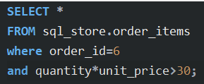

# Table of contents

- [Table of contents](#table-of-contents)
- [Getting Started](#getting-started)
  - [4- Installing MySQL on Windows](#4--installing-mysql-on-windows)
  - [5- Creating the Databases](#5--creating-the-databases)
- [Retrieving Data From a Single Table](#retrieving-data-from-a-single-table)
  - [2- The SELECT Clause](#2--the-select-clause)
  - [3- The WHERE Clause](#3--the-where-clause)
  - [4- The AND, OR and NOT Operators](#4--the-and-or-and-not-operators)
  - [5- The IN Operator](#5--the-in-operator)
  - [6-The Between Operator](#6-the-between-operator)
  - [7-The LIKE Operator](#7-the-like-operator)
  - [8-The REGEXP Operator](#8-the-regexp-operator)
  - [9-The IS NULL Operator](#9-the-is-null-operator)
  - [10-The ORDER BY Clause](#10-the-order-by-clause)
  - [11-The LIMIT Clause](#11-the-limit-clause)
- [Retrieving Data From Multiple Tables](#retrieving-data-from-multiple-tables)
  - [1-Inner Joins](#1-inner-joins)
  - [2-Joining Across Database](#2-joining-across-database)
  - [3-Self Joins](#3-self-joins)
  - [4-Joining Multiple Tables](#4-joining-multiple-tables)
  - [5-Compound Join Conditions](#5-compound-join-conditions)
  - [6-Implicit Join Syntax 隐式连接语法](#6-implicit-join-syntax-隐式连接语法)
  - [7-Outer Joins](#7-outer-joins)
  - [8-Outer Join Between Multiple Tables](#8-outer-join-between-multiple-tables)
  - [9-Self Outer Joins](#9-self-outer-joins)
  - [10-The USING Clause](#10-the-using-clause)
  - [11-Natural Joins](#11-natural-joins)
  - [12-Cross Joins](#12-cross-joins)
  - [13-Unions](#13-unions)
- [Inserting, Updating, and Deleting Data](#inserting-updating-and-deleting-data)
  - [1-Column Attributes](#1-column-attributes)
  - [2-Inserting a Row](#2-inserting-a-row)
  - [3-Inserting Multiple Rows](#3-inserting-multiple-rows)
  - [4-Inserting Hierachical Rows](#4-inserting-hierachical-rows)
  - [5-Creating a Copy of a Table](#5-creating-a-copy-of-a-table)
  - [6-Updating a Single Row](#6-updating-a-single-row)
  - [7-Updating Multiple Rows](#7-updating-multiple-rows)
  - [8-Using Subqueries in Updates](#8-using-subqueries-in-updates)
- [Summarizing Data](#summarizing-data)
  - [1-Aggregate Functions](#1-aggregate-functions)
  - [2-The GROUP BY Clause](#2-the-group-by-clause)
  - [3-The HAVING Clause](#3-the-having-clause)
  - [4-The ROLLUP Operator](#4-the-rollup-operator)
- [Writing Complex Query](#writing-complex-query)
  - [3-The IN Operator](#3-the-in-operator)
  - [4-Subqueries vs Joins](#4-subqueries-vs-joins)
  - [5-The ALL Keyword](#5-the-all-keyword)
  - [7-Correlated Subqueries](#7-correlated-subqueries)
  - [8-The EXISTS Operator](#8-the-exists-operator)
  - [9-Subqueries in the SELECT Clause](#9-subqueries-in-the-select-clause)
  - [10-Subqueries in the FROM Clause](#10-subqueries-in-the-from-clause)
- [Essential MySQL Functions](#essential-mysql-functions)
  - [1-Numeric Functions](#1-numeric-functions)
  - [2-String Functions](#2-string-functions)
  - [3-Date Functions in MySQL](#3-date-functions-in-mysql)
  - [4-Formatting Dates and Times](#4-formatting-dates-and-times)
  - [5-Calculating Dates and Times](#5-calculating-dates-and-times)
  - [6-The IFNULL and COALESCE 合并 Functions](#6-the-ifnull-and-coalesce-合并-functions)
  - [7-The IF Function](#7-the-if-function)
  - [8-The CASE Operator](#8-the-case-operator)
- [Views](#views)
  - [1-Creating Views](#1-creating-views)
  - [2-Altering or Dropping Views](#2-altering-or-dropping-views)
  - [3-Updatable Views](#3-updatable-views)
  - [4-THE WITH CHECK OPTION Clause](#4-the-with-check-option-clause)
- [Stored Procedures](#stored-procedures)
  - [1-What are Stored Procedures](#1-what-are-stored-procedures)
  - [2-Creating a Stored Procedure](#2-creating-a-stored-procedure)
  - [4-Droppong Stored Procedures](#4-droppong-stored-procedures)
  - [5-Parameters](#5-parameters)
  - [6-Parameters with Default Value](#6-parameters-with-default-value)
  - [7-Parameter Validation](#7-parameter-validation)
  - [8-Output Parameters](#8-output-parameters)
  - [9-Variables](#9-variables)
  - [10-Functions](#10-functions)
- [Triggers and Events](#triggers-and-events)
  - [1-Triggers](#1-triggers)
  - [2-Viewing Triggers](#2-viewing-triggers)
  - [3-Dropping Triggers](#3-dropping-triggers)
  - [4-Using Triggers for Auditing](#4-using-triggers-for-auditing)
  - [5-Events](#5-events)
  - [6-Viewing, Dropping and Altering Events](#6-viewing-dropping-and-altering-events)
- [Transactions and Concurrency](#transactions-and-concurrency)
  - [1-Transactions](#1-transactions)
  - [2-Creating Transactions](#2-creating-transactions)
  - [3-Concurrency and Locking](#3-concurrency-and-locking)
  - [4-Concurrency Problems](#4-concurrency-problems)
  - [5-Transaction Isolation Level](#5-transaction-isolation-level)
  - [10-Deadlocks](#10-deadlocks)
- [Data Types](#data-types)
  - [1- Introduction](#1--introduction)
  - [2- String Types](#2--string-types)
  - [3- Integer Types](#3--integer-types)
  - [4- Fixed-point and Floating-point Types](#4--fixed-point-and-floating-point-types)
  - [7- Date and Time Types](#7--date-and-time-types)
  - [8- Blob Types](#8--blob-types)
  - [9-JSON Type](#9-json-type)
- [Designing Databases](#designing-databases)
  - [2-Data Modelling](#2-data-modelling)
  - [3- Conceptual Models](#3--conceptual-models)
  - [4-Logical Models](#4-logical-models)
  - [10- 1NF- First Normal Form（一共 7 个定式，前 3 个最重要）](#10--1nf--first-normal-form一共-7-个定式前-3-个最重要)
  - [12- 2NF- Second Normal Form](#12--2nf--second-normal-form)
  - [13- 3NF- Third Normal Form](#13--3nf--third-normal-form)
  - [14- My Pragmatic Advice](#14--my-pragmatic-advice)
  - [16-Forward Engineering a Model](#16-forward-engineering-a-model)
  - [17-Synchronizing a Model with a Database](#17-synchronizing-a-model-with-a-database)
  - [18-Reverse Engineering a Database](#18-reverse-engineering-a-database)
  - [30-Character Sets and Collations](#30-character-sets-and-collations)
- [Indexing for High Performance](#indexing-for-high-performance)
  - [2-Indexes](#2-indexes)
  - [3-Creating Indexes](#3-creating-indexes)
  - [5-Prefix Indexes](#5-prefix-indexes)
  - [6-Full-text Indexes](#6-full-text-indexes)
  - [7-Composite Indexes](#7-composite-indexes)
  - [8-Order of Columns in Composite Indexes](#8-order-of-columns-in-composite-indexes)
  - [9-When Indexes are Ignored](#9-when-indexes-are-ignored)
  - [10-Using Indexes for Sorting](#10-using-indexes-for-sorting)
  - [11-Covering Indexes](#11-covering-indexes)
  - [12-Index Maintenace](#12-index-maintenace)
  - [13-Performance Best Practices](#13-performance-best-practices)
- [Securing Databases](#securing-databases)
  - [2-Creating a User](#2-creating-a-user)
  - [4-Dropping Users](#4-dropping-users)
  - [5-Changing Passwords](#5-changing-passwords)
  - [6-Granting Privileges 特权](#6-granting-privileges-特权)
  - [8-Revoking Privileges 撤销特权](#8-revoking-privileges-撤销特权)

# Getting Started

大小写不敏感，保留字最好全大写，以分号分语句  
root  
890411

## 4- Installing MySQL on Windows


## 5- Creating the Databases


- we use the administration tab to do administrative work such as starting or stopping our server, importing or exporting data
- schemas: this schemas tab shows the database that we have in the current database server
- sys 是 mysql 使用的内部数据库

# Retrieving Data From a Single Table

## 2- The SELECT Clause


distinct 保留字


## 3- The WHERE Clause

<>相当于！=  
sql 大小写不敏感  
date 需要用引号括起来

## 4- The AND, OR and NOT Operators

主意使用（），可以帮忙优先级  
可以在 where 中直接利用 column 进行运算



## 5- The IN Operator


改写成以下，方便使用和阅读


## 6-The Between Operator


## 7-The LIKE Operator

- last name start with b

```SQL
select *
from customers
where last_name like 'b%'
```

- \_y: \_代表一个字母
- last name is 2 characters long, 并且最后一个字母是 y

```SQL
select *
from customers
where last_name like '_y'

select *
from customers
where last_name like 'b____y'
-- Boagey

-- % any number of characters
-- _ single character
```

```SQL
-- get the customer whose addresses contain TRAIL or AVENUE
select *
from customers
where address like '%trail%' or
      address like '%avenue%'

-- phone numbers don't end with 9
select *
from customers
where phone not like '%9'
```

## 8-The REGEXP Operator

- ^: beginnig of a string
  - where last_name REGEXP '^field'
  - start with field
- $: end of a string
  - where last_name REGEXP 'field$'
  - end with field

```SQL
select *
from customers
where last_name REGEXP 'field'
-- where last_name like '%field%'

-- where last_name REGEXP 'field|mac'
-- maccaffrey and brushfield
```


```SQL
select *
from customers
where last_name REGEXP '[a-h]e'
```


## 9-The IS NULL Operator

```SQL
select *
from customers
where phone IS NOT NULL
```

## 10-The ORDER BY Clause

```SQL
-- 以下语句，先按照state降序排列，再按照first_name降序排列（不破坏state的排序）。select可以不是这两个排序列
select first_name, last_name
from customers
ORDER BY state DESC, first_name DESC

-- 按照第一列first_name，和第二列last_name，排序。不建议这么写
select first_name, last_name, 10 as points
from customers
order by 1, 2
```

## 11-The LIMIT Clause

```SQL
select *
from customers
limit 300


-- 取第三页的三项。跳过前6项，取3项
select *
from customers
limit 6, 3
-- page 1: 1-3
-- page 2: 4-6
-- page 3: 7-9
```

# Retrieving Data From Multiple Tables

## 1-Inner Joins

## 2-Joining Across Database

```SQL
USE sql_inventory

-- 从不属于这个数据库的表中提取数据，需要写出数据库的名字，sql_store.order_items

select *
from sql_store.order_items oi
JOIN products p
  ON oi.product_id = p.product_id
```

## 3-Self Joins

```SQL
USE sql_hr

select
  e.employee_id,
  e.first_name,
  m.first_name AS manager
from employees e
JOIN employees m
  ON e.reports_to = m.employee_id
```

## 4-Joining Multiple Tables

## 5-Compound Join Conditions

```SQL
select *
from order_items oi
JOIN order_item_notes oin
  ON oi.order_id = oin.order_id
  AND oi.product_id = oin.product_id
```

## 6-Implicit Join Syntax 隐式连接语法

- 不建议用这种方式，因为一旦忘了写 where，会发现两个表没有 join，而是每一个 orders 的 record，join 了每一个 customers 的 record，一共 100 行（正确的应该是 10 行）

```SQL
select *
from orders o, customers c
WHERE o.customer_id = c.customer_id
```

## 7-Outer Joins

- JOIN = INNER JOIN
- 对于没有任何 order 的 customer，inner 会忽略他们

```SQL
select
  c.customer_id
  c.first_name
  o.order_id
from customers c
JOIN orders o
  ON c.customer_id = o.customer_id
ORDER BY c.customer_id
```

- OUTER 也是 optional 的，与 inner 一样，不需要写

```SQL
-- LEFT JOIN: 每一条属于 LEFT 表的 record，都会被返回，不管 ON... 的条件是否匹配

select
  c.customer_id
  c.first_name
  o.order_id
from customers c
LEFT JOIN orders o
  ON c.customer_id = o.customer_id
ORDER BY c.customer_id
```

## 8-Outer Join Between Multiple Tables

- 最好一直使用 left join，便于阅读，维护

## 9-Self Outer Joins

## 10-The USING Clause

- 只在两个表中列名一致的情况下可用

```SQL
select
  o.order_id
  c.first_name
  sh.name AS shipper
from orders o
JOIN customers c
  USING (customer_id)
LEFT JOIN shippers sh
  USING (shipper_id, order_id)
```

## 11-Natural Joins

- 让数据库引擎，自己选择 column，他会自动查看两个表中一致的列，join on them。这个方法不推荐，有风险

```SQL
select *
from orders o
NATURAL JOIN customers c
```

## 12-Cross Joins

- join every record from the first table, and every record from the second table
- 以下两种写法，一模一样

```SQL
select *
from customers c
CROSS JOIN products p

select *
from customers c, products p
```

## 13-Unions

- 使用 UNION，我们可以将多个 query 结果，拼接在一起
- 以下结果是一列，列名就是 first_name
- 如果第一个 select 后面是两列，但是第二个 select 是一个列，会报错

```SQL
select first_name
from customers
UNION
select name
from shippers
```

# Inserting, Updating, and Deleting Data

## 1-Column Attributes

- varchar(50): 如果字符串长 5，就会只存 5，不会存 50
- char(50): 即使字符串长 5，也会存 50
- NN: not null
- AI: auto increment
- Default Expression: default value


## 2-Inserting a Row

- 对于 default expression 是 Null 的列，可以利用 key word DEFAULT, 也可以利用 NULL，插入空值
- 对于空值或者 default 值，可以不写他们，指定列名的时候，跳过他们

## 3-Inserting Multiple Rows

```SQL
INSERT INTO shippers (name)
VALUES ('Shipper1'),
        ('Shipper2'),
        ('Shipper3')
```

## 4-Inserting Hierachical Rows

- 给一个 insert 会产生一条新数据 with a new ID
- 第二条会拿到新产生的 ID，将他作为输入，insert 到另一个表


## 5-Creating a Copy of a Table

- 复制一个 table，orders_archived，order_id 不是 primary key，而且不会 AI

```SQL
CREAT TABLE orders_archives AS
SELECT * FROM orders

INSERT INTO orders_archives
SELECT *
FROM orders
WHERE order_date < '2019-01-01'
```

## 6-Updating a Single Row

```SQL
UPDATE invoices
SET
  payement_total = DEFAULT
  payment_date = NULL
WHERE invoice_id = 1

UPDATE invoices
SET
  payement_total = invoice_total * 0.5
  payment_date = due_date
WHERE invoice_id = 3
```

## 7-Updating Multiple Rows

- MySQL workbench safe update mode: 一次只允许 update 一行
- 重启 workbench


```SQL
UPDATE invoices
SET
  payement_total = invoice_total * 0.5
  payment_date = due_date
WHERE client_id IN (3, 4)
```

## 8-Using Subqueries in Updates


# Summarizing Data

## 1-Aggregate Functions

- 他们只会处理非空值，如果有空值，会跳过
- 下面的语句，注意书写顺利


## 2-The GROUP BY Clause

```SQL
SELECT
    state,
    city,
    SUM(invoice_total) AS total_sales
FROM invoices i
JOIN clients USING (client_id)
GROUP BY state, city
```

## 3-The HAVING Clause

```SQL
-- 不能这样写，会报错，unkown column total_salses
-- where 可以 filter data before rows are grouped
SELECT
    client_id
    SUM(invoice_total) AS total_sales
FROM invoices
WHERE total_salses > 500
GROUP BY client_id

-- having 可以 filter data after rows are grouped
-- having 中不可以包含 payment_date,因为在select子句中不包含 payment_date
SELECT
    client_id
    SUM(invoice_total) AS total_sales
    COUNT(*) AS number_of_invoices
FROM invoices
GROUP BY client_id
HAVING total_sales > 500 AND number_of_invoices > 5
```

## 4-The ROLLUP Operator

- 只在 MySQL 中有这个操作符


# Writing Complex Query

## 3-The IN Operator

```SQL
select *
from products
where product_id not in (
  select distinct product_id
  from order_items
)
```

## 4-Subqueries vs Joins

当两种方法都可以的时候，要考虑两件事，1 是效能，后面会介绍。2 是可读性，subquery 在简单的 query 中，可读性比 join 高，但也不全是这样的，要根据具体情况看。

## 5-The ALL Keyword

all 的意思是每一个，后面是一个 list，需要大于他们中的每一个。所以以下两个 query，的目的是一样的

```SQL
select *
from invoices
where invoice_total > (
  select max(invoice_total)
  from invoices
  where client_id = 3
)

select *
from invoices
where invoice_total > ALL (
  select invoice_total
  from invoices
  where client_id = 3
)
```

## 7-Correlated Subqueries

对于每一个 employee 都会执行一遍 subquery，计算一遍 avg(salary)，我们称这种为 Correlated Subqueries，因为在 subquery 中，我们有 correlation with 外层 query，we are referencing the alias from the outer query。之前写的那些 subquery 都是没有这种情况。Correlated Subqueries 会有点慢，课程没有提解决办法

```SQL
select *
from employees e
where salary > (
  select avg(salary)
  from employees
  where office_id = e.office_id
)

```

## 8-The EXISTS Operator

- 使用 exist 操作符的时候，子查询不会真的返沪给外圈查询一个结果，他会返回一个 indication of whether any rows in the subquery matches these earch condition(where client_id = c.client_id)
- 一旦它找到一个符合标准的行，它会 return true
- 如果 in operator 后面，是一个很长的 list，那么使用 exist 会更高效

```SQL
select *
from clients
where client_id in (
  select distinct client_id
  from invoices
)

select *
from clients c
where exists (
  select client_id
  from invoices
  where client_id = c.client_id
)
```

## 9-Subqueries in the SELECT Clause

subquery are not limited in where clauses, we can also use them in select clause

```SQL
select
    invoice_id,
    inoivce_total,
    (select avg(invoice_total) from inovices) as invoice_average,
    invoice_total - (select invoice_average) as different
from inovices
```

## 10-Subqueries in the FROM Clause

- 必须给他一个别名 sales_summary
- 在 from clause 中写子查询，会将主 query 变复杂。最好使用 views，将这个 query 最为 views 保存在数据库中

```SQL
select *
from (
  select
    invoice_id,
    inoivce_total,
    (select avg(invoice_total) from inovices) as invoice_average,
    invoice_total - (select invoice_average) as different
  from inovices
) as sales_summary
where inoivce_total is not null
```

# Essential MySQL Functions

## 1-Numeric Functions

google mysql numeric functions ---> mysql reference manual

```SQL
select ROUND(5.7345, 2)
-- 5.73
select TRUNCATE(5.7345, 2)
-- 5.73 截短
select CEILING(5.2)
-- 6
select FLOOR(5.2)
-- 5
select ABS(-5.2)
-- 5.2
select RAND()
-- 0-1之间的随机数，0.1754839012170992
```

## 2-String Functions

google mysql string functions ---> mysql reference manual

```SQL
select LENGTH('sky')
-- 3
select UPPER('sky')
-- SKY
select LOWER('Sky')
-- sky
select LTRIM('   sky')
-- sky
select RTRIM('sky   ')
select TRIM('    sky   ')
select LEFT('Kindergarten', 4)
-- Kind
-- the first 4 characters
select RIGHT('Kindergarten', 6)
-- garten
select SUBSTRING('Kindergarten', 3, 5)
-- nderg
-- 从3位开始，往后数5位
select SUBSTRING('Kindergarten', 3)
-- 从3位到最后
select LOCATE('n', 'Kindergarten')
-- 3
-- the position of the first 'n' is 3. N or n is the same
select LOCATE('q', 'Kindergarten')
-- result is 0: not -1 but is 0
select REPLACE('Kindergarten', 'garten', 'garden')
-- Kindergarden
select CONCAT('first', 'last')

select CONCAT(first_name, ' ', last_name) as full_name
from customers
```

## 3-Date Functions in MySQL

```SQL
select NOW(), CURDATE(), CURTIME()
-- 2023-11-25 20:41:40
-- 2023-11-25
-- 20:41:40
select YEAR(NOW()), MONTH(NOW()), DAY(NOW()), HOUR(NOW()), MINUTE(NOW()), SECOND(NOW())
select DAYNAME(NOW()), MONTHNAME(NOW())
-- Monday March
select EXTRACT(YEAR FROM NOW())
-- 2023
-- YEAR/MONTH/DAY/...
-- EXTRACT is part of standard SQL language so if you want to be able to port your code to other database management system, it is better to use extract function
```

## 4-Formatting Dates and Times

```SQL
select DATE_FORMAT(NOW(), '%M %d %Y')
-- March 11 2019
select TIME_FORMAT(NOW(), '%H:%i %p')
-- 12:58 PM
```

## 5-Calculating Dates and Times

```SQL
select DATE_ADD(NOW(), INTERVAL -1 YEAR)
select DATE_SUB(NOW(), INTERVAL 1 YEAR)
select DATEDIFF('2023-01-05 09:00', '2023-01-01 17:00')
-- 4
-- 第一个减去第二个，只计算相差天数，不计算时间
select TIME_TO_SEC('09:00') - TIME_TO_SEC('09:02')
-- -120
```

## 6-The IFNULL and COALESCE 合并 Functions

```SQL
select
    order_id,
    IFNULL(shipper_id, 'Not assigned') AS shipper
from orders

select
    order_id,
    COALESCE(shipper_id, comments, 'Not assigned') AS shipper
from orders
-- 如果 shipper_id 是空，就显示comments，如果comment也是空，就显示'Not assigned'
-- COALESCE：a list of value, return the first not null value
```

## 7-The IF Function

```SQL
select
    order_id,
    order_date,
    IF(
      YEAR(order_date) = YEAR(NOW()),
      'Active',
      'Archived'
    ) AS category
from orders
```

## 8-The CASE Operator

```SQL
select
    order_id,
    CASE
      WHEN YEAR(order_date) = YEAR(NOW()) THEN 'Active'
      WHEN YEAR(order_date) = YEAR(NOW()) - 1 THEN 'Last Year'
      WHEN YEAR(order_date) < YEAR(NOW()) - 1 THEN 'Active'
      ELSE 'Future'
    END AS category
from orders
```

# Views

## 1-Creating Views

```SQL
CREATE VIEW sales_by_client AS
select
  c.client_id,
  c.name,
  SUM(invoice_total) AS total_sales
FROM client c
JOIN invoices i USING (client_id)
GROUP BY client_id, name
```

## 2-Altering or Dropping Views

```SQL
DROP VIEW sales_by_client
CREATE OR REPLACE VIEW sales_by_client AS ...
```

## 3-Updatable Views

- 不包含以下任何一个的 view，被称为 updatable view
  - distinct
  - aggregate functions (min, max, sum ...)
  - group by / having
  - union
- 可以使用这样的 view 进行 insert update and delete statement.
- 比如说，我们可以删除数据：

```SQL
-- invoices_with_balance is a updatable view
DELETE FROM invoices_with_balance
where invoice_id = 1
```

## 4-THE WITH CHECK OPTION Clause

- 如果利用 view update 一行数据，你会发现，再 select \* from view 的时候，这行数据消失了。这是 view 的行为方式：update 或者 delete through a view，一些行会消失
- 如果你不希望以上发生，在 create view 中，最后一行添加，WITH CHECK OPTION
- 有了 WITH CHECK OPTION 这一行，this view will prevent update or delete statement from excluding rows form the view
- 有了这个 WITH CHECK OPTION 后，你会发现 update through view 的时候会报错，'check option failed'

# Stored Procedures

## 1-What are Stored Procedures

- 不要将 SQL query 写在后端，应该写在 Stored Procedures 中
- 第二，Stored Procedures 更快
- 第三，可以给 Stored Procedures 限制访问，数据更安全

## 2-Creating a Stored Procedure

```SQL
DELIMITER $$
CREATE PROCEDURE get_client()
BEGIN
  SELECT * FROM clients;
END$$

DELIMITER ;

CALL get_clients()
```

## 4-Droppong Stored Procedures

```SQL
DROP PROCEDURE IF EXISTS get_clients
```

## 5-Parameters

```SQL
DROP PROCEDURE IF EXISTS get_clients_by_state;

DELIMITER $$
CREATE PROCEDURE get_clients_by_state
(
  state CHAR(2)
)
BEGIN
  SELECT * FROM clients c
  WHERE c.state = state;
END$$

DELIMITER ;

CALL get_clients_by_state('CA')
```

## 6-Parameters with Default Value

```SQL
DROP PROCEDURE IF EXISTS get_clients_by_state;

DELIMITER $$
CREATE PROCEDURE get_clients_by_state
(
  state CHAR(2)
)
BEGIN
  IF state IS NULL THEN
    SET state = 'CA';
  END IF;

  SELECT * FROM clients c
  WHERE c.state = state;
END$$

DELIMITER ;

CALL get_clients_by_state(NULL)
```

```SQL
-- 方法二：
BEGIN
  IF state IS NULL THEN
    SELECT * FROM clients;
  ELSE
    SELECT * FROM clients c
    WHERE c.state = state;
  END IF;

END$$
-- 方法三：
BEGIN
    SELECT * FROM clients c
    WHERE c.state = IFNULL(state, c.state);
END$$
```

## 7-Parameter Validation

- google sqlstate errors ---> DB2 10 - Codes - SQLSTATE values and common error codes - IBM

```SQL
BEGIN
  IF payment_amount <= 0 THEN
    SIGNAL SQLSTATE '22003'
      SET MESSAGE_TEXT = 'Invalid payment amount';
  END IF;
    SELECT * FROM clients c
    WHERE c.state = IFNULL(state, c.state);
END
```

## 8-Output Parameters

```SQL
CREATE PROCEDURE get_unpaid_invoices_for_client
(
  client_id INT,
  OUT invoices_count INT,
  OUT invoice_total DECIMAL(9,2)
)
BEGIN
  SELECT COUNT(*), SUM(invoice_total)
  INTO invoices_count, invoices_total
  FROM invoices i
  WHERE i.client_id = client_id
    AND payment_total = 0;
END

set @inovices_count = 0;
set @invoices_total = 0;
call sql_invoicing.get_unpaid_invoices_for_client
  (3, @inovices_count, @invoices_total);
select @inovices_count, @invoices_total;
```

## 9-Variables


## 10-Functions

- Functions 与 Stored Procedures 非常相似，唯一区别是，Functions 只能返回单一值 single value
- function 属性 keyword
  - DETERMINISTIC：同样的 input，一定会返回同样的 output。比如有 select from database 的 function 就会拥有这个属性，因为 data 会变化
  - MODIFIES SQL DATA：在这个 function 中，会进行 update

```SQL
CREATE FUNCTION get_risk_factor_for_client
(
  client_id INT
)
RETURNS INTEGER
READS SQL DATA
BEGIN
  DECLARE risk_factor DECIMAL(9,2) DEFAULT 0;
  DECLARE invoices_total DECIMAL(9,2);
  DECLARE invoices_count INT;

  SELECT COUNT(*), SUM(invoice_total)
  INTO invoices_count, invoices_total
  FROM invoices i
  WHERE i.client_id = client_id;

  SET risk_factor = invoices_total / invoices_count * 5;

  RETURN IFNULL(risk_factor,0)
END

SELECT
  client_id,
  name,
  get_risk_factor_for_client(client_id) AS risk_factor
FROM clients

DROP FUNCTION IF EXISTS get_risk_factor_for_client;
```

# Triggers and Events

## 1-Triggers

- trigger: a block of SQL code that automatically gets executed before or after an insert, update or delete statement


## 2-Viewing Triggers

SHOW TRIGGERS LIKE 'payments%'

## 3-Dropping Triggers

- DROP TRIGGER IF EXISTS payments_after_insert;
- 将上面这句放到 DELIMITER $$ 之后

## 4-Using Triggers for Auditing


## 5-Events

- events: a task(or block of SQL code) that gets executed according to a schedule
- we are going to delete all the audit records that are older than one year


## 6-Viewing, Dropping and Altering Events


# Transactions and Concurrency

## 1-Transactions

- Transactions: a group of SQL statement that represent a single unit of work
- ACID properties
  - atomicity
  - consistency
  - isolation
  - durability

## 2-Creating Transactions

- 如果是测试的时候，最后一行不用 commit，使用 rollback
- 下图中，第二个 insert 是故意写错的，当第二个错的时候，第一个也不会被执行


## 3-Concurrency and Locking

if your transaction tries to modify a row or multiple rows, it puts a lock on these rows, and this lock prevents other transaction from modifying these rows util the first transaction is done, either it is commited or rolled back

## 4-Concurrency Problems

- lost updates. 当不使用 lock，想要同时改变同一条数据的时候，后一个改变会覆盖前一个
- dirty read. when a transaction reads data that hasn't been committed yet. transaction a 添加了 10 个 point，transaction b 根据这个 points 的值做了一些事，但是 a roll back 了
  - 我们需要提供 a level of isolation around our transaction
  - set isolation level (read committed)
- non-repeating reads/inconsisstent rad
  - transaction a 第一次读的时候，point 是 10，第二次的 read 的时候（a 有一个 subquery），transaction B 已经 commit 了，point 是 0
  - 如果我们需要规定，transaction A 每次都看到最一开始的 point 值 10，可将 isolation level 设定成 repeatable read
- phantom 幻影 reads
  - transaction a 要给每个 point 超过 10 的 customers 一个 discount。transaction b 更新了一个 customer 的 point，超过 10 了，但是 A 不知道，这个 customer 不会得到这些 discount
  - set isolation level to be SERIALIZABLE: guarantee that our transaction will be aware of changes currently being made by other transaction to the data. if there are other transactions modifying the data that can impact our query result, our transaction has to wait for them to complete. transactions should executed sequentially
  - 这种 isolation level 最准确，但是非常消耗，只用在重要的情况中

## 5-Transaction Isolation Level


- default isolation level
- set session transaction isolation level SERIALIABLE
- all new transaction in all sessions
  - set global transaction isolation level SERIALIABLE


## 10-Deadlocks

- transaction cannot complete because each transcation holds a lock that the other needs, so both transactions need each other and never release their lock
- 两个 session 有一模一样的以下内容， update 的内容顺序不一样。一行一行执行，第一个的第一行，第二个的第一行，第一个的第二行....直到第二个的第四行，会报错，死锁
- write your application in a way that it can reissue a transaction if it gets roll back because of a deadlock --- tell the user, this operation failed, let's try again
- 避免死锁
  - 注意执行 order，保持同样的顺序
  - keep transaction small and short in duration

```SQL
USE sql_store;
START TRANSACTION;
UPDATE customers SET state = 'VA' WHERE customer_id = 1;
UPDATE orders SET status = 1 WHERE order_id = 1;
COMMIT;

USE sql_store;
START TRANSACTION;
UPDATE orders SET status = 1 WHERE order_id = 1;
UPDATE customers SET state = 'VA' WHERE customer_id = 1;
COMMIT;
```

# Data Types

## 1- Introduction

Blob type: binary data  
Spatial type: geography or geographical values

## 2- String Types

Char: fixed length (like the aggregation of states)  
Varchar: variable length strings (username, password, email, address), 也可以存储 zip code 和电话号码，因为这些数字不用于计算。可以利用常用长度，便于维护数据库：


Mediumtest: max 16MB, varchar 最长 65535 characters(~64KB)。Json objects， cs view strings, and short to medium length quotes  
Longtext: max 4GB, textbook, year of log files

以上是常用  
下面非常用：  
Tinytext: max 255 bytes  
Text: max 64 KB, 最好用 varchar，因为它可以使用 index，可以加速 query

所有这些都支持国际化  
英语 letters use 1 byte；european and middle eastern use 2 bytes; chinese and japanese use 3 bytes  
If the type of a column char of 10, mySQL will reserve 30 bytes for the values in that column

## 3- Integer Types

5 种不同的 number，区别是需要多少 bytes，适用于存储不同大小的数（range of value they can store）


## 4- Fixed-point and Floating-point Types

3 种 type for storing numbers with a decimal point

- Decimal (别名 dec, numeric, fixed)

  - Precision: the maximum number of digits 1-65
  - Scale: determins the number of digits after the decimal point

- Float（4b） and Double（8b） are used in scientific calculations, 用于超大值和超小值，这两种存储近似值。如果 precision 不重要，应该使用 float or double

## 7- Date and Time Types

Date: without a time component  
Time: time value  
Datetime：8b，如果要记录大于 2038 年，需要使用 datetime 类型  
Timestamp: keeping track of when a row was inserted or last updated,也可以使用 date time 做这个，但是区别是，timestamp 是 4b，up to 2038 年  
Year: 4 digit year

## 8- Blob Types

Large amounts of binary data like images, videos, pdf's, word files, pretty much any binary data  
Mysql, 四种可存储文件的大小


最好不用 database 存文件，因为关系型数据库是被用于存储，结构性数据的。  
如果存储 binary 数据，会使得 backup 变慢，会造成一些性能问题

## 9-JSON Type


- properties -> '$.dimendions[0]'


# Designing Databases

## 2-Data Modelling


## 3- Conceptual Models

画图工具


## 4-Logical Models


- Conceptual Model: doesn't really give us a structure for storing data, it only represents the business entities and their relationship. we use it to understand the problem domain and communicate the experts


- Logical Model: add more details to our conceptual model, we almost know what structure or what tables we need to store our data, the entities that we have here eventually end up as tables in our database


## 10- 1NF- First Normal Form（一共 7 个定式，前 3 个最重要）


根据第一定式，不应该有重复的 column，比如 tag1，tag2，tag3  
也不应该一个 column 有多个值，比如 tag，这个 column 中有 tag1，tag2，tag3  
如果一个课程可以给多个 tag，就应该把 tag 作为一个单独的表。因为不确定会给这个 course 多少个 tag，这是不可控的  
Tag_id: 选择数据类型，如果是用户添加，就需要选择 bigint，如果是 admin 添加，量级较小，可以选择 tiny int

## 12- 2NF- Second Normal Form


比如，课程种可以包含，title，price，instructor。但是如果是入学时间，就不应该在 course 中，因为一个 course 可以有多个学生，不同时间加入。  
所以 enroll 不应该在 course 表中。  
下面的例子，不符合第二定式，因为 customer name 不应该属于 order table。如果一开始这列叫 customer 而非 customer name，还是不太容易看出问题来的。但是如果发现这列经常有重复值，就意味着不符合第二定式，需要修改数据库结构


## 13- 3NF- Third Normal Form


以下例子不符合第三定式，因为 balance 可以由 invoice 减去 payment 计算得到。如果其中之一变化了，但是 balance 还没变，就会产生歧义，到底哪个数是对的。应该删除 balance column


还有一个典型的例子就是 first name + last name = full name，不应该有 full name 这列

## 14- My Pragmatic Advice

去除重复，如果有重复值，而且他们不是 foreign key，那就说明设计没有 normalize

## 16-Forward Engineering a Model

Database ---> Forward Engineer ...

## 17-Synchronizing a Model with a Database

在 EER Diagram 修改 model，使用 Database ---> Synchronize Model ... apply 这些修改

## 18-Reverse Engineering a Database

Database ---> Reverse Engineer ...

## 30-Character Sets and Collations

first_name VARCHAR(50) CHARACTRT SET latin1 NOT NULL

# Indexing for High Performance

## 2-Indexes

- reserve indexes for PERFORMANCE CRITICAL queries
- design indexes based on your queries, not your tables

## 3-Creating Indexes

- type AL: MySQL is going to do a full table scan, it will read or scan every single record in this table
- rows: 1010
- CREATE INDEX idx_state ON customers (state);
- type ref: 不是 full scan
- rows: 112

## 5-Prefix Indexes

- 找到 prefix 的最优解
- 5 就很好，因为 10，只增加了 30 个不同


## 6-Full-text Indexes


```SQL
USE sql_blog;
SELECT *
FROM posts
WHERE title LIKE '%react redux%' OR
      body LIKE '%react redux%'
-- 以上query有几个问题，慢，必须是‘react redux’这种格式

-- 不包含redux 包含form 在 title 或者 body 中
WHERE MATCH(title, body) AGAINST('react -redux +form' IN BOOLEAN MODE)
-- 包含 exactly 这个string: handling a form
WHERE MATCH(title, body) AGAINST('"handling a form"' IN BOOLEAN MODE)
```

## 7-Composite Indexes


## 8-Order of Columns in Composite Indexes

- put the most frequently used columns first
- put the columns with a higher cardinality first 更多样化的列，放在前面，比如男/女，只有两种，应该放在后面
- always take your queries into account

## 9-When Indexes are Ignored

if you want MySQL to utilize your indexes, you should always isolate your columns

## 10-Using Indexes for Sorting

- (a, b) index with column a and b
- a
- a, b
- a DESC, b DESC

## 11-Covering Indexes

- 设计 index 的时候，查看以下一个，让 index 更高效
- where
- order
- select

## 12-Index Maintenace


## 13-Performance Best Practices

# Securing Databases

## 2-Creating a User

```SQL
-- @ 后面的部分是 restrict where the suer can connect from
-- @127.0.0.1 from own computer
CREATE USER john@127.0.0.1;
CREATE USER john@localhost;
-- from this domains or any of its subdomains
CREATE USER john@'%.codewithmosh.com';

-- create user with password
CREATE USER john IDENTIFIED BY '1234';
```

## 4-Dropping Users

```SQL
CREATE USER bob@codewithmosh.com IDENTIFIED BY '1234';
DROP USER bob@codewithmosh.com
```

## 5-Changing Passwords

```SQL
SET PASSWORD FOR john = '2345';
-- 给当前login的用户重置密码
SET PASSWORD = '2345';
```

## 6-Granting Privileges 特权

- google mysql privileges ---> mysql reference manual
- _._ 所有数据库的所有表


## 8-Revoking Privileges 撤销特权

```SQL
GRANT CREATE VIEW
ON sql_store.*
TO moon_app;

REVOKE CREATE VIEW
ON sql_store.*
FROM moon_app;
```
