# Contents

1. 命名：变量名，方法名，类名
2. 长参数列表：将几个参数提取成一个单独的类
3. magic number：常量需要单独列出来
4. nested conditionals
5. case switch 拆分
6. 重复代码提取
7. comments why and how not what
8. 长方法

# My Notes

1.  List Unpacking

```python
numbers = [1, 2, 3, 4, 5]
first, second, *other = numbers
```

2.  x = map(lambda item: item[1], items)

- Use meaningful variable names: Use descriptive variable names that reflect the purpose of the variable. This makes it easier for others (and yourself) to understand the code.
- Write concise code: Use concise expressions and avoid unnecessary complexity. This can make your code easier to read and understand.
- Use comments: Comments are a great way to explain what your code is doing. Use them sparingly and only when necessary to avoid cluttering the code.
- Use whitespace: Use whitespace to make your code more readable. Use blank lines to separate logical sections of code and use indentation to indicate nested blocks of code.
- Use functions and classes: Use functions and classes to organize your code and make it more modular. This can make it easier to understand and maintain your code.
- Use built-in functions and modules: Python has many built-in functions and modules that can simplify your code and make it more readable.
- Use consistent coding style: Use consistent coding style throughout your codebase. This can make it easier for others to read and understand your code.
- Optimize loops: Use optimized looping techniques such as list comprehensions or generator expressions instead of traditional loops where appropriate. This can improve the performance of your code and make it more readable.
- Use try-except blocks: Use try-except blocks to handle exceptions and errors in your code. This can make your code more robust and reliable.
- Use appropriate data structures: Use appropriate data structures for the task at hand. This can make your code more efficient and easier to read.

- 使用有意义的变量名称：使用反映变量用途的描述性变量名称。 这使得其他人（和你自己）更容易理解代码。
- 编写简洁的代码：使用简洁的表达方式，避免不必要的复杂性。 这可以使您的代码更易于阅读和理解。
- 使用注释：注释是解释您的代码正在做什么的好方法。 谨慎使用它们，仅在必要时使用它们以避免代码混乱。
- 使用空格：使用空格使您的代码更具可读性。 使用空行来分隔代码的逻辑部分，并使用缩进来指示嵌套的代码块。
- 使用函数和类：使用函数和类来组织您的代码并使其更加模块化。 这可以使您更容易理解和维护您的代码。
- 使用内置函数和模块：Python 有许多内置函数和模块，可以简化您的代码并使其更具可读性。
- 使用一致的编码风格：在整个代码库中使用一致的编码风格。 这可以让其他人更容易阅读和理解您的代码。
- 优化循环：在适当的地方使用优化的循环技术，例如列表理解或生成器表达式，而不是传统的循环。 这可以提高代码的性能并使其更具可读性。
- 使用 try-except 块：使用 try-except 块来处理代码中的异常和错误。 这可以使您的代码更加健壮和可靠。
- 使用适当的数据结构：为手头的任务使用适当的数据结构。 这可以使您的代码更高效且更易于阅读。

# Common Code Smells

## 1- Poor Names

坏名字的例子：button1_click，page2，od，dr

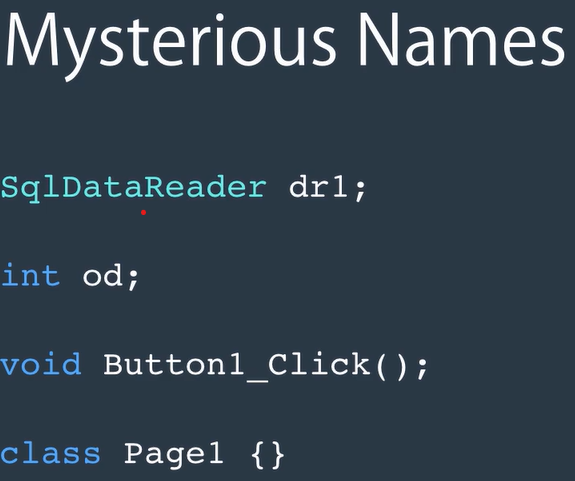

另一种坏名字：meningless names。以下的这个名字没有意义，并不能知道要这是要干什么

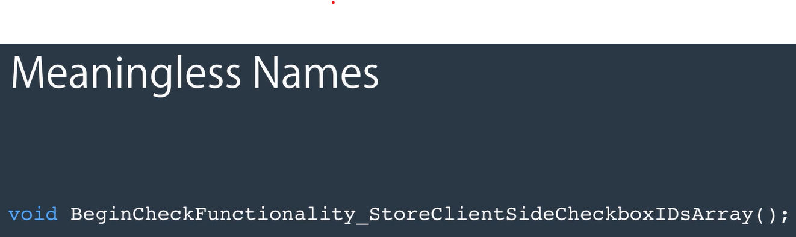
<br />
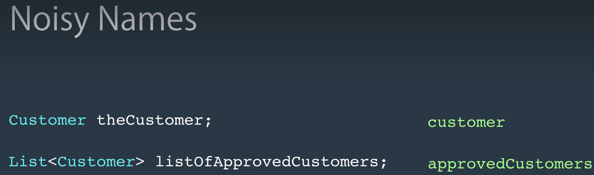
<br />
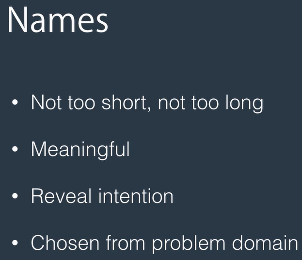

## 3- Poor Method Signatures

- Poor Method Signatures 的意思是，比如说：Orange GetCustomer(int airplane), airplane 的数据应该是 string 但是却用了 int；GetCustomer 方法返回值应该是 customer，但是却是 orange
- get user method in ./OriginCode/PoorMethodSignatures, befor: GetUser(string username, int password, boolean login)
- refactory: GetUser(string username), Login(string username, int password)

```cs
var user = userService.Login("username", "password");
var anotherUser = userService.GetUser("username");

public User GetUser(string username, string password, bool login)
{
        // Check if there is a user with the given username
        // If yes, return it, otherwise return null
        var user = _dbContext.Users.SingleOrDefault(u => u.Username == username);
        return user;
}

public User Login(string username, string password)
{
        // Check if there is a user with the given username and password in db
        // If yes, set the last login date
        // and then return the user.
        var user = _dbContext.Users.SingleOrDefault(u => u.Username == username && u.Password == password);
        if (user != null)
            user.LastLogin = DateTime.Now;
        return user;
}
```

## 4- Long Parameter List

- LongParameterList
- 预定酒店，每个方法都有 dataFrom dataTo 这连个 parameter，所以可以重构成。构建一个 DateRange 类

```cs
public class DateRange
{
    private DateTime _dateFrom;
    private DateTime _dateTo;

    public DateRange(DateTime dateFrom, DateTime dateTo)
    {
        _dateFrom = dateFrom;
        _dateTo = dateTo;
    }

    public DateTime DateFrom
    {
        get { return _dateFrom; }
    }

    public DateTime DateTo
    {
        get { return _dateTo; }
    }
}

public IEnumerable<Reservation> GetReservations(DateRange dateRange, User user, int locationId, LocationType locationType, int customerId = null)
{
    if (dateRange.dateFrom >= DateTime.Now)
        throw new ArgumentNullException("dateFrom");
    if (dateRange.dateTo <= DateTime.Now)
        throw new ArgumentNullException("dateTo");

    throw new NotImplementedException();
}

```

- GetReservations and GetUpcomingReservations are very similar, 其中一个有 customerID（optional parameter）另一个没有。GetReservations 这个函数的功能更像是 filter，query 出符合条件的 reservations list。将 GetReservations 的<mark>参数列表变成一个 class ReservationQuery</mark>
- 这节课我们的结论，最好不要超过 3 个参数，如果超过后应该想办法重构

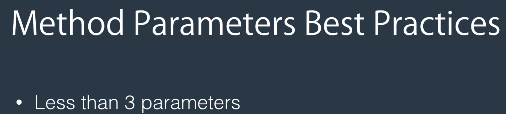

## 5- Ouput Parameters


- 返回值是两个元素(Cusomers, totalCount)，可以利用一个类（GetCustomersResult）将它们包裹起来

## 6- Variable Declarations on the Top

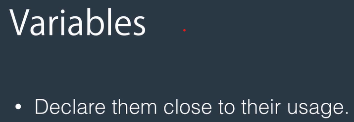

## 7- Magic Numbers

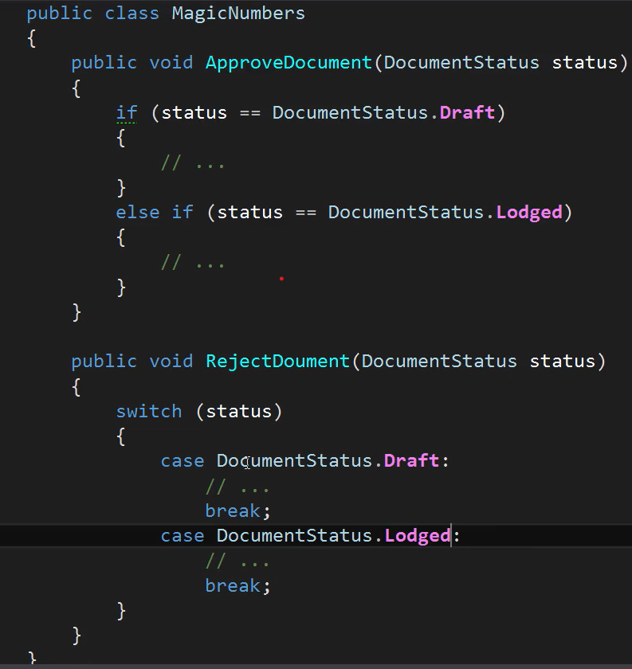

## 8- Nested Conditionals

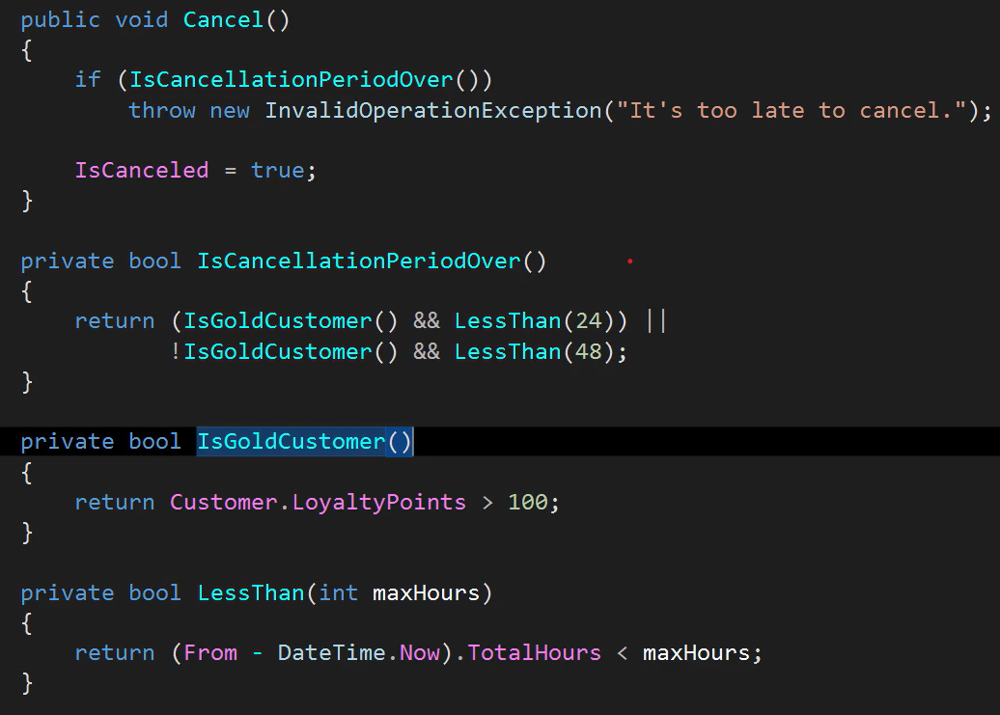

- is already started is redundent, so delete the logic about it

## 9- Switch Statements

- 问题：

  - 不符合扩展开放，封闭原则，每次都要给 MonthlyStatement 添加新代码，会影响之前的代码和设计。every class in this app depends on this method has to re-compiled, and this cycle goes all the way up to the application root
    - 开闭原则：软件中的对象（类，模块，函数等等）应该对于扩展是开放的，但是对于修改是封闭的。这意味着一个实体是允许在不改变它的源代码的前提下变更它的行为。
  - 这个 case switch 会变很长，还会有很多其他的规则
  - when we have switch statement based on the type of some objects, it is quite possible that switch statement is spread all over the app for different reasons. sometimes we want to calculate cost based on the type of customer, sometimes we may want to give them different promotions, we will have different rules all based on the type of customer

- 优化：polymorphism
  - Origin: MonthlyStatement(MonthlyUsage(Customer)), inside MonthlyStatement contain case and swith
  - Optimized: PayAsYouGo/Unlimited(inherit from customer)(contain method: GenerateStatement, optimized from Generate in MonthlyStatement).把 MonthlyStatement 分开成了两个类（customer 的子类）

## 10- Duplicated Code

- 将重复的代码提取出来，单独形成一个方法

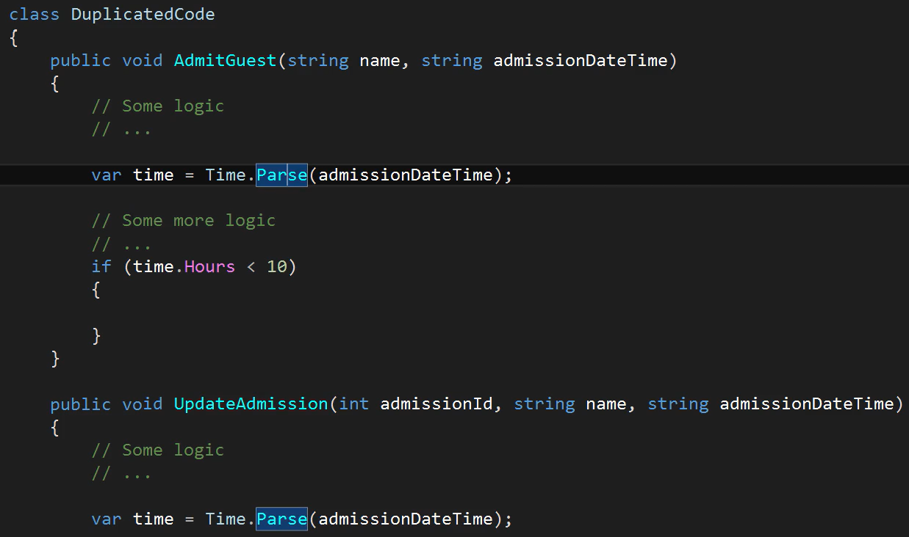

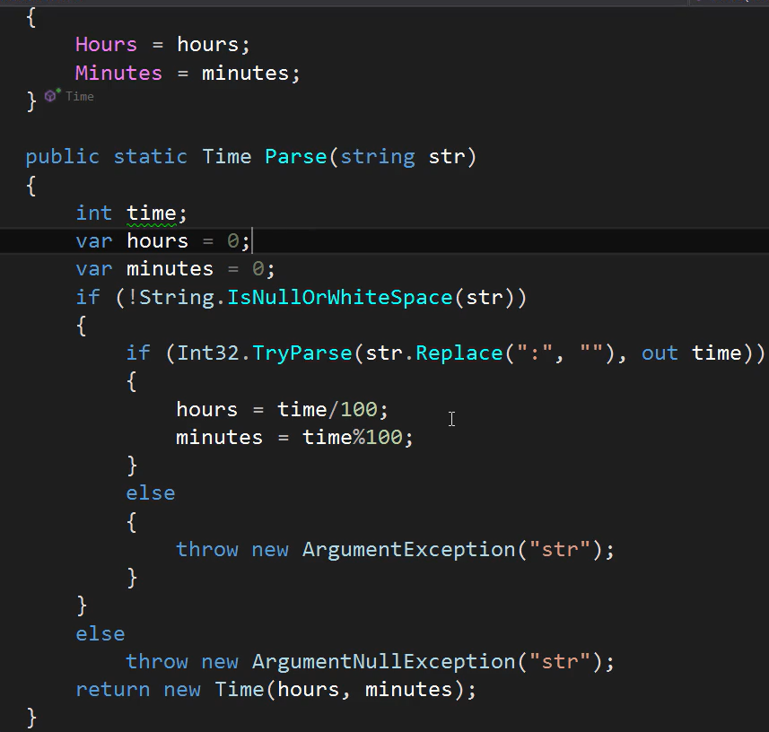

## 11- Comments

- one kine of good comments: when you are solving one problem, but there are some constrains, maybe there is a problem in the database, maybe using a third party component that has problem, these kinds of constrains are great for document in the code
- write comments for whys and hows not whats
- 另外，看到利用 comment 以及空行将两部分分开的时候，其实是 refactoring 的好时候。可以将这两个部分分开写两个方法

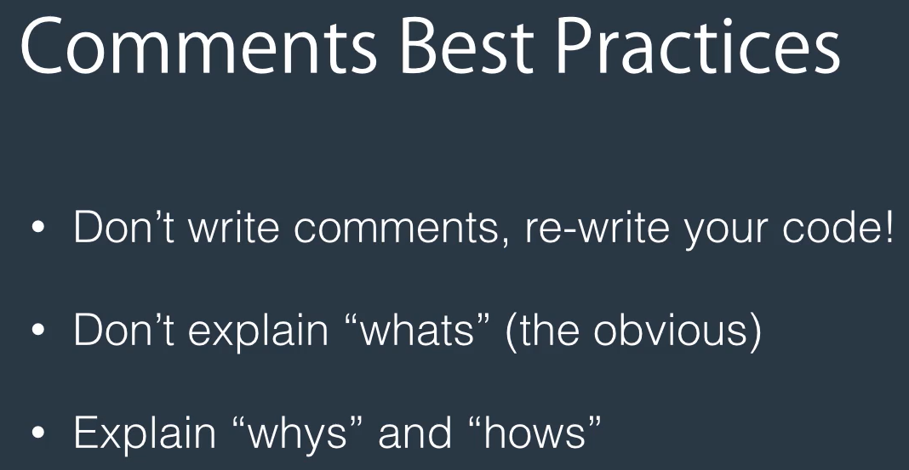

## 12- Long Methods

- long methods: more than 10 lines of code
- we want methods that specialise in one thing
- cohesion principle: things that are related should be together
- single responsibility principle: a class/method should do only one thing, and do it very well

page-load:  
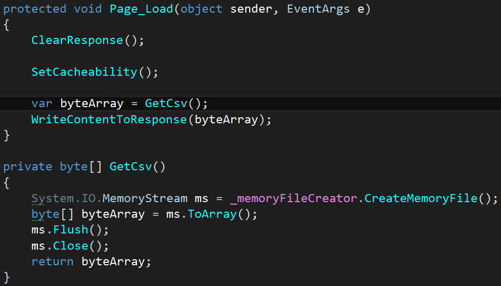

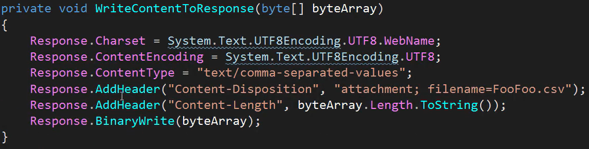

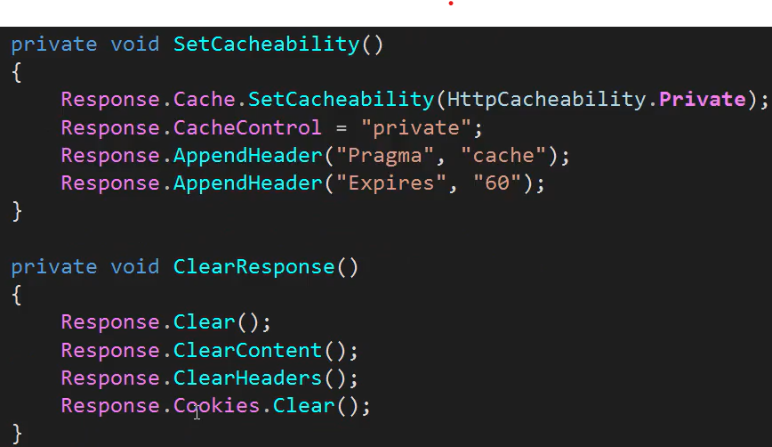

memory-file-creator:  
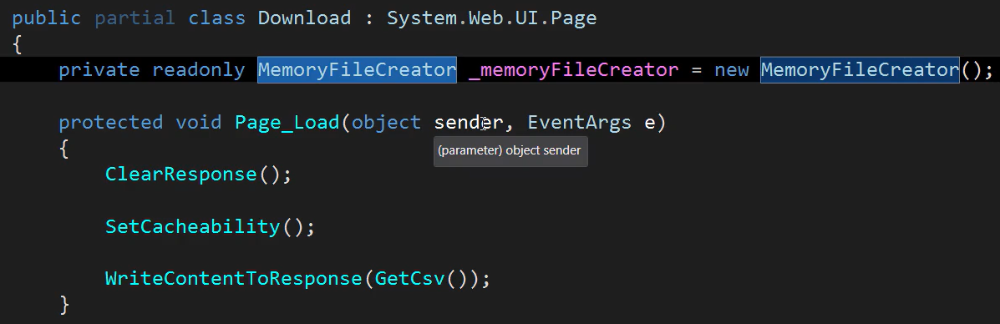

- memory-file-creator ---> data table to csv mapper

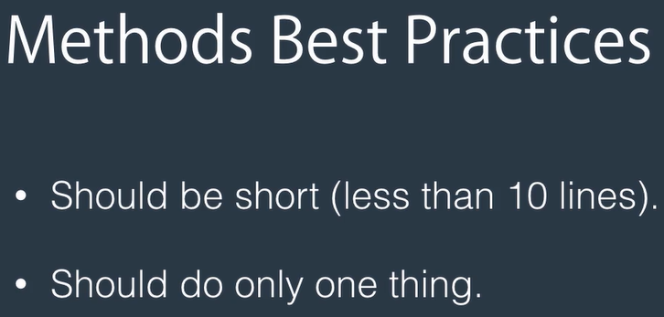
