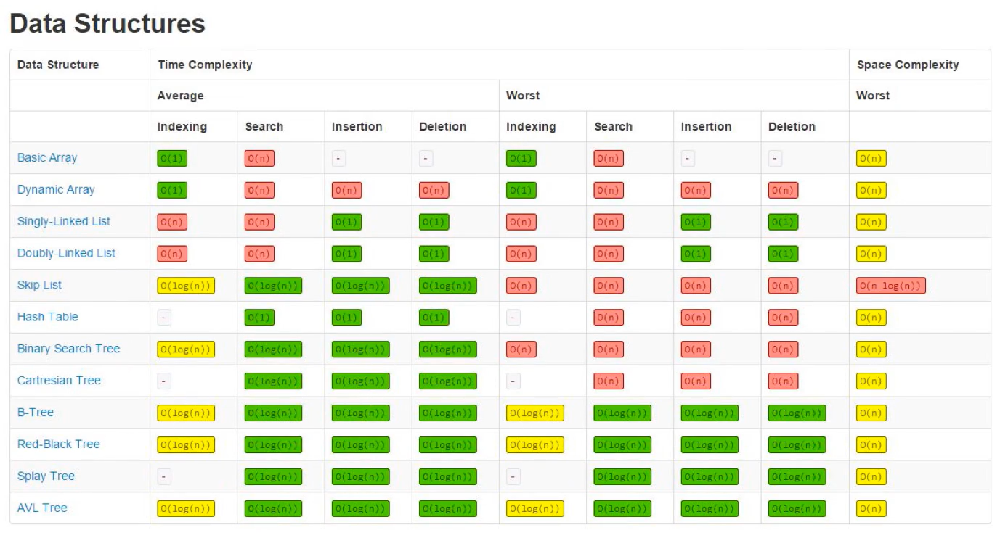
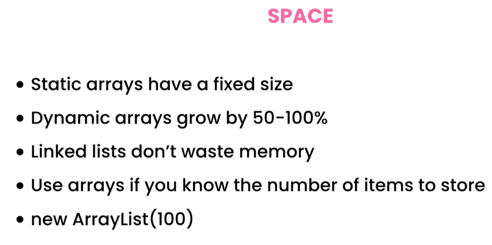
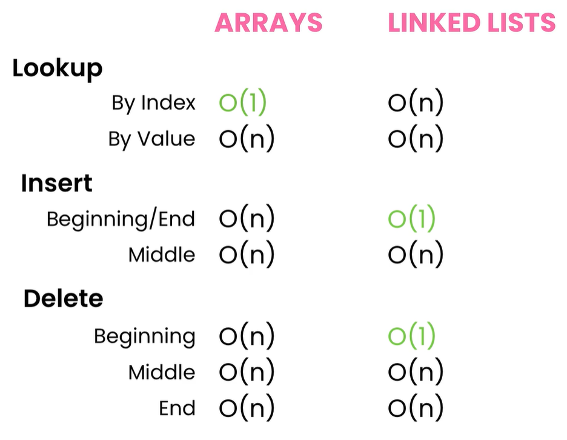
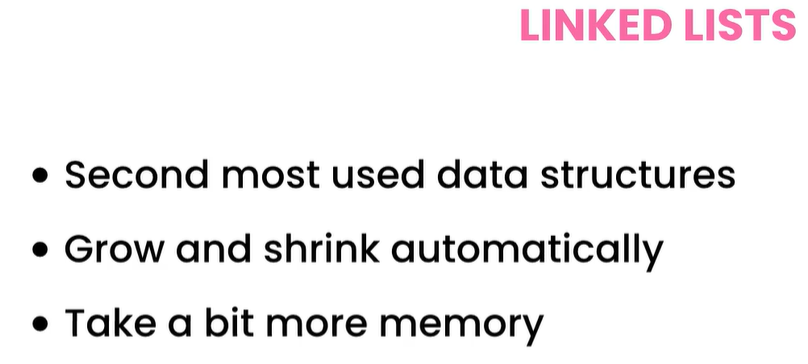

# Table of contents

- [Table of contents](#table-of-contents)
- [The Big O Notation](#the-big-o-notation)
  - [6-O(log n)](#6-olog-n)
  - [7-O(2^n)](#7-o2n)
- [Arrays](#arrays)
  - [2-Understanding Arrays](#2-understanding-arrays)
  - [3-Working with Arrays in Java](#3-working-with-arrays-in-java)
  - [4-Exercise-Array Class](#4-exercise-array-class)
  - [5-Solution-Creating the Class](#5-solution-creating-the-class)
  - [参考代码章节](#参考代码章节)
  - [9- Dynamic Arrays](#9--dynamic-arrays)
- [Linked Lists](#linked-lists)
  - [2- What are Linked Lists](#2--what-are-linked-lists)
  - [3- Working with Linked Lists](#3--working-with-linked-lists)
  - [4- Exercise- Building a Linked List](#4--exercise--building-a-linked-list)
  - [5- Solution - addLast](#5--solution---addlast)
  - [7- Solution - indexOf](#7--solution---indexof)
  - [参考代码章节](#参考代码章节-1)
  - [11- Implementing size()](#11--implementing-size)
  - [12- Converting Linked Lists to Arrays](#12--converting-linked-lists-to-arrays)
  - [13- Cheat Sheets](#13--cheat-sheets)
  - [14- Arrays vs Linked Lists](#14--arrays-vs-linked-lists)
  - [15- Types of Linked Lists](#15--types-of-linked-lists)
  - [省略章节](#省略章节)
  - [21- Summary](#21--summary)
- [Stacks](#stacks)
  - [.java](#java)
  - [2- what are stack](#2--what-are-stack)
  - [3- working with stacks](#3--working-with-stacks)
  - [4 - excercise - reversing a string](#4---excercise---reversing-a-string)
  - [省略章节](#省略章节-1)
  - [7 - solution a basic implementation - balanced expressions](#7---solution-a-basic-implementation---balanced-expressions)
  - [12 - solution - implementing a stack using an array](#12---solution---implementing-a-stack-using-an-array)
- [Queues](#queues)
  - [.java](#java-1)
  - [2 - what are queues](#2---what-are-queues)
  - [3- Queues in Java](#3--queues-in-java)
  - [4- Exercise- Reversing a Queue](#4--exercise--reversing-a-queue)
  - [5- Solution- Reversing a Queue](#5--solution--reversing-a-queue)
  - [6- Exercise- Building a Queue Using an Array](#6--exercise--building-a-queue-using-an-array)
  - [7- Solution- A Basic Implementation](#7--solution--a-basic-implementation)
  - [8- Solution- Circular Arrays](#8--solution--circular-arrays)
  - [9- Exercise- Implementing a Queue Using a Stack](#9--exercise--implementing-a-queue-using-a-stack)
  - [10- Solution- Building a Queue Using a Stack](#10--solution--building-a-queue-using-a-stack)
  - [11- Priority Queues](#11--priority-queues)
  - [12- Exercise- Building a Priority Queue](#12--exercise--building-a-priority-queue)
  - [13- Solution- Building a Priority Queue](#13--solution--building-a-priority-queue)
  - [14- Solution- Refactoring](#14--solution--refactoring)
  - [15- Queues- Exercises](#15--queues--exercises)
- [Hash Tables](#hash-tables)
  - [2- What are Hash Tables](#2--what-are-hash-tables)
  - [3- Working with Hash Tables](#3--working-with-hash-tables)
  - [4- Exercise- Find the First Non-repeated Character](#4--exercise--find-the-first-non-repeated-character)
  - [5- Solution- First Non-repeating Character](#5--solution--first-non-repeating-character)
  - [6- Sets](#6--sets)
  - [7- Exercise- First Repeated Character](#7--exercise--first-repeated-character)
  - [8- Solution- First Repeated Character](#8--solution--first-repeated-character)
  - [9- Hash Functions](#9--hash-functions)
  - [10- Collisions 碰撞](#10--collisions-碰撞)
  - [11- Chaining 链式](#11--chaining-链式)
  - [12- Open Addressing- Linear Probing 探测](#12--open-addressing--linear-probing-探测)
  - [13- Open Addressing- Quadratic 二次函数 Probing](#13--open-addressing--quadratic-二次函数-probing)
  - [14- Open Addressing- Double Hashing](#14--open-addressing--double-hashing)
  - [15- Exercise- Build a HashTable](#15--exercise--build-a-hashtable)
  - [省略章节](#省略章节-2)
  - [20- Hash Tables- Exercises](#20--hash-tables--exercises)

# The Big O Notation

## 6-O(log n)

- 随着 input 的增多，在一个时间点后，会趋近不再增加，增加很缓慢
- 二分法找数

## 7-O(2^n)

- constant O(1)
- logarithmic O(log n) 对数
- linear O(n)
- quadratic O(n^2)
- exponential O(2^n) 指数


# Arrays

## 2-Understanding Arrays

- array：在内存中，序列存储。每个位置，固定长度，所以查找时间是 O(1),可以利用 index 直接访问。
- 缺点：

  - array 是静态的，当声明一个 array 的时候，需要说明它的 size，并且 size 在之后是不能变化的。如果当初申请的空间不足，需要给一个新的更大的内存给 array，并且 copy paste，这个过程的复杂度是 O(n)
  - delete, 如果从最后删除就是 O(1)。但是如果是从第一个删除，就是 O(n)

- lookup by index O(1)
- lookup by value O(n)
- insert O(n)
- delete O(n)

## 3-Working with Arrays in Java

```java
package com.codewithmosh;

public class Main {
    public static void main(String[] args) {
        int[] numbers = new int[3];
        System.out.println(numbers);
    }
}
// result in console: [I@38af3868
// [I: the type of array
// 38af3868: address of this object in memory
```

```java
package com.codewithmosh;

import java.util.Arrays;

public class Main {
    public static void main(String[] args) {
        int[] numbers = new int[3];
        System.out.println(Arrays.toString(numbers));
    }
}
// [0,0,0]
```

```java
package com.codewithmosh;

import java.util.Arrays;

public class Main {
    public static void main(String[] args) {
        int[] numbers = new int[3];
        number[0] = 10;
        number[1] = 20;
        number[2] = 30;
        System.out.println(Arrays.toString(numbers));
    }
}
// [10,20,30]
```

```java
package com.codewithmosh;

import java.util.Arrays;

public class Main {
    public static void main(String[] args) {
        int[] numbers = {10,20,30};
        System.out.println(numbers.length);
        System.out.println(Arrays.toString(numbers));
    }
}
// 3
// [10,20,30]
```

- 如果想给这个 3 个长的 array 再加一个元素，不能在 numbers 上直接加，因为 array 是固定长度的。需要新建一个 array，将 numbers 拷贝给新 array

## 4-Exercise-Array Class

```java
package com.codewithmosh;

public class Main {
    public static void main(String[] args) {
        Array numbers = new Array(3);
        numbers.insert(10);
        numbers.insert(20);
        numbers.insert(30);
        numbers.insert(40);
        numbers.removeAt(3);
        numbers.print();
        System.out.println(numbers.indexOf(10));
    }
}
```

## 5-Solution-Creating the Class

- 参考代码：Data Structures - Part 1\src\com\codewithmosh\Array.java
- 我们需要一个 field，keep track of the number of items in this array, 不希望依赖于 items.length, 这是我们正在分配的内存，最初我们会分配 44 或者 50 items，但是我们可能只会 isnert 2 个 item 到这个 array 中。所以每一次我们 insert 新的 item 的时候，我们需要 keep track of the number of items in this array。使用 count 变量记录

## 参考代码章节

- 6- Solution- insert()
- 7- Solution- removeAt()
- 8- Solution- indexOf()

## 9- Dynamic Arrays

- 已经学了怎么样 build a dynamic array from scratch, java 有自带的两种实现动态 array 的方法：Vector and ArrayList, 都是从 java.util 来的。
- Vector：
  - grow by 100% of its size, every time it gets full
  - 所有方法都是 synchronized，只有单线程可以访问这个方法。多线程应用程序，就不能使用 vector class
- ArrayList: grow by 50% of its size
- alt + enter：自动 import package

```java
package com.codewithmosh;

import java.util.ArrayList;

public class Main {
    public static void main(String[] args) {
        ArrayList<Integer> list = new ArrayList<>();
        list.add(10);
        list.add(20);
        list.add(30);
        Sytem.out.println(list);
        // [10,20,30]

        // remove item in an index
        list.remove(0);
        // index of a given value
        list.indexOf(20);
        // last index of, return the last index of an item
        list.lastIndexOf(20);
        // boolean value
        list.contains(20);
        // number of items
        list.size();
        // convert this array list to a regular array object
        list.toArray();
    }
}
```

# Linked Lists

## 2- What are Linked Lists

- can grow and shrink automatically 可以自动增长和缩小
- node(value, address), 第一个 node 是 head。最后一个 node 是 tail
- 时间复杂度
  - 查找
    - 按值查找 O(n)
    - 按 index 查找 O(n)
  - insert
    - 头插入 O(1)
    - 尾插入 O(1)
    - 中间任何位置插入，因为要先找到这个位置，所以 O(n)
  - 删除
    - 删除第一个很快，只要把 head 指针指向第二个节点， O(1). 还需要将原本第一个节点指向第二个节点的指针 link 也删掉，使它不再指向第二个节点，否则 java 垃圾收集器会认为第一个节点依然在被使用，不会将它从内存中删除
    - 从尾巴/中间删除， O(n)

## 3- Working with Linked Lists

```java
package com.codewithmosh;

import java.util.LinkedList;

public class Main {
    public static void main(String[] args) {
        LinkedList list = new LinkedList();
        list.addLast(10);
        list.addLast(20);
        list.addLast(30);
        list.addFirst(5);
        list.removeLast();
        list.contains(10);      // 是否包含 10 这个元素
        list.indexOf(10);       // 第一个 10 的 index
        list.size();            // number of items in the list
        Sytem.out.println(list);

        var array = list.toArray();
        Sytem.out.println(Arrays.toString(array));
    }
}
```

## 4- Exercise- Building a Linked List

- Node.java

```java
public class Node {
  private int value;
  private Node next;
}
```

- LinkedList.java

```java
public class LinkedList {
  private Node first;
  private Node last;

  // addFirst
  // addLast
  // deleteFirst
  // deleteLast
  // contains
  // indexOf
}
```

## 5- Solution - addLast

- 代码参考 LinkedList.java
- 因为 class Node 是在 linked list 中声明的，我们就有权限访问它的私有 field（value）。所以我们不要 setter

```java
package com.codewithmosh;

public class Main {
    public static void main(String[] args) {
        var list = new LinkedList();
        list.addLast(10);
        list.addLast(20);
        list.addLast(30);
    }
}
```

```java
// 方法一
Node node = new Node();
// 方法二
var node = new Node();
```

## 7- Solution - indexOf

```java
package com.codewithmosh;

public class Main {
    public static void main(String[] args) {
        var list = new LinkedList();
        list.addLast(10);
        list.addLast(20);
        list.addLast(30);
        System.out.println(list.indexOf(30));
    }
}
```

## 参考代码章节

- 6- Solution- addFirst
- 8- Solution- contains
- 9- Solution- removeFirst
- 10- Solution- removeLast

## 11- Implementing size()

- 参考代码 LinkedList.java， size 方法的时间复杂度是 O(1)

## 12- Converting Linked Lists to Arrays

```java
package com.codewithmosh;

public class Main {
    public static void main(String[] args) {
        var list = new LinkedList();
        list.addLast(10);
        list.addLast(20);
        list.addLast(30);

        var array = list.toArray();
        System.out.println(Arrays.toString(array));
    }
}
```

## 13- Cheat Sheets



## 14- Arrays vs Linked Lists

双链表尾端 delete O(1)



## 15- Types of Linked Lists

- 单链表 singly：头指向尾
- 双链表 doubly：每个节点都互相指向对方，好处是删除结尾一个时间复杂度是 O(1)
- 循环链表 circular: 头指向尾，最后一个尾指向头

## 省略章节

- 16- Exercise- Reversing a Linked List
- 17- Solution- Reversing a Linked List
- 18- Exercise- Kth Node from the End
- 19- Solution- Kth Node from the End
- 20- Linked Lists- Exercises

## 21- Summary



# Stacks

## .java

- Stack.java
- StringReverser.java
- Expression.java
- TwoStacks.java
- MinStack.java

## 2- what are stack

- 时间复杂度，均为 O(1)
- push(item)
- pop()
- peek()
- isEmpty()

## 3- working with stacks

```java
package com.codewithmosh;

import java.util.Stack;

public class Main {
    public static void main(String[] args) {
        Stack<Integer> stack = new Stack<>();
        stack.push(10);
        stack.push(20);
        stack.push(30);
        System.out.println(stack);    // [10, 20, 30]
        var top = stack.pop();
        System.out.println(top);      // 30
        System.out.println(stack);    // [10, 20]
        top = stack.peek();           // peek 只是查看，不会移除
        System.out.println(top);      // 20
    }
}
```

## 4 - excercise - reversing a string

参考代码 StringReverser

```java
package com.codewithmosh;

import java.util.Stack;

public class StringReverser {
  public String reverse(String input) {
    if (input == null)
      throw new IllegalArgumentException();

    Stack<Character> stack = new Stack<>();

    // method one:
    // for (int i = 0; i < input.lenght(); i++)
    //     stack.push(input.chartAt(i));

    // method two:for each loop
    for (char ch : input.toCharArray())
      stack.push(ch);

    // method one: 会有很多string concatenations 字符串连接,
    // 花费多。每一次跑这个方法，一个新的string object会在内存中被生成。
    // 因为 string 在 java 中是不可变量，不可以修改它
    // 如果修改一个 string，一个新的内存 is allocated，一个字符串会被拷贝进去
    // String reversed = "";
    // while (!stack.empty())
    //   reversed += stack.pop();

    // method two
    StringBuffer reversed = new StringBuffer();
    while (!stack.empty())
      reversed.append(stack.pop());

    return reversed.toString();
  }
}
```

```java
package com.codewithmosh;

import java.util.Stack;

public class Main {
    public static void main(String[] args) {
        String str = "abcd";

        StringReverser reverser = new StringReverser();
        var result =  reverser.reverse(str);
        System.out.println(result);
    }
}
```

## 省略章节

- 5- Solution - Reversing a String
- 6- Exercise- Balanced Expressions
- 8- Solution- Supporting Other Brackets
- 9- Solution- First Refactoring
- 10- Solution- Second Refactoring
- 11- Exercise- Building a Stack Using an Array
- 13 - stacks - excerises

## 7 - solution a basic implementation - balanced expressions

参考代码 Expression.java

```java
for (char ch : input.toCharArray()) {
    if (ch == '(' || ch == '[' || ch == '{' || ch == '<')
        stack.push(ch);
    if ( ch == ')' || ch == ']' || ch == '}' || ch == '>' )
        if (stack.empty()) return false;

        var top = stack.pop();
        if (
            ( ch == ')' && top != '(' ) ||
            ( ch == ']' && top != '[' ) ||
            ( ch == '}' && top != '{' ) ||
            ( ch == '>' && top != '<' ) ||
        ) return false;
}
```

```java
package com.codewithmosh;

import java.util.Stack;

public class Main {
    public static void main(String[] args) {
        String str = "(1 + 2(";

        Expression exp = new Expression();
        var result = exp.isBalanced(str);
        System.out.println(result);
    }
}
```

## 12 - solution - implementing a stack using an array

参考代码 Stack.java

```java
package com.codewithmosh;

public class Main {
    public static void main(String[] args) {
        Stack stack = new Stack();
        stack.push(10);
        stack.push(20);
        stack.push(30);
        System.out.println(stack);
    }
}
```

# Queues

## .java

- ArrayQueue.java
- QueueWithTwoStacks.java
- PriorityQueue.java
- QueueReverser.java
- LinkedListQueue.java
- StackWithTwoQueues.java

## 2 - what are queues

- 时间复杂度均为 O(1)
- enqueue
- dequeue
- peek
- isEmpty
- isFull

## 3- Queues in Java

- Queue
  - ArrayDeque - array double queue - has two ends, you can add items from any direction, from left or from right, from front or from back. internally this class uses the resizable array to store the items
  - LinkedList
- enqueue - add() / offer() 返回值是 Boolean，如果 queue 已经满了，add 会抛出异常，但是 offer 不会
- remove() / poll() 返回值是一个 items，如果 queue 已经空了，remove 会抛出异常，poll 会返回 null
- element() / peek() , 如果 queue 空了，element 抛出异常，peek 返回 null


## 4- Exercise- Reversing a Queue

- public static void reverse(Queue<Integer> queue)
- 只允许使用 add remove isEmpty

## 5- Solution- Reversing a Queue


## 6- Exercise- Building a Queue Using an Array


## 7- Solution- A Basic Implementation

- ArrayQueue.java

## 8- Solution- Circular Arrays


- ArrayQueue.java
  - 改写一下部分，以实现尾连头

```java
public void enqueue(int item) {
  if (isFull())
    throw new IllegalStateException();

  items[rear] = item;
  rear = (rear + 1) % items.length;
  count++;
}
```


## 9- Exercise- Implementing a Queue Using a Stack

## 10- Solution- Building a Queue Using a Stack

- QueueWithTwoStacks.java


## 11- Priority Queues

- 结果是 1235


## 12- Exercise- Building a Priority Queue


## 13- Solution- Building a Priority Queue

- PriorityQueue.java

## 14- Solution- Refactoring

## 15- Queues- Exercises

- solutions
  - QueueReverser.reverse()
  - LinkedListQueue
  - StackWithTwoQueues

# Hash Tables

## 2- What are Hash Tables

- hash table
  - Java - HashMap
  - JavaScript - Object
  - Python - Dictionary
  - C# Dictionary
- hash function
  - deterministic: every time we give it the same input it return the same value
  - we can use it both storing and retrieving object
- hash table support operations, all O(1), 因为 hash function 会告诉我们他们在内存的什么地方，不需要遍历
  - insert
  - lookup
  - delete

## 3- Working with Hash Tables

- google java map interface
  - interface Map<K,V>
  - 常用的 Map：
    - HashMap
      - 允许 both null key null value
    - ConcurrentHashMap - multi threaded applications

```java
public class Main {
  public static void main(String[] args) {
    Map<Integer, String> map = new HashMap<>();
    map.put(1, "Ching");
    map.put(2, "John");
    map.put(3, "Mary");
    // {1=Ching, 2=John, 3=Mary}
    System.out.println(map);

    map.put(1, "Ching");
    map.put(2, "John");
    map.put(3, "Mary");
    map.put(3, "Marianne");
    // {1=Ching, 2=John, 3=Marianne}
    System.out.println(map);

    map.put(null, null);
    map.remove(null);

    var value = map.get(3);
    System.out.println(value);

    map.containsKey(3);           // O(1)
    map.containsValue("Ching");   // O(n)

    // 1,2,3
    for (var item : map.keySet())
      System.out.println(item);

    // 1=Ching,2=John,3=Mary
    for (var item : map.entrySet())
      System.out.println(item);
      // item.getKey()
      // item.getValue()
  }
}
```

## 4- Exercise- Find the First Non-repeated Character

给定一个 string，找到其中不重复的字符

## 5- Solution- First Non-repeating Character

- CharFinder.java

## 6- Sets

- set 类似 map，只是没有 value，只有 key。也是不允许重复
- Interface Set<E>
  - 常用：HashSet


## 7- Exercise- First Repeated Character

## 8- Solution- First Repeated Character

- CharFinder.java

## 9- Hash Functions

- the hash table should map key to an index value, the index at which we should store the value. this is the job of hash function
- hash value, hash code, hash
- 在 hash table 这种数据结构中 hash value 应该是一个 index 值

- 将长 int 转换为 0-99 之间的 int


- 将 string 转化为 0-99 之间的 int。下图中最后一行改成 hash % 100


## 10- Collisions 碰撞

- 两个 key 经过 hash function 转换，得到了同样的 value，就称之为 Collisions
- 方法一：have each cell in our array point to a linked list, we are not going to store the values in the array, we are going to store them in the linked list. 如果出现重复，我们将重复的值添加到链表的尾部。这被称为 chaining
- 方法二：find a different slot for storing the second value, 这被称之为 open address, 因为我们找到一个新的地址去存储第二个值

## 11- Chaining 链式

- 我们有一个 0-4 的 array 用来保存 items，每个 cell 被称为 bucket/slot
- k=6 v=A - 6 % 5 = 1
- k=8 v=B - 8 % 5 = 3
- k=11 v=C - 11 % 5 = 1


## 12- Open Addressing- Linear Probing 探测

- 位置已满的时候，顺着这个位置向后，直到找到空位

## 13- Open Addressing- Quadratic 二次函数 Probing

## 14- Open Addressing- Double Hashing


## 15- Exercise- Build a HashTable


- HashTable.java

## 省略章节

- 16- Solution- put()
- 17- Solution- get()
- 18- Solution- remove()
- 19- Solution- Refactoring

## 20- Hash Tables- Exercises

- solutions
  - HashTableExercises.mostFrequent()
  - HashTableExercises.countPairsWithDiff()
  - HashTableExercises.twoSum()
  - HashMap
