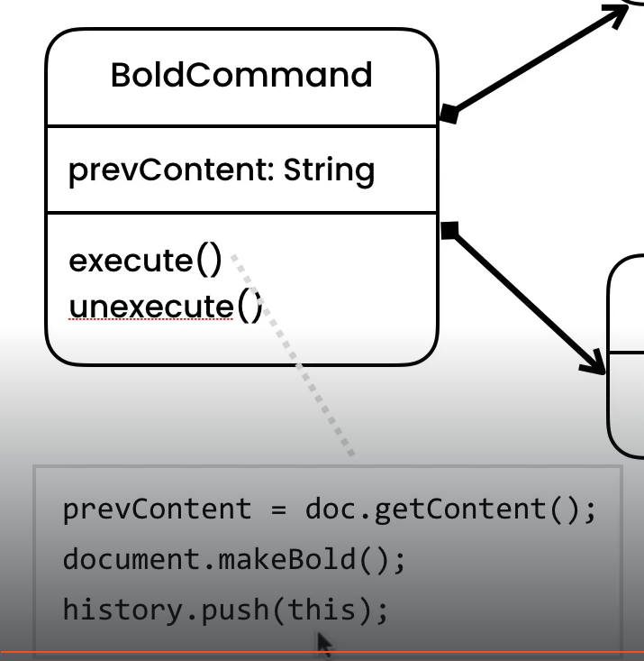

# Summary

- S - 类职责单一原则： 即职责划分要清晰，不同职责的不要搅和在一起。每个类应该只有一个让他发生改变的原因。
- O - 开放封闭原则： 对扩展开发，对修改封闭。即如果系统要变化，就去扩展、新增新类，不要修改现有的类。
- L - LISKOV 原则： 子类应该能充分覆盖父类，并且让使用者分不出差别。
- I - 接口分离原则：每个接口只管一个功能，不要出现“胖接口”。增加功能时，要加接口，而不是改接口
- D - 依赖倒置原则：具体应该依赖于抽象，而不是抽象一来于具体，即低层要依赖于高层。

- 创建型模式：对象实例化的模式，创建型模式用于解耦对象的实例化过程。单例, 工厂方法, 抽象工厂, 建造者, 原型
- 结构型模式：把类或对象结合在一起形成一个更大的结构。适配器, 桥接, 装饰, 外观, 亨元, 代理
  - 组合 Coposite
- 行为型模式：类和对象如何交互，及划分责任和算法。
  - 备忘录 Memento：将记事簿和记事簿状态分开两个 class，history 保存记事簿状态
  - 状态 State：画板 + 工具，工具就是 state, 类的行为是基于它的状态改变的
  - 迭代器 Iterator：每个类中有自己的 iterator 的定义，main 中使用这些类时 iterator 的格式保持不变
  - 策略 Strategry：策略对象改变 context 对象的执行算法
  - 模板 Template method: Task 中定义一个执行步骤 template（必须执行记录 user 和时间），按步骤 call abstract method，Task 的子类 overrid 这些抽象方法
  - 命令 Command
  - 观察者 Observer
  - 中介者 Mediator
  - 责任链 Chain of Responsibility
  - 访问者 Visitor
  - 解释器

# The Essentials

- code：Demos

## 5- Interfaces

- 使用 interface 是为了去耦合（耦合是一个 class 使用或者说 depend on 另一个 class 的情况）。
- 这意味着一个类可以依赖于接口而不是具体的实现类，从而使代码更容易扩展和维护。这也有助于实现松散耦合的设计原则。
- interface: a contract that specifies the capabilities that a class should proivde

### 例子：报税计算器

- 代码参考 TaxCalculator TaxCalculator2019 TaxCalculator2020

```Java
public class Main {
  public static void main(String[] args) {
    TaxCalculator calculator = getCalculator();
    calculator.calculateTax();
  }

  public static TaxCalculator getCalculator() {
    return new TaxCalculator2019();
  }
}
```

- 报税计算器，每年规则都会变化。但是，所有报税计算机的共性是什么呢？他们应该都是一个叫做 calculate tax 的方法
- 在主方法中，我们有一个 dependency 或者说耦合 to internface TaxCalculator
- 这个 interface，只有一个方法，叫做 calculateTax
- As long as we keep the signature of this method exactly as is, we're not going to have a breaking change. this is how we achieve loose coupling
- 只要我们完全保持此方法的签名不变，就不会发生重大更改。 这就是我们实现松耦合的方式
- 在 TaxCalculator2029 中添加 calculateInsurance，这不会影响到 main 函数，因为我们是使用的 interface，而不是一个具体的 implementation
- 但是你会问，return new TaxCalculator2019(); 这句话中，我们使用了 TaxCalculator2019，如果这个类有任何变化，这个类会重新编译，这就意味着主函数也会重新编译。这个例子只是一个说明，在真正的企业应用中，我们不会这样写。我们会使用一个叫做依赖注入的框架，给我们真正的接口实现

## 6- Encapsulation 封装

- Account.java
- 使用 setter 的原因是，如果类变量是公有的，就可以再 main 函数中修改 balance，这是危险的，比如将 balance 改成-1。应该将类变量设为私有，利用 setter 修改这个变量，在 setter 中添加 validation
- Encapsulation: bundling the data(private variable), and methods that operate on the data(getter, setter) within one unit or one class. and hiding the values or state of an object inside the class. with this we can create robust applications, we can prevent our object from going in an invalid state
- 将数据（私有变量）和对数据进行操作的方法（getter、setter）捆绑在一个单元或一个类中。 并隐藏类内对象的值或状态。 这样我们就可以创建健壮的应用程序，我们可以防止我们的对象进入无效状态

## 7- Abstraction

- Abstraction: we should reduce complexity by hiding unnecessary details in our classes
- 这就类似于遥控器，每个按键被按的时候，内部有很多电极，不必暴露电极具体操作，只需暴露按键。这就是抽象原则：我们需要隐藏类中不必要的细节，这会帮助我们减少复杂度。
- 例子：MaiService.java
- 将类内部使用的方法，类方法设为私有，以免在外部访问的时候，一个类实例可以访问到过多的函数

## 8- Inheritance

- UIControl.java
- TextBox.java
- 每一个子类不需要重复写 enable()

## 9- Polymorphism

- 每一个子类可以自定义 draw()

## 10- UML

- UML: Unified Modeling Language
  - 第一行是类名，第二行是类变量，第三行是类方法
  - -: private, +: public


- inheritance relationship:


- composition relationship:the shape class is composed of the size class


- dependency relationship: somewhere in the shap class, we have a reference to the document class. render method has a private parameter of document, document is not a field in the class, but it is used somewhere in the class, in this case it is parameter, but it could also be a local variable defined in the render method. somewhere in the shape class we have a reference or a dependency to the document class
- 依赖关系：在 Shape 类的某处，我们有一个对 Document 类的引用。render 方法具有一个私有参数 document，document 不是类中的字段，而是在类中的某个地方使用，此处是一个参数，但它也可以是在 render 方法中定义的局部变量。在 Shape 类的某处，我们有一个对 Document 类的引用或依赖关系。


总结：

1. 继承：长方形 是 shape 的继承，子类
2. 组成：size 是 shape 的组成，是 shape 的类变量
3. 依赖：document 是 shape 的类方法的一个参数

# Memento Pattern

## 1- The Problem

- 为了实现 undo 操作
- prevContents 应该是一个 list，否则只能 undo 一次
- 每次加一个 field，就需要加一个 prevTitles/prevContents，not extensible


## 2- Solution

  

- EditorState 类：这个类完全负责在给定时间保存编辑器的状态（内容/标题等）。
- Editor 类有两个职责：其中之一是状态管理，另一个是提供编辑器所需的功能。我们需要将所有状态管理工作从 Editor 类中移出，因此不应该在 Editor 类中有 prevStates。
- History 类用于状态管理，它跟踪编辑器状态的变化。
- History 类将存储多个 EditorState 对象。
- Editor 类：createState()方法：将编辑器的当前状态（例如：内容/标题）保存在 EditorState 对象中并返回它。我们调用 createState()方法并说：“嗨，保存你的当前状态并给我”，然后我们会得到一个 EditorState 对象，然后调用 History 类的 push 方法，说：“嗨，历史记录，保存这个状态。”
- restore()方法接受一个 EditorState 对象，并将编辑器恢复到该状态。
- 因此，它将根据我们在该状态对象中拥有的内容重新设置它的字段（内容）。
  

## 3- Implementation

- 代码参考 Design Patterns - Part 1/Demos/src/com/codewithmosh/memento

```java
public class Main {
  public static void main(String[] args) {
    var editor = new Editor();
    var history = new History();

    editor.setContent("a");
    history.push(editor.createState());

    editor.setContent("b");
    history.push(editor.createState());

    editor.setContent("c");
    editor.restore(history.pop());

    System.out.println(editor.getContent());
    // console print: b

    editor.restore(history.pop());
    System.out.println(editor.getContent());
    // console print: a
  }
}

```

## 4-Excercise

- start code is in Design Patterns - Part 1/Excercises/src/com/codewithmosh/memento
- result code is in Design Patterns - Part 1/Solutions/src/com/codewithmosh/memento

  

- Editor ---> Document
- EditorState ---> DocumentMemento

# State Pattern

## 1-The Problem

画布，落笔（显示不同的 icon），起笔（画成不同的形状），每次被选择了不同的画笔，起落笔的内容不同。这就有一个问题，当画笔的种类越来越多，这部分代码就难以维护。而且多个 if else 也会更慢。第三，不具备可扩展性。比如说，未来添加一个画笔，我们需要去不同的地方做变化，比如落笔，起笔两处位置

  

## 2-Solution

  

cotext：上下文  
state：状态

  

## 3-Implementation

## 5-Abusing the State Pattern

- stop watch 正常用法：

  

  - 结果中 running stop 交替出现

  

- abuse，代码参考 Design Patterns - Part 1/Demos/src/com/codewithmosh/state/abuse：
  - stop watch
  - state
  - running state
  - stop state

## 6-Excercise

  

# Iterator Pattern

## 1-The Problem

- 代码参考 Design Patterns - Part 1/Demos/src/com/codewithmosh/iterator

BrowseHistory.java

```java
package com.codewithmosh.iterator;

import java.util.ArrayList;
import java.util.List;

public class BrowseHistory {
  private List<String> urls = new ArrayList<>();

  public void push(String url) {
    urls.add(url);
  }

  public String pop() {
    var lastIndex = urls.size() - 1;
    var lastUrl = urls.get(lastIndex);
    urls.remove(lastUrl);

    return lastUrl;
  }

  public List<String> getUrls() {
    return urls;
  }
}
```

main.java

```java
package com.codewithmosh;

import com.codewithmosh.iterator.BrowseHistory;

public class Main {
  public static void main(String[] args) {
    var history = new BrowseHistory();
    history.push("a");
    history.push("b");
    history.push("c");

    for (var i = 0; i < history.getUrls().size(); i++){
      var url = history.getUrls().get(i);
      System.out.println(url);
    }
  }
}
```

- 在以上的实现中，有一个问题。如果明天，我们决定使用一种不同的数据结构，来存储 urls list，比如说 stack 或者 a fixed size array（我们只想存储最后 10 个 urls）。我们的 main class 可能会 break。
- 在 BrowseHistory 中有几个地方需要修改： List\<String> 变成 String[\]。更麻烦的是在 main 中，history.getUrls()会产生 array，String[\]（array）数据结构没有.size() .get()方法。那么每个用到 BrowseHistory 的地方都需要修改。
- changing the internals of an object should not affect its consumers. 就好像遥控器，内部的改变不应该迫使外部按键变化。

## 2-Solution

  

## 3-Implementation

- 以下是与 demo 中的 BrowseHistory.java 不同的另一个 BrowseHistory.java。main 中使用两种不同的 BrowseHistory.java，却不需要在 main 中做任何修改

```java
package com.codewithmosh.iterator;

import java.util.ArrayList;
import java.util.List;

public class BrowseHistory {
  private List<String> urls = new ArrayList<>();

  public void push(String url) {
    urls.add(url);
  }

  public String pop() {
    var lastIndex = urls.size() - 1;
    var lastUrl = urls.get(lastIndex);
    urls.remove(lastUrl);

    return lastUrl;
  }

  public Iterator createIterator() {
    // here need to pass a reference to a history object, the history object, we want to iterate over
    return new ListIterator(this);
  }

  public class ListIterator implements Iterator {
    private BrowseHistory history;
    private int index;

    public ListIterator(BrowseHistory history) {
      this.history = history;
    }

    @Override
    public boolean hasNext() {
      return (index < history.url.size());
    }

    @Override
    public String current() {
      return history.urls.get(index);
    }

    @Override
    public void next() {
      index++;
    }
  }
}
```

main.java

```java
package com.codewithmosh;

import com.codewithmosh.iterator.BrowseHistory;

public class Main {
  public static void main(String[] args) {
    var history = new BrowseHistory();
    history.push("a");
    history.push("b");
    history.push("c");

  Iterator iterator = history.creatIterator();
  while (iterator.hasNext()) {
    var url = iterator.current();
    System.out.println(url);
    iterator.next();
  }
  }
}
```

## 5-Exercise

In the Exercises project, look at the iterator/ProductCollection class. This class only allows us to add a product to a collection. Once we add a bunch of products to a collection, there is no way to iterate that collection and print the products. Implement this feature using the iterator pattern.  
代码参考问题： Design Patterns - Part 1/Exercise/src/com/codewithmosh/iterator  
代码参考答案： Design Patterns - Part 1/Solutions/src/com/codewithmosh/iterator

# Strategy Pattern

## 1- The Problem

- 这个类不只是存储 image，还负责 compress image 和 filter image

```java
package com.codewithmosh.strategy;

public class ImageStorage {
  private String compressor;
  private String filter;

  public ImageStorage(String compressor, String filter) {
    this.compressor = compressor;
    this.filter = filter;
  }

  public void store(String fileName, Compressor compressor, Filter filter) {
    // JPEG, PNG, ...
    // B&W, High Contrast

    if (compressor == 'jpeg')
      System.out.println("Compressing using JPEG");
    else if (compressor == 'png')
      System.out.println("Compressing using PNG");


    if (filter == 'b&w')
      System.out.println("Applying B&W filer");
    else if (filter == 'high-contrast')
      System.out.println("Applying high contrast filer");
  }
}
```

## 2- Solution

- 图 1
  

- 图 2

  

- 图 3
- context maintain a reference to strategy 上下文维护对策略的引用
- strategy is an interface or an abstract class that represents an algorithm, like a image compression algorithm
- 然后就是有不同的 class，实现这个算法

  

- Strategy Pattern 类似 state pattern
- 相同点：we use both these patterns to change the behavior of an object
- 比如说，canvas object 根据 current tool， 可以有不同的行为
- 这两个 pattern 的不同之处在于: state pattern 中，画布 object 只能有一个 state，which is current tool，所有的行为，are represented by a subclass of this tool interface
- Strategy Pattern，我们没有一个 single state。不同的行为，are represented using different objects

- 图 4
  

- 图 5

  

## 3- Implementation

```java
package com.codewithmosh;

import com.codewithmosh.strategy.ImageStorage;
import com.codewithmosh.strategy.JpegCompressor;
import com.codewithmosh.strategy.BlackAndWhiteFilter;

public class Main {
  public static void main(String[] args) {
    // var imageStorage = new ImageStorage(
    //   new JpegCompressor(), new BlackAndWhiteFilter());
    // imageStorage.store('a');

    var imageStorage = new ImageStorage();
    imageStorage.store('a', new JpegCompressor(), new BlackAndWhiteFilter());
    imageStorage.store('a', new PngCompressor(), new BlackAndWhiteFilter());
  }
}
```

## 4- Excerise

Exercise

In the Exercises project, look at the strategy/ChatClient class. This class uses an encryption algorithm to encrypt a message before sending it out.

What are the problems in this implementation? Refactor the code using the strategy pattern. What are the benefits of the new implementation?

# Template Method Pattern

## 1-The Problem

- 每次 user performs a task, 我们需要记录，谁，什么时候，做了什么，within an audit trail 在审计追踪中
- 比如我们有两种 tasks: 转账，生成报告
- 我们不想实现这些 tasks，as 单一类中的不同方法。因为每次我们想变化任务，都需要回到那个类改变它
- 我们需要 system: close for modifications and open for extensions
- 所以我们需要 represent each task using a separate class

```Java
public class AuditTrail {
  // 在真实app中，这个方法需要一个参数，for capturing info about who 在进行现在的任务
  public void record() {
    System.out.println("Audit");
  }
}
```

```Java
public class TransferMonqyeTask {
  private AuditTrail auditTrail;

  public TransferMoneyTask(AuditTrail auditTrail) {
    this.auditTrail = auditTrail;
  }

  public void exucute() {
    // 每一次转账，我们都需要记录，是谁在进行这个操作。我们需要将这些信息保存在auditTrail中
    auditTrail.record();

    System.out.println("Transfer Money");
  }
}
```

```Java
public class GenerateRecordTask {
  private AuditTrail auditTrail;

  public GenerateRecordTask(AuditTrail auditTrail) {
    this.auditTrail = auditTrail;
  }

  public void exucute() {
    auditTrail.record();

    System.out.println("Generate Record");
  }
}
```

- 第一个问题是，code 重复
- 第二个问题是，没有人强制我们使用这个结构，如果明天有一个新程序员，新建一个新 task，without follow 这种结构。我的 task 不会 record the current task in an audit trail

## 2-Solution

- 有两种方法解决这问题：

- 方法一：多态原则 ---> strategy pattern


- 方法二：继承：Task 类，在 execute 中 call doExecute。doExecute 是抽象的，所以 Task 类也是抽象的，灰色
- template method pattern: 我们执行的方法 method，定义了一个操作的 template/skeleton。method --- Task 中的 execute, template --- 必须执行 auditTrail.record()


- AbstractClass 中包含一个 templateMethod()，已经多个抽象的 primitive operations，这些抽象方法，被 template method call
- 我们也有 ConcreteClass 对于上面那个抽象类扩展，覆写/实现 primitive operations


- primitive method 也可以不是抽象的，可以给他们定义一些 default implementation，让子类决定是否 override 这些方法
- we refer to this method as hooks


## 3-Implementation

- issue：public TransferMoneyTask(AuditTrail auditTrail) 方法报错
- task 中没有默认构造方法（没有参数列表的构造方法）。更准确的说，父类中没有初始化 AuditTrail 对象可用
- 当 create a TransferMoneyTask 类的时候，我们需要将 AuditTrail 对象传递给父类的构造函数（方法一），或者想办法在父类中初始化一个 AuditTrail（方法二）

- 方法一：在 TransferMoneyTask 类中，重写 TransferMoneyTask 方法
- this 指向本类，super 指向父类

```java
public TransferMoneyTask(AuditTrail auditTrail) {
  super(auditTrail)
}
```

- 方法二：demo 代码中的方法，在 task 类中新建一个默认构造函数
- 有了这个默认构造函数，我们可以在外部传递 audit trail object
- 如果你想在不同 task 中，share an audit trail, 这个方法会有用
- 有参数的 task 构造函数，对于 deal with interface，有用。可以 decouple task class from the audit trail class, swap an implementation of the audit trail from outside

```java
public Task() {
  auditTrail = new AuditTrail();
}
```

- 结核 demo code 看
- main：

```Java
public class Main {
  public static void main(String[] args) {
    var task = new TransferMoneyTask();

    // 使用了 protected 以后，就不能在 task 外部访问 doExcute 了。直接执行doExcute，会跳过audit trail这步骤，这是错误的
    task.doExcute();

    // 使用了 protected 以后，只能看到 execute 了，看不到 doExcute 了
    task.execute();
  }
}
```

## 4-Exercise

Exercise

In the Exercises project, look at the template/Window class. This class represents a window in a GUI framework. Application developers can use this framework to build desktop applications.

The Window class has a method for closing a window. Certain windows may need to execute some code before or after a window is closed.

We cannot hardcode this behaviour in the Window class because the code that needs to be executed is different from one window to another.

Use the template method pattern to solve this problem.

# Command Pattern

## 1-Problem

button 中，click 方法，对于不同的 button，有不同的功能。在写 button 这个类的时候，我们不知道具体的 click 是什么

## 2-Solution

- 当建立 button 的时候，我们不知道 customer service 是什么样的。
- 需要让 button 与 interface command 对话，在 button 中 click 的时候，call execute in command。将实际的工作交给 execute 方法


- 将 invoker/sender 和 receiver 解绑。invoker 可以与 receiver 对话，without being aware of it
- command pattern 的好处:
  - 将 sender 和 receiver decouple
  - 因为我们使用 command object 来代表每个 request。我们可以将它们作为参数传给我们的方法，我们可以将他们添加到一个 list。比如说，我们可以追踪所有的已经执行过的 command，重复执行，或者取消。也可以在数据库中存储，在未来执行


## 3-Implementation

fx: framework

```Java
public class Main {
  public static void main(String[] args) {
    var service = new CustomerService();
    var command = new AddCustomerCommand(service);
    var button = new Button(command);
    button.click();
    // 屏幕上会打印 ‘Add customer’
  }
}
```

## 4-Composite commands

- 黑白命令，resize 命令...
- CompositeCommand,将所有命令存成 list，一次执行

```Java
public class Main {
  public static void main(String[] args) {
    var composite = new CompositeCommand();
    composite.add(new ResizeCommand());
    composite.add(new BlackAndWhiteCommand());
    composite.execute();
    composite.execute();
    // 可以多次执行
  }
}
```

## 5-Undoable commands

- 记事簿 pattern 与取消命令的区别：Memento paatern we store the changes in the state of an object, 所以随着时间保存多个快照，有时，保存这些快照是很贵的。比如说保存视频快照。在这种情况下，最好使用命令模式，因为每个命令知道如何取消他自己，那么就不用保存快照了
- 比如说 resize 操作，如果用户 resize video，我们只需要保存 original 尺寸，而非整个视频对象的快照，你只需要保存前一次的尺寸
  

- bold command 用法

  

  

  

- bold 命令中的类变量是 preContent，如果是 resize 命令，这个类变量应该是 preDimension
- history 有两个方法，push，pop
- unexecute 方法，如果是 resize 命令，就将 setSize(prevDimentsion)

# Observer Pattern

## 1-The Problem

- 当 data and object 变化时，我们需要将这个变化 notify 通知其他 object

## 2-Solution

- 在 datasource 中我们需要维护 a list of observer,所以 DataSource 与 Observer 之间是一个组成关系
- 为什么不再 setValue 中 notifyObservers：如果有多个 field，他们的更新是独立的，我们不想在多个位置重复 notifyObservers 的逻辑


## 3- Implementation

- 以下的 chart 是 push style 的


## 4-Communication Styles

- subject 变化的时候，subject 利用 calling update 方法的方式，通知 observer，observer get notified, 但是 observer 无法知道具体变化内容，需要给它传递 value
- 但是以上方法有一个问题：如果未来有一个新的 concrete observer, and that observer need a different set of values. 那么我们就需要回到 observer，改变这个 interface，需要引入一个新参数，或者改变 value（the object that is passed over here, we have to introduce new fields in that class）
- 所以以上方法不灵活的，subject is making assumptions about this observers, 它假设，当变化发生的时候这个 observer 需要这个 value
- 但是如果不同的 observer，需要不同的 value 怎么办呢


- 这就需要使用 pull style 了
- 不好的 coupling 是指在 concrete subject and concrete observer 中的，以下的 coupling 是好的，是 between the concrete observer and concrete subject 的。坏的：data source class 依赖于 chart or spreadsheet，因为后两个类未来会变化。第二我们未来会引入新的 observer，我们不希望每个新的 observer 加入的时候，都改变 data source or subject class


## 5-The Push Style


- subject class


- DataSource class


## 7-Exercise


# Mediator Pattern

## 1-The Problem

- 他们之间需要互相通信，当选择了一个 artical in a list box 的时候，text box 应该会显示被选择的 title，并且 button 应该变成 enabled
- 当我们清除文章的 title 的时候，save button 应该变成 disabled
- 问题是，我们不能 access list box 类的源代码，即使能访问，也不能修改。这应该是一个可复用的 list box, 我们不应该修改它的源码
- 因为这种合作会变化，所以 list box 不应该知道有关于 text box 或者 button 的任何事，或者任何其他种类的 user interface object
- 中介者就很适合这类问题，多个 object 之间需要通信


## 2-Solution

- 方法一：继承。这个方法的问题在于，如果 box 越来越复杂，我们会在类之间有很多连接或者说依赖。如果你想看出来，这些变化之间的关系，你需要每个类都阅读一遍，但是随着这几个类越来越复杂，读懂和维护成本会急剧上升


- 方法二：
  - Mediator：dialog class
  - ConcreteMediator: artical dialog class
  - colleague: UI interface
  - ConcreteColleague: ListBox, TextBox, ButtonBox


## 3-Implementation

- DialogBox


- UI Interface


- Button.java


- ArticalesDialogBox


- main
- simulateUserInteraction, 只写第一行，main 的结果是如图
- simulateUserInteraction，再写第二行 titleTextBox.setContent（“”）,main 的结果显示为：TextBox: null, Button: false


## 4-Using the Observer Pattern


## 5-Implementation Using the Observer Pattern

参考 demo 中的代码

# Chain of Responsibility

## 1-The Problem

- 执行顺序在 WebServer handle 中是 hard coded 的
- 比如说未来，我们想 disable login，我们必须回到这个类中，改变这个类的代码
- 再比如，如果我们想添加一个步骤，我们需要回到这个类中，改变 code
- 利用 Chain of Responsibility Pattern，我们可以建立一个 pipeline 或者处理 request 的 a chain of objects


- Authenticator:根据 HttpRequest 中包含的用户和密码，判断
- HttpRequest:包含类属性，用户和密码
- Logger:print logger

## 2-Solution


## 3-Implementation

- 我们需要一个 template 或者说 blueprint 蓝图 for handling request
- 在这个 template 中，我们会有一个 concrete handler handle a request
- 如果 request 完全被 handled 了，我们就会在这里停止 process
- 否则，我们就会继续 call next handler in the chain
- 所以我们能实现类中 template 的逻辑
- 查看 demo
- 下图中 console 的结果是 Authentication Log Compress


- 如果不想使用 log 这步，将 var logger 这行 comment 掉，给下一行 Authenticator(compressor)传入 compressor 参数
- 简简单单，添加一步 encryptor


## 4-Excercise


# Visitor Pattern

## 1-The Problem

- 违反开闭原则，因为每一次，我们想引入一个新的 method，我们需要改变我们 object 结构的每个 type


## 2-Solution

- 这种 pattern 适用于 object structure 比较固定的情况，html 的 node 就那么 2-30 个


## 3-Implementation

- console 中：text-heading text-anchor


## 4-Exercise


