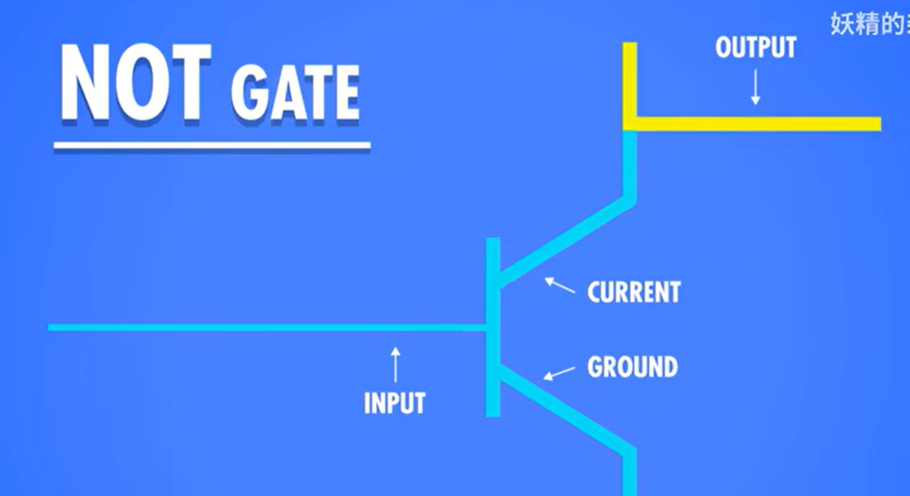
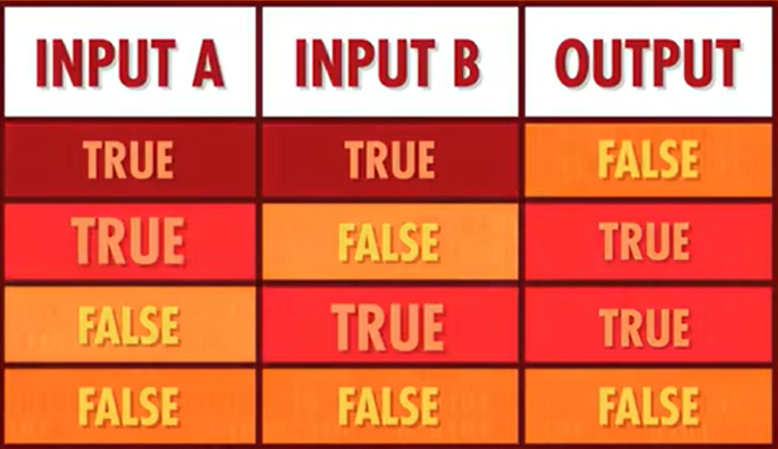
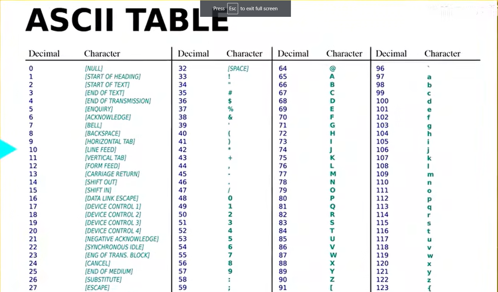
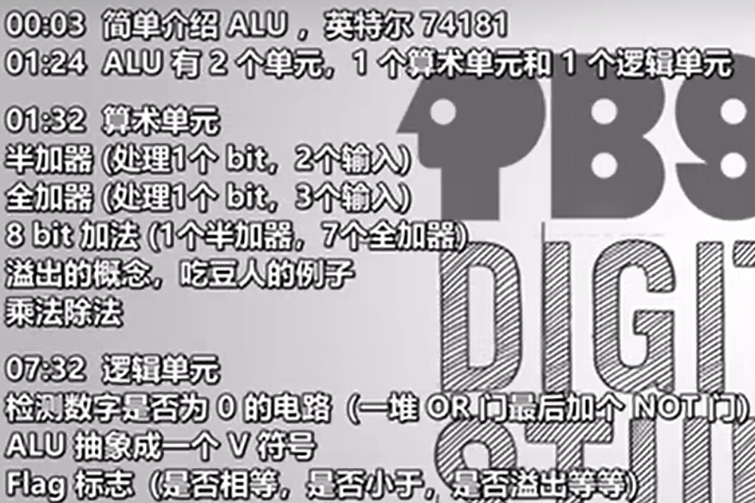
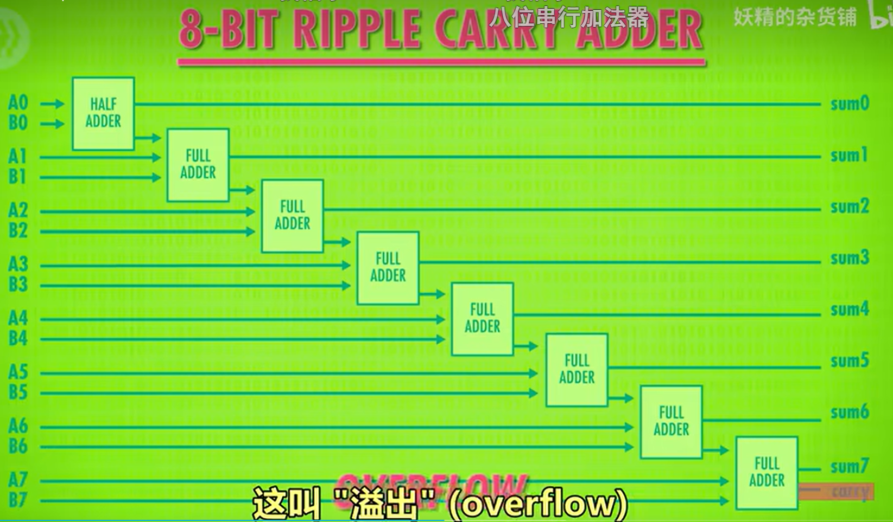
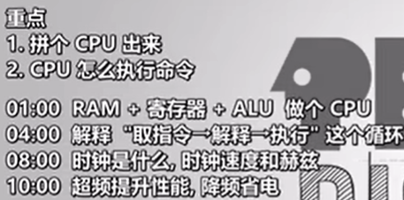

[Youtube: Crash Course Computer Science](https://www.youtube.com/watch?v=tpIctyqH29Q&list=PLH2l6uzC4UEW0s7-KewFLBC1D0l6XRfye&index=1)  
[Bilibili: 计算机科学速成课](https://www.bilibili.com/)

# 1. 计算机早期历史

# 2. 电子计算机（晶体管，半导体）

# 3. 布尔逻辑和逻辑门（与或非）

一个 gate 就是可以通电流作为输入（control wire），the wire coming from the bottom electrodoe as the output

可以利用晶体管，形成各种逻辑门  
异或 XOR

# 4. 二进制

- bit binary digit, 0/1
- byte 是字节，1 byte = 8 bits, 8 位（bit），可以表示 2^8 = 256 个不同的值
- 字节是计算机存储和处理数据的基本单位。大多数计算机系统使用字节作为基本的存储单元，例如文件大小、内存大小等通常以字节或其倍数（如千字节 KB，兆字节 MB，吉字节 GB）表示。
- 编码集，就穷举，利用二进制浮点数（97）表示具体字符（a）

# 5. 算术逻辑单元

ALU：分为算术单元，逻辑单元，intel 制造了一个，把所有晶体管都集成在一个小黑盒种，是一个壮举  
溢出：两个数相加，结果超过 8 位（或者说你正在使用的位数）

# 6.寄存器 register & 内存

- 随机存取储存器，RAM(random access memory), the memory of the computer, like human's short term or working memory
- 多种内存， 不同之处在于，用不同的逻辑门，电容器，电荷捕获，或者忆阻器
  - SRAM, static random access memory
  - DRAM
  - Flash memory, 闪存
  - NVRAM

# 7.中央处理器（CPU，center process unit）

- ALU: 输入二进制，执行计算
- register: 很小一块内存，能存一个值
- RAM: 一大块内存，能在不同地址存大量数字
- CPU: execute program. program are made up of a series of individual operations, called instructions
