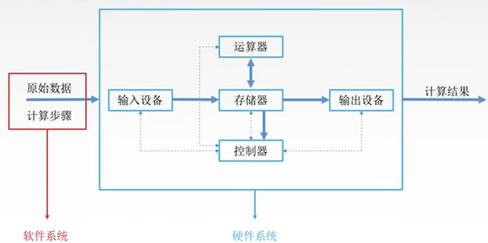
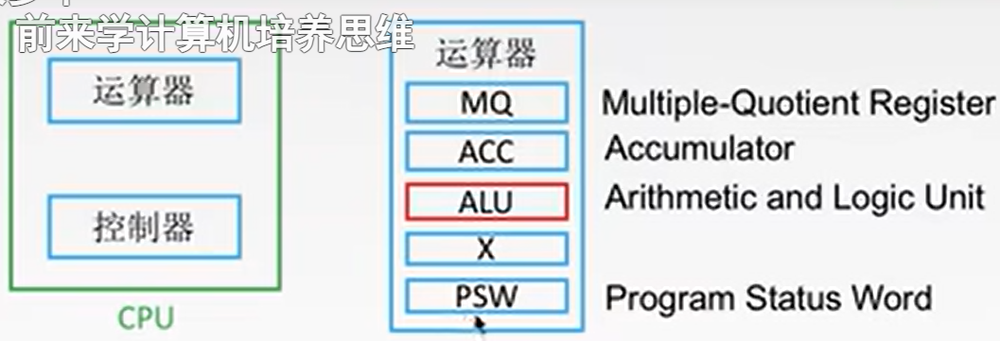
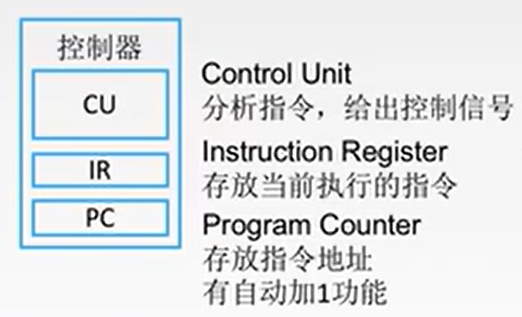
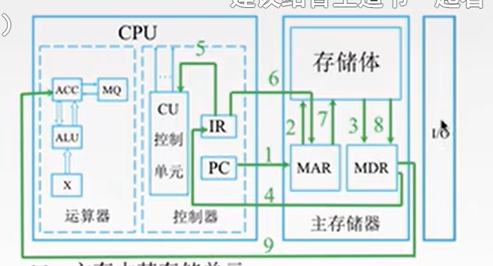
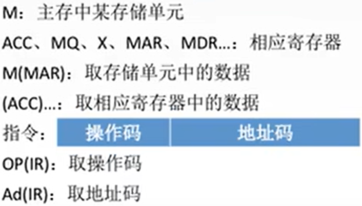

[王道计算机考研 计算机组成原理](https://www.bilibili.com/video/BV1BE411D7ii?p=32)
[计算机组成原理](https://github.com/glshi/books/blob/master/docs/course/%E8%AE%A1%E7%AE%97%E6%9C%BA%E7%BB%84%E6%88%90%E5%8E%9F%E7%90%86/%E8%AE%A1%E7%AE%97%E6%9C%BA%E7%BB%84%E6%88%90%E5%8E%9F%E7%90%86.md)

- [第一章 计算机系统概论](#第一章-计算机系统概论)
  - [1.2.1 系统结构](#121-系统结构)
  - [1.2.2 CPU 及其工作原理](#122-cpu-及其工作原理)
  - [1.2.4 软件系统](#124-软件系统)
  - [1.2.25 五层结构](#1225-五层结构)
- [第二章 运算方法和运算部件](#第二章-运算方法和运算部件)
- [第三章 存储系统](#第三章-存储系统)
- [第四章:指令系统](#第四章指令系统)
- [第五章：中央处理器](#第五章中央处理器)
- [第六章：辅助存储器](#第六章辅助存储器)
- [第七章：输出输出（I/O）设备/系统](#第七章输出输出io设备系统)

# 第一章 计算机系统概论

## 1.2.1 系统结构

- 输入输出设备。将想表达的内容转换成电信号，将电信号转换成人类可理解的形式
- 运算器。把输入到输出的规律总结下来，做成一个电路。当电路接收到输入信号的时候，根据电路的内部的电流流动规律，会自动的对应到输出设备所需要的电信号。
- 控制器。运算器不知道什么时候接收数据，输出设备也不知道什么已经计算好了，可以取运算结果。控制器解决计算机内部各个部件之间的协调交流问题。控制器与其他部件连接（图中使用虚线与数据流区分），这种连接是双向的，因为控制器一方面给各个部件控制信号，另一方面，这个控制信号的提出需要根据各个部件当前的工作状态以及每个部件的需求
- 存储器。原本的模式：给一个数据，给一个结果，等待下一个数据，等下一个数据到了，再给出一个结果。对于使用者，需要等待结果，看到第一个结果后再输入第二个数据。对于计算机来说，它也在等待使用者输入下一个数据。浪费计算资源。有了存储器，可以批量输入数据，运算器到存储器当中取数据，也可以把计算产生的中间结果存回存储器中，可以进行更复杂的运算
- 假设现有运算器，处理的是四位运算，之后需要处理八位 16 位 32 位，要么再买一块计算器，方法二，可以将长数据切断，切成 4 位 4 位送过来。这个切数据的过程，如果不添加新的部件，就需要手动控制。如果把控制流程，抽象成控制器可以理解的形式---指令，事前存到存储器当中，就能让计算机自动完成这个工作了。存储器需要给控制器提供数据（指令）。提前要输入的除了数据，还有指令，这两个合在一起就是程序
- 将存储器放到中间来，一则提高运算器效率，二则可以有更宽的数据通路

- 运算器和控制器，在结构上比较相似，在硬件上，会设计成一个芯片---cpu

## 1.2.2 CPU 及其工作原理

- 运算器
  - ALU，算数逻辑单元，运算器的核心部件，进行算数和逻辑运算的。组合逻辑设计方式
  - 存放运算中间结果
    - MQ，乘商寄存器
    - ACC，累加器
    - X，通用寄存器，有很多个
  - PSW，程序状态字节运行，存放一些状态

- 控制器
  - CU，控制单元。时序逻辑设计方式
  - IR，指令寄存器
  - PC，存放指令地址

- 主机
  
- 专有名词
  

- pc 里面存的是下一条指令的地址，在工作中间有可能存的是当前指令的地址
- 控制器需要记得的唯一一件事，到 PC 里面去找执行的指令
- PC 保存的是内存块的地址，IR 要的是该内存块的内容

1. 取指令
   - 1 (PC) -> MAR, 把 PC 的内容放到 MAR 中。到主存，取 PC 所指向的位置的指令
   - 2&3 M(MAR) -> MDR, 把 MAR 这个位置的数据取出来，放到 MDR 中。主存会根据地址，到存储体中，找到数据，然后把它写到 MDR 中。取出来的数据是一条指令
   - 4 (MDR) -> IR, 把 MDR 里面的内容放到 IR（指令寄存器）里面
2. 解析指令码/分析指令，把操作码部分放到控制单元当中，控制单元去解析操作码，就知道接下来怎么控制各个部件工作的。
   - 5 OP(IR) -> CU, 把操作码 OP 放到控制单元 CU 当中。放好后就自动完成了分析指令
3. 执行指令，分析完之后，发现这是一条取数指令
   - 6 Ad(IR) -> MAR, 按照地址码，去寻找存储体当中这个数的位置。地址码要从指令中切分出来。将指令中的地址码存到 MAR 当中
   - 7&8 M(MAR) -> MDR，重复一遍，将相应位置的数据取到数据寄存器 MDR 当中。这时取出的是一个数据。
   - 9 (MDR) -> ACC, 将数据放到累加寄存器 ACC 当中

- CPU 区分指令/数据（决定 MDR 中的内容存到 IR 还是 ACC）的依据： 指令周期的不同阶段，取指令阶段放到 IR 里面，执行指令阶段放到相应的寄存器当中。具体是如何区分不同的阶段：设置了相应的触发器，触发器连起来就是寄存器，通过查询寄存器状态就知道现在处于哪个阶段，通过这个阶段来决定最终的数据流向

## 1.2.4 软件系统

- 第一个 0000，决定这段代码执行的是什么内容
- 第二个 000，到哪里找数据
- 最后，要将这个数据放到哪里
- 最重要是第一部分。因为知道编址规律，很容易就定位到相应位置

- 以下方法是解释过程，逐条翻译，无法优化

## 1.2.25 五层结构

# 第二章 运算方法和运算部件

- 原码、反码、补码和移码是计算机中表示整数的一些常见编码方法。它们主要用于解决二进制系统中表示和处理正负整数的问题

# 第三章 存储系统

- 内存 = cache + 主存。通常说的内存是 RAM
- 内存是计算机系统中用于存储和处理数据的关键组件，包含主存储器和缓存。主存储器主要由 RAM 组成，用于存储当前运行的程序和数据，而缓存是一种速度更快的小容量存储器，用于提高 CPU 访问数据的效率。两者共同构成了计算机的存储层次结构，通过优化数据传输和存取速度，提升了整体系统性能。
- 主存储器 = RAM（随机存取存储器, Random Access Memory） + ROM（只读存储器，断电依然有记录，包含操作系统引导程序）
- 主存储器和 RAM 在多数情况下是指相同的计算机存储组件，RAM 是主存储器的一种，主要用于提供高速的数据存取能力，支持计算机系统的正常运行。
- 为了解决 cpu 比主存速度快的问题，引入 cache
- 为了解决储存空间问题，引入虚拟存储器（虚拟存储器通过使应用程序感知到一个连续且较大的内存空间，提升了系统的灵活性和有效内存利用率。尽管可能会对性能造成一定的影响，但其带来的内存管理优势和扩展能力使其成为现代计算机系统中不可或缺的一部分。）
- 存储器编址，寻址

# 第四章:指令系统

- 寻址
  - 存储内寻址：存储器如何定位到某个存储单元
  - 指令寻址: 指令如何指出某个对象它在存储器中的哪个位置
    - 一条指令要定位的目标有两个：指令寻址，数据寻址
- 数据寻址的两种寻址方式：
  - 偏移寻址通过基地址和偏移量组合来确定数据位置，灵活性较高，适用于处理数组和动态数据结构。
  - 堆栈寻址通过堆栈指针自动管理数据位置，适用于函数调用和中断处理等需要临时保存数据的场景。

# 第五章：中央处理器

# 第六章：辅助存储器

# 第七章：输出输出（I/O）设备/系统
