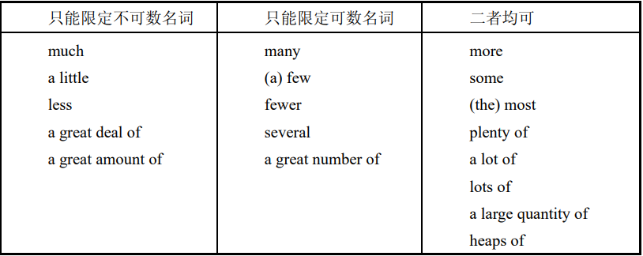
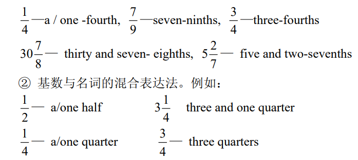

# 名词

## 可数/不可数

#### 分类

1. 可数
   1. computer
   2. family
2. 不可数
   1. water
   2. New York
   3. happiness
   4. furniture

#### 前面限定词的用法

很多 / 很少 / 一些 / 更多 / 更少

- 不可数
  - 很多：a lot of / much / a great deal of / a great amount of
  - 很少: a little
  - 一些: some
  - 更多：more
  - 更少：less
- 可数
  - 很多: a lot of / many / a great number of
  - 很少: a few
  - 一些: some / several
  - 更多：more
  - 更少：fewer

A. the quantity of ＋不可数名词／可数名词复数  
B. the amount of ＋不可数名词  
C. the number of ＋可数名词复数

#### 习题

- No one will fail to marvel at the **\_\_\_\_** of the Himalayas.
  A. snowing B. snowings C. snow D. snows
  答案：D
  提示：当 snow 被作为复数形式时，表示“积雪”，也可理解为“多年下的雪”。
  译文：大家无不为喜马拉雅山的积雪惊叹。
- advice 为不可数名词，没有复数形式
- fall 用作复数，意为“瀑布”，该词单数形式无此义. Niagara falls
- two weeks’ vacation
- fireworks, 可数/不可数, 都可以
- “Wages” 是一个可数名词。它通常以复数形式出现，用来表示工资或薪水
- Great quantities of fish are caught every year
- Everyone danced to his heart’s content at the party. 每个人都尽情地跳舞，非常开心和满足
- That man is not much of a scholar. 他并不是一个很有学问的人. “not much of a + 名词” 是一个固定搭配，通常用于表示某人并不特别符合某个名词的特征。
- “police” 是一个集体名词，指的是一群警察。因此，当谈论“police”时，通常使用复数动词“have”，而不是单数动词“has”
- He wrote a two-thousand-word report.
- The women workers held a strike.
- a friend of Mary’s vs. a friend of Mary 都对, 但是前者更地道
- 当句子中使用 “Not only... but also...” 的结构时，动词的数通常取决于靠近它的主语。
- Only about one out of twelve of the young men and women of this country (receives) a college education. 句子的主语是“one”, 是单数
- “many a” 是一个固定表达，用来表示“许多”或“很多”. 它应该与单数名词和单数动词连用. Many a novel is...
- Domestic cattle provide(not provides) us with milk, beef and hides. 许多小说已被（尚未被）翻译

# 冠词

- A whale is a mammal, not a fish. 三个空均表示类属。
- 火星，Mars， not "the Mars"
- played chess, not played "the" chess
- The Chinese are a hardworking people.
- “What musical instrument do you play?” “The piano.”
- They failed six times but they have made their minds to try a seventh time
- What do you usually do after class
- Mr. Brown must be over forty for he’s grown gray hairs
- She is as beautiful a girl as you can meet in Hollywood. as + 形容词 + a + 名词 + as...这个结构强调形容词和名词的关系
- The workers in this factory are paid by the hour
- This is the second time I have been to Nanjing. 注意 to
- Now I’m on a diet. I’m trying to lose weight.
- I want an assistant with a little knowledge of French and experience of office routine. experience 不需要冠词，因为经验是不可数名词。
- "European" 的发音以辅音音素 /j/ 开头 a European...
- "Asian" 的发音以元音音素开头 an Asian...
- An elephant is bigger than a horse.

# 代词

- 名词性物主代词的双重所有格的使用
  - a, an, this, that + 名词 + of + 名词性物主代词
  - A friend of mine is going to Berlin.
  - This is no fault of yours.
- Although many people view conflict as bad, conflict is sometimes useful in that it forces people to test the relative merits of their attitudes and behaviors.
- These two areas are similar in that they both have a high rainfall during this season.

# 数词

# 介词

## 时间介词

### at

- at the beginning of
- at the end of
- at half past five
- at night
- at sunrise
- at the time of
- at the age of

### in

- in a week
- in the morning
- in class
- in spring/summer/autumn/winter

### on

- on Sunday
- on Saturday afternoon
- on a winter evening

## 地点介词

### at

- at the back of
- at the foot of
- at home
- at the gate
- at the table

### in

- in the front of
- in hte middle of
- in the sky
- in a tree
- in the south
- in the sun
- in the bed

### on

- on the ground
- on one's way home

# 时态

1. 一般现在时
2. 一般过去时
3. 现在进行时
4. 过去进行时
5. 一般将来时
6. 过去将来时
   1. you knew I would come
   2. they were going to Naning
7. 现在完成时
8. 现在完成进行时
   1. I have been sitting here for an hour.
   2. She has been collecting stamps for about 6 years.
9. 过去完成时

# 从句

## 宾语从句

- 连接词：that, if/whehter, what/who/where/when/why/how/which
- 语序
  - 宾语从句的连接词后加陈述语序(主语在前，谓语在后): I want to know if he can come tomorrow.
  - 当连接词本身又是宾语从句的主语时，后面直接加谓语动词: She asked me who had helped him.
- 时态：
  - 主现则从任: 主句如果是一般现在时，则从句根据时间状语需要从八种时态中任选一种
  - 主过则从过: 主句如果是一般过去时，则从句根据时间状语需要从四种带“过”字的时态中任选一种
  - 客观真理永远用一般现在时: He says the moon goes around the earth.

## 状语从句

1. 时间状语从句

- 连接词: when, while, as, after, before, as soon as, since, till/until, by the time
- 语序: 陈述语序
- 时态

1）时间状语从句中一般不使用将来时态，尽管主句使用将来时态，从句使用一般现在时态或现在完成时态。
I'll go on with the work when I come back tomorrow.
please tell him about it when you see him back.

2）till/until 引导时间状语从句，主句的谓语动词，如果是延续动词，可使用否定或不用否定，如果是不延续动词，必须使用否定形式。
He didn't go to bed until it was 12 o'clock last night.
They worked until it was dark.

3）as soon as, the moment, every time, each time, the minute, the instant, the day, the week, the year, the first time, next time, any time, the last time, all the time, from the time, by the time, immediately, instantly, directly 等表示时间的词语，后面也可以接时间状语从句，表示“一……就……”
I recognized you the minute I saw you.
By the time he was fourteen, he had built his own lab.

2. 原因状语从句

- 连接词: because, since, as, for, now that

3. 条件状语从句

- 连接词: if, unless(=if not)

4. 目的、结果状语从句

- 连接词:
  - 目的: so that, so…that, in order that
  - 结果: so…that, such…that, so much/many…that
- 例子: The scientist’s report was so instructive that we were all very excited.

5. 让步状语从句

- 连接词: though, although, whether…or not
- 例子: Although he is rich, yet he is not happy.

## no matter 从句

- 结构："no matter +特殊疑问词疑问词+陈述语序" 或"特殊疑问词+后缀 ever+陈述语序"
- 例子：No matter what happened, he would not mind.
- 注意：no matter 不能引导主语从句和宾语从句

## 定语从句

- beautiful flower(beautiful 是 flower 的定语). 定语从句是指在一个句子中作定语的句子，定语从句要放在所修饰的词后.
- 例子：I have met the doctor who is in the No.1 hospital.
- 连接词：
  - 连接代词：who、which、whom、whose、that
  - 连接副词：when、where、why
