# Table of contents

- [Table of contents](#table-of-contents)
- [Introduction To Docker](#introduction-to-docker)
  - [Virtual Machines vs Containers](#virtual-machines-vs-containers)
  - [Installing Docker](#installing-docker)
  - [Docker in Action](#docker-in-action)
  - [Summary](#summary)
    - [Terms](#terms)
    - [Summary](#summary-1)
  - [A Note for Windows Users](#a-note-for-windows-users)
- [The Linux Command Line](#the-linux-command-line)
  - [Running Linux](#running-linux)
  - [Managing Packages](#managing-packages)
    - [apt](#apt)
  - [Linux File System](#linux-file-system)
    - [Windows](#windows)
    - [Linux](#linux)
  - [Navigating the File System](#navigating-the-file-system)
  - [Manipulating Files and Directories](#manipulating-files-and-directories)
  - [Editing and Viewing Files](#editing-and-viewing-files)
  - [Redirection](#redirection)
  - [Searching for Text](#searching-for-text)
  - [11- Finding Files and Directories](#11--finding-files-and-directories)
  - [12- Chaining Commands](#12--chaining-commands)
  - [13- Environment Variables](#13--environment-variables)
  - [14- Managing Processes](#14--managing-processes)
  - [15- Managing Users](#15--managing-users)
  - [16- Managing Groups](#16--managing-groups)
  - [17- File Permissions](#17--file-permissions)
- [Building Images](#building-images)
  - [2- Images and Containers](#2--images-and-containers)
  - [5- Choosing the Right Base Image](#5--choosing-the-right-base-image)
  - [6- Copying Files and Directories](#6--copying-files-and-directories)
  - [9- Setting Environment Variables](#9--setting-environment-variables)
  - [10- Exposing Ports](#10--exposing-ports)
  - [11- Setting the User](#11--setting-the-user)
  - [12- Defining Entrypoints](#12--defining-entrypoints)
  - [13- Speeding Up Builds](#13--speeding-up-builds)
  - [14- Removing Images](#14--removing-images)
  - [15- Tagging Images](#15--tagging-images)
  - [16- Sharing Images](#16--sharing-images)
  - [17- Saving and Loading Images](#17--saving-and-loading-images)
- [Working with Containers](#working-with-containers)
  - [2- Starting Containers](#2--starting-containers)
  - [3- Viewing the Logs](#3--viewing-the-logs)
  - [4- Publishing Ports](#4--publishing-ports)
  - [5- Executing Commands in Running Containers](#5--executing-commands-in-running-containers)
  - [6- Stopping and Starting Containers](#6--stopping-and-starting-containers)
  - [7- Removing Containers](#7--removing-containers)
  - [9- Persisting Data using Volumes](#9--persisting-data-using-volumes)
  - [10- Copying Files between the Host and Containers](#10--copying-files-between-the-host-and-containers)
  - [11- Sharing the Source Code with a Container](#11--sharing-the-source-code-with-a-container)
- [Running Multi-container Applications](#running-multi-container-applications)
  - [2- Installing Docker Compose](#2--installing-docker-compose)
  - [3- Cleaning Up our Workspace](#3--cleaning-up-our-workspace)
  - [5- JSON and YAML Formats](#5--json-and-yaml-formats)
  - [6- Creating a Compose File](#6--creating-a-compose-file)
  - [7- Building Images](#7--building-images)
  - [8- Starting and Stopping the Application](#8--starting-and-stopping-the-application)
  - [9- Docker Networking](#9--docker-networking)
  - [10- Viewing Logs](#10--viewing-logs)
  - [11- Publishing Changes](#11--publishing-changes)
  - [12- Migrating the Database](#12--migrating-the-database)
  - [13- Running Tests](#13--running-tests)
- [Deploying Applications](#deploying-applications)
  - [2- Deployment Options](#2--deployment-options)
  - [3- Getting a Virtual Private Server](#3--getting-a-virtual-private-server)
  - [4- Installing Docker Machine](#4--installing-docker-machine)
  - [5- Provisioning a Host](#5--provisioning-a-host)
  - [6- Connecting to the Host](#6--connecting-to-the-host)
  - [7- Defining the Production Configuration](#7--defining-the-production-configuration)
  - [8- Reducing the Image Size](#8--reducing-the-image-size)
  - [9- Deploying the Application](#9--deploying-the-application)
  - [10- Troubleshooting Deployment Issues](#10--troubleshooting-deployment-issues)
  - [11- Publishing Changes](#11--publishing-changes-1)
- [my record](#my-record)

# Introduction To Docker

## Virtual Machines vs Containers

Containers 与 Virtual Machines 很类似，都是独立运行的环境  
但是 Virtual Machines 需要的资源大，启动慢。内存会被分成多份给多个虚拟机  
Containers 也可以提供隔离的环境，但是它不需要全套的操作系统，所有的 containers 在同一台电脑上，share 操作系统，而非分割。

## Installing Docker

- the course is using docker version 20.10.5
- install docker: https://docs.docker.com/get-docker/
- mac good download url: https://desktop.docker.com/mac/stable/50684/Docker.dmg
- turn on Hyper-V and Containers Windows features, go to settings, and type in features, mark Hyper-V and Containers features.

## Docker in Action

```docker
<!-- image:tag, start from a base image. base image有很多file，我们take这些files，在此基础上增加file。我们可以选择linux image，在此基础上build node，也可以直接选择node image，这是docker建好的。可以去docker hub找到相关的image的信息.不同的image是为了不同的distributions（发布） of linux。tag就是为了标明我想用哪个linux的发布。-->
FROM node:alpine
<!-- 点: all the file, to app directory -->
COPY . /app
WORKDIR /app
CMD node app.js
```

- 建立一个 docker image：-t 是 tag，点是目前的 directory 的意思，specify where docker can find a docker file

  - docker build -t hello-docker .

- 查看所有的 images

  - docker image ls/ docker images

- run image
  - docker run hello-docker

## Summary

### Terms

Client/server architecture  
Hypervisors  
Docker daemon (engine)

### Summary

- A virtual machine is an abstraction of hardware resources. Using hypervisors we can create and manage virtual machines. The most popular hypervisors are VirtualBox, VMware and Hyper-v (Windows-only).
- Virtual machines are very resource intensive and slow to start. Containers are very lightweight and start quickly because they share the kernel of the host (which is already started).
- Docker uses client/server architecture. It has a client component that talks to the server using a RESTful API. The server is also called the Docker engine (or daemon) runs in the background and is responsible for doing the actual work.

## A Note for Windows Users

Windows 10+ ships with a Linux kernel. So when using Docker, you can choose between Windows or Linux containers. Windows containers (processes) need to talk to the Windows kernel under the hood. Linux containers need the Linux kernel.

These are essentially two different isolated worlds. You can choose between these two worlds by right-clicking on the Docker icon in the notification tray (in the bottom status bar).

Remember: the images and containers in the Windows world are invisible to the Linux world. You'd need Windows containers only if you need an image that starts from Windows.

# The Linux Command Line

## Running Linux

- 首先需要将 ubuntu 的 image 下载
  - docker pull ubuntu
- 还有更简便的办法,直接 run，如果没有 docker 会直接先 pull(这样以后才会在 ps -a 的时候显示 ubuntu，只是 pull 不会显示)
  - docker run ubuntu
- see the list of running prcesses or running containers
  - docker ps
- 查看所有的 container，包括那些 stopped
  - docker ps -a
- run interactive. a shell is a program that takes our commands and passes them to the operationg system for excution
  - docker run -it ubuntu
- shell promp: root is currently login user, after the @ assign we have the name of the machine, this container has this ID, which is automatically generated by docker. / is where we are in the file system.#/@ means we have the highest privilegesor or other level
  - root@925cec6dbae3:/#
- the location of this shell program
  - echo $0
- history command, run the second history
  - history
  - !2

## Managing Packages

the managing packages software: npm/yarn/pip  
apt: advanced package tool, the linux popular  
nano: a basic editor for linux

### apt

- apt install nano
- apt list (list all the packages in the linux package database)
- apt update (update the package database, before install package always update firstly)
- apt remove nano (uninstall package)

## Linux File System

file and directory are organized in a tree in hierarchical

### Windows

- C:\
  - Program Files
  - Windows

### Linux

- /
  - bin (binarys and programs)
  - boot (all the file related to booting)
  - dev (the file that are needed to access devices)
  - etc (editable text configuration, configuration files)
  - home (this is where home directories for users are stored. each user will have a home directory here)
  - root (home directory for root user, only root user can access this dir)
  - lib (library files)
  - var (variable, files that are updated frequently, like loc files, application data)
  - pro (represent running processes)

## Navigating the File System

- pwd (print working directory, where we are in the file system)
- ls (list)
  - ls -1 (竖排显示)
  - ls -l (long list, more details)  
     lrwxrwxrwx 1 root root 7 Nov 1 21:15 bin -> usr/bin
    - lrwxrwxrwx: the permissions of this file or directory
    - root: user own this fie
    - 7: size
    - 21:15: date
- cd etc/a + tab (show all the files with 'a' beginning in the folder etc)
- cd ../.. (go to two level up)
- cd ~ (go to home directory)
- blue represent directory and white is file

## Manipulating Files and Directories

- mkdir (create a new directory)
- mv test docker (rename/move to somewhere else)
- touch hello.txt file1.txt file2.txt (create a new file)
- rm file\*
- rm -r docker/ (remove directory)

## Editing and Viewing Files

- cat filename (see the content of a file)(concatenate or combine multiple files)
- more /etc/adduser.conf (for long file. space: jump to next page, enter: line by line)
- less /etc/adduser.conf (more can only go down, less can use arrow button to go up and down. Q: exit)
- head -n 5 /etc/adduser.conf (view first 5 few lines)
- tail -n 5 /etc/adduser.conf

## Redirection

standard input represent the keyboard  
standard output represent the screen  
redirection is to change the source of input and output

- cat file1.txt > file2.txt (read file1's content not to screen but write it to file2)
- echo whatever > whatever.txt (echo is write something to screen)

## Searching for Text

- grep whatever whatever.txt (global regular expression print)
  - grep -i whatever whatever.txt (case insensitive)
- grep -i root /etc/passwd
  - this file contains the list of user accounts on this machine, not their password
- grep -i hello file\*
  - file1.txt: Hello
  - file2.txt: Hello
- grep -i -r hello .
  - . means current directory
  - -r: recursive, with this we can search this directory and all his subdirectories recursively
  - same as: grep -ir hello .

## 11- Finding Files and Directories

- find
  - we see all the files and directories in the current direcotry recursively(递归地)
- ls -a
  - show files and direcotries
  - when a directory is a direcotry, the color of it is blue
- find -type d
  - only the directory in the current directory
- find -type f -iname "F\*"
- find / -type f -name '\*.py' > python-files.txt
  - find all the files start from the root directory
  - find out all the python files
  - write the result to a file name pthon-files.txt

## 12- Chaining Commands

- mkdir test ; cd test ; echo done
  - if test folder has alredy exist, the first commad will give an error, but the other two command will execute
- mkdir test && cd test && echo done
  - and
  - if test folder has alredy exist, the first commad will give an error, and the other two command won't execute
- mkdir test || echo "direcotry exists"
  - or
  - if mkdir test executed, echo "direcotry exists" won't execute
- ls /bin | head -n 5
  - pipe
  - list the first 5 lines in bin folder
- long command into mulitple lines:
  - mkdir hello;\
  - \> cd hello;\
  - \> echo done;

## 13- Environment Variables

- printenv
  - list all the environment variables in this machine
- printenv PATH
  - to see the value of paticular variable
- another way to see the value of an environment variable
  - echo $PATH
  - $ refer to an environment variables
- export DB_USER=ching
  - 准对当前 terminal session，新建一个环境变量。当这个 session 结束，即使重新 active 这个 container，这个变量也不在了 s
- exit
  - exit current terminal session
- docker start -i 73088
  - 73088 is the id of one container
  - -i: can interact with it
- for store the variable in a permament location
  - cd ~
  - echo DB_USER=mosh >> .bashrc
    - .bashrc: the file to permanently store environment variables
    - \>\> : append not overwrite
    - this environment variables will only available until we open another terminal session
- source .bashrc
  - reload this file
  - source ~/.bashrc

## 14- Managing Processes

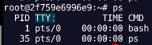

- TTY: teletype
- pts/0: which termianal the user is logged into
  - sudo terminal
  - /0: the first terminal window
- TIME: the amount of CPU time each process consumed
  - 00:00:00: not taking much of CPU time
  - sometimes you find your computer getting slow, that's because some process is taking too much CPU time
- put this command (sleep 3) in the background, so we can execute other commands
  - sleep 3 &
- kill PID

## 15- Managing Users

- useradd: add
- usermod: modify
- userdel: delete
- useradd -m john: -m(create user's home direcotry)
- cat /etc/passwd: check all users' account info
  - john: username
  - x: password is store in somewhere else
  - 1001: user ID
  - 1001: the second ID: the user's primary group
  - /home/jonh: home directory for this user
  - /bin/sh: represents the old original shell program. the shell program used when this user logs in
  
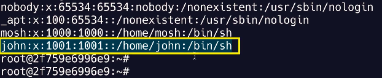

- modify the user login shell
  - usermod -s /bin/bash join
- where is the password: in the same directory, we a file, that is shadow
  - cat /etc/shadow
  - this file is only accessable to the root user
- login as john
  - docker exec -it -u john 2f59e bash
    - bash: we want to run bash session here
- \# for root user
- $ for regular user
- adduser: perl script with more interactive more functions

## 16- Managing Groups

- groupadd, groupmod, groupdel
- cat /etc/group
- usermod -G developers john
  - developers: group name
  - john: user to be added to the group
- cat /etc/passwd | grep john
- grep john /etc/passwd
- chech the group of one user:
  - groups john
  - result: john:john developers
    - two groups: john(primary group) and developers

## 17- File Permissions

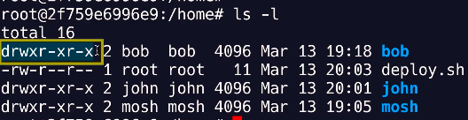

- drwr-xr-x: permissions for each
  - d: directory; -: file
  - the other letters: nine letters divided into three groups
  - r: read permission; w: write permission; x: execute permission
  - three groups
    - bob: the first group present the user who own this file
    - bob: the second group represent the permissions for the group that own this file. by default every user that is created is automatically placed inside a group with the same name
    - the third group represent the permissions for everyone else
- change permission:
  - chmod u: user, chomod g: group, chmod o: others
    - chomod u+x deploy.sh: add execute permission to file deploy.sh, for user root
    - chomod u-x: remove the excute permission
    -
  - chmod o+x deploy.sh
    - allow others to have the execute permission on the file deploy.sh
    - for user john(others)

# Building Images

## 2- Images and Containers

- image: includes everything an application needs to run. contains all the files and configuration settings needed to run an application
  - cut down operation system like linux
  - third-party libraries
  - application files
  - environment variables
- once we have an image we can start a container from it
- container: a kind of virtual machine in the sense that it provides an isolated environment fro executeing an application. similar with virtual machine, we can start and stop containers. a container is just an operating system process. but it has its own file system which is provided by the image
- start a container from an image
  - docker run -it ubuntu
    - ubuntu is the type of the image
    - this will create a new container, container ID is different from ubuntu
    - in the new container, there is no files which is created in ubuntu
    - container get file system from image, but each container has its own right layer, so what we write in a given container is invisible from other containers
    - each container is an isolated environment for executing an application

container 是由 image 实例化而来，这和我们学习的面向对象的概念十分相似，我们可以把 image 看作类，把 container 看作类实例化后的对象。

也可以说 image 是文件, container 是进程。 container 是基于 image 创建的, 即 container 中的进程依赖于 image 中的文件, 这里的文件包括进程运行所需要的可执行文件， 依赖软件， 库文件， 配置文件等等...

docker 的 image 概念类似虚拟机的 image。是一个只读的模板，一个独立的文件系统，包括运行 container 所需的数据，可以用来创建新的 container。（ docker create <image -id > ：为指定的 image 添加一个可读写层，构成一个新的 container；）

例如：一个 image 可以包含一个完整的 ubuntu 操作系统环境，里面仅安装了 mysql 或用户需要的其他应用程序。

docker image 实际上是由一层一层的系统文件组成，这种层级的文件系统被称为 UnionFS( Union file system 统一文件系统)，image 可以基于 dockerfile 构建，dockerfile 是一个描述文件，里面包含了若干条密令，每条命令都会对基础文件系统创建新的层次结构。

docker 提供了一个很简单的机制来创建 image 或更新现有的 image。用户甚至可以从其他人那里下载一个已经做好的 image 直接使用。（image 是只读的，可以理解为静态文件）

docker 利用 container 来运行应用：docker container 是由 docker image 创建的运行实例。docker container 类似虚拟机，可以执行包含启动，停止，删除等。每个 container 间是相互隔离的。container 中会运行特定的运用，包含特定应用的代码及所需的依赖文件。可以把 container 看作一个简易版的 linux 环境（包含 root 用户权限，进程空间，用户空间和网络空间等）和运行在其中的应用程序。

相对于 image 来说 container 是动态的，container 在启动的时候创建了一层可写层次作为最上层。（ docker create <image -id > ：为指定的 image 添加一个可读写层，构成一个新的 container；）

## 5- Choosing the Right Base Image

- google docker samples: docs.docker.com/samples/
  - it contains various examples of docker file for different technology stack
- go to hub.docker.com
  - search for node
  - choose node
  - click tags
- FROM node:14.16.0-alpine3.13
  - alpine is small size
- in the react app new file: Dockerfile
- docker build -t react-app .
  - -t: tagging the image
  - .: from current direcotry, there is a Dockerfile with from image in the current directory
- docker image ls
- docker run -it react-app sh
  - specify the command to run when starting this container
  - sh: open shell, doing a shell session inside the container
  - ls: bin, etc, lib...
  - node --version: v14.16.0

## 6- Copying Files and Directories

- COPY vs. ADD

  - add can pass a URL as a parameter
  - add accept .zip file and it automatically uncompress the file

- can copy one or more file or direcotry into the image. we cannot copy anything outside of this diretory. when we execute the build command, look at the last argument 'docker build -t react-app .', a period means the curent diretory. so when we execute this command, docker client sends the content of this diretory to Docker engine, this is called the build context. So Docker client sends the build context to Docker engine. and then Docker engine will start executing these commands one by one
- if the direcoty doesn't exist, Docker will automatically create it
- COPY package.json README.ms /app/
  - when using copy with more than one source file, the destination must be a direcotry /app/, end with /
- absolute path vs. relative path
  - abolute path: COPY . /app/
  - relative path:
    - WORKDIR /app
    - COPY . .
- copy a file with space in it: COPY ["hello world.txt", "."]

## 9- Setting Environment Variables
- ENV API_URL=http://api.myapp.com/
- check env variable:
  - printenv
  - printenv API_URL
  - echo $API_URL

## 10- Exposing Ports
- when we run this application inside a Docker container, this port, 3000 will be open on the container not on the localhost
- on the same machine, we can have multiple containers running the same image, all these containers will be listening to Port 3000, but the port 3000 on the host is not going to be automaticall mapped to these containers
- EXPOSE
  - tell what port this container will listening on
  - doesn't automatically publish the port on the host
  - it is just a form of doc to tell us this container will eventually listen on port 3000

## 11- Setting the User
- addgroup app
- adduser -S -G app app
  - -S: create a system user, which is only for run application
  - -G: setting the group
  - the first app: group 'app'
  - the second app: user 'app'
  - 'app app' is the comman best practice in linux, when we create a new user we create a primary group for that user in the same way
- groups app
  - shows the groups for the user 'app'
- RUN addgroup app && adduser -S -G app app
- USER app
  - all the following command will be executed using this user
- whoami

## 12- Defining Entrypoints
- docker run react-app npm start
- CMD npm start
  - because the command instruction(CMD) is for supplying the default command, it doesn't make sense to have mulitple command instructions in a Docker file
  - if we have multiple command instructions in the Docker file, only the last one will take effect
- RUN vs. CMD
  -  RUN instruction is a build time instruction, so this is executed at the time of building the image. so when building the image, we are installing NPM dependencies, and these dependencies are stored in the image
  -  in contrast, the command instruction(CMD) is a runtime instruction. it is executed when start a container

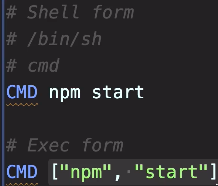

- shell form: docker will execute the command inside a separate shell, that is why it's called the shell form
  - on linux, that shell is slash bin slash shell, the original shell program
  - on windows, it is cmd, or command prompt
- exec form: execute the command directly, and there is no need to have another shell process. also this makes if easier and faster to clean up resources when you stop the container. so always use the exec form
- ENTRYPOINT
  - we can always over write the default command when starting a container 
    - docker run react-app echo hello: will over write CMD ["npm", "start"]
  - in contrast we cannot easily over write ENTRYPOINT when running a container
    - if you want to do that we have the entry point option
      - docker run react-app --entrypoint
  - ENTRYPOINT ["npm", "start"]: when we know for sure this is the command or this is the program that should be execute, whenever we start a container. there is no exception
  - CMD ["npm", "start"]: we have a bit more flexibility, we can always override this. so we want to use this instruction for executing ad hoc commands in a container

## 13- Speeding Up Builds

- docker history react-app
- created by & size

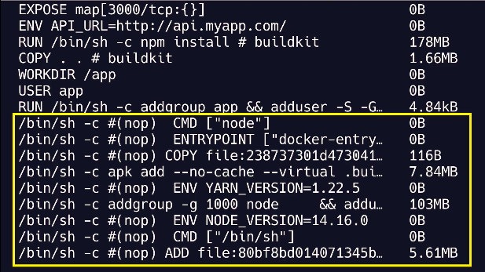

- the yellow frame: when we use from instruction, that instruction is going to bring in several layers that belong to linux or node, and we are going to build on top of those layer
- docker是根据layer一层一层建立image的，docker会查看是否有变化，如果没有变化就不会从新建立一次。npm install会消耗这么多时间，是因为它在COPY . .之后，docker无法确定current folder中是否有变化，就会从这步开始重新建立image，就会重新跑npm install。
- 改法：
  - COPY package*.jason .
  - RUN npm install
  - COPY . .
- to optimize your build, you should organize your Dokcer file such that the instructions taht don't change frequently should be on the top and the instructions or files that change frequetly should be down the bottom

## 14- Removing Images
- docker images
  - inthe list, we have bunch of images that have no name and no tags
  - dangling images, meaning loose images
  - these are essentially layer that have no relationship with a tagged image
  - so as we were changing our docker file and rebuilding our image, Docker was creating these layers, and at some point these layers lost relationship with our react app image
- to get rid of them we use the pronoun combat
  - docker image prune
- docker container prune
- docker image: to see all the image relative command, sub commands
  - remove image: docker image rm hello-docker

## 15- Tagging Images
- method one: add tag which build image
  - docker build -t react-app:buster .
    - it will generate the same image with different tags
- remove tage: docker image remove react-app:buster
- method two: add tag after build
  - docker image tab react-app:latest react-app:buster
- the latest tag can get out of order
  - the latest tag doesn't necessarily reference the latest image, you have explicitly apply to the latest image. 当改变readme中的内容，重新build，docker build -t react-app:2 .，并给一个新tag2的时候，latest还是跟原来的tag一直，不会跟tag一致
- docker image tag b06 react-app:latest
  - b06: tag 2的image ID
  - 将tag2 的内容付给latest tag

## 16- Sharing Images
- hub.docker.com
- login
- create a new repository
  - we can have multiple images with different tags
  - name react-app
- docker image tag b06 codewithmosh/react-app:2
  - b06: tag 2的image ID
  - codewithmosh: docker hub account
  - react-app: new repo name
  - :2: tag name for docker hub

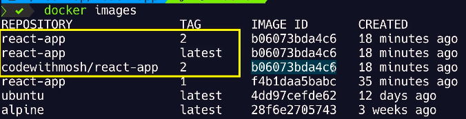

- push image
  - docker lgoin
  - docker push codewithmosh/react-app:2
    - now docker is pushing each of the layer in this image

## 17- Saving and Loading Images
- put one image from one machine to another machine without going through a Docker Hub
- in this case, you can save this image as a compressed file, and load it on the other machine
- save image
  - docker image save -o react-app.tar react-app:3
    - -o: write to a file, specify the file to write to
    - .tar in linux is like a zip file on windows
- load image:
  - docker image load -i react-app.tar
    - -i: read from tar archive file

# Working with Containers

## 2- Starting Containers
- docker run react-app
- there is a problem, I cannot type any additional commands on the terminal window
- docker run -d react-app
  - -d: detached, run the container in the detached mode, means in the background. now the terminal window is free, and we can do whatever we want
  - docker automatically associates each container with a random name. when we wnat to reference a container, we can either use it ID or name
- docker run -d --name blue-sky react-app

## 3- Viewing the Logs
- docker logs aa0
  - -f: follow log output, this is useful, if your container is continuously producing output. so instead of running docker logs, some conainter ID multiple times, you can just use dash F to follow the log, then whatever is written to the log, you can see it in real time on the terminal
- docker logs -n 5 aa0
  - to look at the last 5 lines of the log
- timestamp of each message:
  - docker logs -n 5 -t aa0

## 4- Publishing Ports
- docker run -d -p 80:3000 --name c1 react-app
  - to go localhost:80, we can see the react app

## 5- Executing Commands in Running Containers
- docker exec vs. docker run
  - run: we start a new container and run a command
  - exec: we execute a command in the running container
- docker exec c1 ls
  - c1: container name
  - ls: contents of our app directory 
- docker exec -it c1 sh

## 6- Stopping and Starting Containers
- docker stop c1
- docker start c1
  - run: start a new container
  - start: start a stopped container

## 7- Removing Containers
- docker container rm c1
- docker rm -f c1
- docker ps -a | grep c1

## 9- Persisting Data using Volumes
- volumnes: a storage outside of containers
- docker volume create app-data
- docker volume inspect app-data


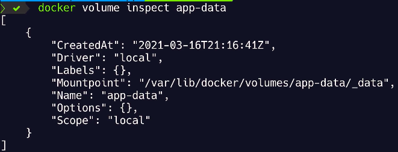

- driver:local: this is a directory on the host. sometimes we create volums in the cloud, if you use a cloud platform, you need to find a diver for creating a volumn in that cloud platform
- mountpoint: this is where that directory is created on the host, so this is a linux path. docker on Mac runs inside a lightweight linux virtual machine, so this path is a path inside that virtual machine, it doesn't exist on your mac

1. docker run -d -p 5000:3000 -v app-data:/app/data react-app
2. docker exec -it 716 sh
3. cd data
4. echo data \> data.txt
- 以上后，在shell中添加文件，是不被允许的，因为是user app， not user root。需要在docker file中添加RUN mkdir data， 重新build image。docker build -t react-app .. 然后重复上述1-4步
- docker rm -f 007
- docker run -d -p 5000:3000 -v app-data:/app/data react-app
- docker exec -it 716 sh

## 10- Copying Files between the Host and Containers
- sometimes we need to copy files between the host and a container, for example, we want to bring the log file of a container to the host and analize it
- docker exec -it 716 sh
- echo hello \> log.txt
- docker cp \<containerID>:/app/log.txt .
- in the terminal: echo hello \> secret.txt
- docker cp secret.txt \<containerID>:/app
- docker exec -it 716 sh
- ls -l

## 11- Sharing the Source Code with a Container
- publish our application changes
- for production machines, we should always build a new image target properly and deploy
- for develop machines, we don't want to build the image every time we make a tiny change in our code
- we can create a mapping or binding between a diretory on the host and a directory inside the container, so this way any changes we make to any files in this directory are immediately visible inside the container
- to share the source code with a container, we use the volume option to map the project diretory to a directory in the containers file system
- docker run -d -p 5001:3000 -v $(pwd):/app react-app

# Running Multi-container Applications

## 2- Installing Docker Compose
- google docker compose install
  - docs.docker.com/compose/install/
- docker-compose --version

## 3- Cleaning Up our Workspace
- docker container rm -f $(docker container ls -aq)
  - -a: bring the stopped container as well
- docker image rm $(docker image ls -q)

## 5- JSON and YAML Formats
- use indentation to represent hierarchy, instead of curly braces
- don't need quotes 
- no commas to separate key value pairs
- use hyhen to define list  

yml file:  
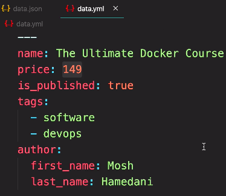

json file:  
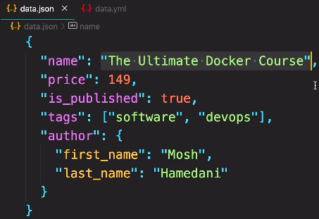


## 6- Creating a Compose File
- what docker compose version should be use: google docker compose file
  - docs.docker.com/compose/compose-file/
  - compose file format and docker engine release
  - we are using the latest version of docker engine, so I want to use the latest compose file format to have the access to the latest feature
- we don't need to manually run our container using docker run(parameter -p for mapping port; -v for mapping volums, we also have to specify an image react-app), all these command can be defined in the docker compose file  
- build: ./backend
  - where docker find the docker file
- for db service, we are not build the image, we are using the image from docker hub
  - image: mongo:4.0-xenial
- we can check online docs.docker.com/compose/compose-file/compose-file-v3/
  - we can see all validate property(like: build, image, port, volumes, environment)

## 7- Building Images
- docker-compose build --help
  - --no-cache
    - prevent caching when building the image, sometimes you encounter the werid issue and you want to make sure that cache is not used
  - --pull
    - pull a newer version of the image
- docker-compose build

## 8- Starting and Stopping the Application
- docker-compose up
  - if the image are ready, docker compose will run them inside containers, otherwise it's going to build the images automatically
- docker-compose up --help
  - --build: instead of docker-compose build then docker-compose up, we can use docker-compose up --build
- docker-compose up -d
- docker-compose ps
- docker-compose down

## 9- Docker Networking
- docker network ls
- every docker installation has three networks
  - bridge host and none
- and we have network called vidly_default
  - the driver for this network is bridge on linux or net on windows
  - this network contains three hosts or three containers: web, api, db
- docker exec -it -u root 8c6(the container ID of vidly_web) sh
  - /app $: regular user
  - /app #: root user
    - /app # ping api
    - we get responses from a machine with this IP address(172.21.0.3)

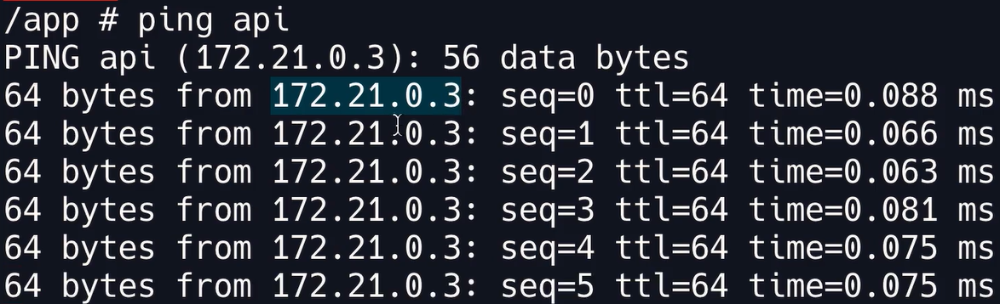  

- docker comes with an embedded DNS server that contains the name and IP of these containers. inside these container, we have a component called the DNS resolver. this DNS resolver talks to the DNS server to find the IP address of the target container. so when we ping the api container, this DNS resolver asks the server, what is the IP address of the API machine or API container, the DNS server returns the IP address. and then the web container can directly talk to the API container using its IP address. and then the web container can directly talk to the api container using its IP address  

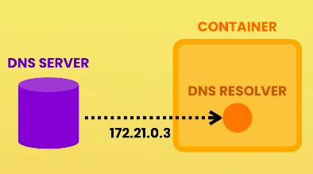

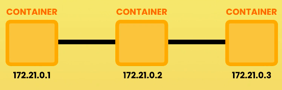  

- each container has an IP address, and is part of a network
- /app # ifconfig
  - to see the IP address of the web container
- this container has two network adapters: etho and lo  

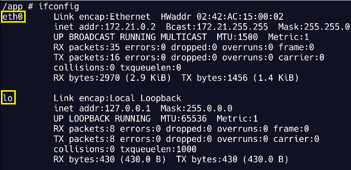

- defined api service, we added an environment variable that contains a database connection string. in this connection string(mongodb://db/vidly), we have 'db', which is the name of the host, and it is DB container. you saw that our api container can talk to this container, because both these containers or all containers in this application are part of the same network.
- mongodb://db/vidly: this host is only available inside the docker environment, so localhost:/db/vidly has nothing
- if you want to access db container, we need port mappings: 27017:27017, the first 27017 is the port on the host, and the second is the port on the container
```Docker
  api:   
    build: ./backend  
    ports:   
      - 3001:3001  
    environment:   
      DB_URL: mongodb://db/vidly  
```

## 10- Viewing Logs
- docker-compose logs
- seperate

## 11- Publishing Changes
- we don't want to re-build our application images every time we change our code, so we are going to map our project directory, like the backend diretory to the app directory inside our container
- method one: inthe docker-compose.yml add volumns  
  - volumes:  
      -./backend:/app
- method two: when we started our containers manully, we had to type an absolute path
  - docker run -v $(pwd):/app

## 12- Migrating the Database
- most of the time, when we release our application, we want our database to be in a particular shape with some data, which is called database migration
- in compose file, we can override the command that we write in the separete docker file, and do something else
  -  command: migrate-mongo up && npm start

```Docker
api: 
  build: ./backend
  ports: 
    - 3001:3001
  environment: 
    DB_URL: mongodb://db/vidly
  volumes:
    - ./backend:/app
  command: migrate-mongo up && npm start
```
- there is a problem with the above command: it is possible that our database server is not ready at the time of executing this command. even though our database container might be running the actual database engine in this case, mongo my not be ready, becasue starting a database engine often takes several seconds
  - this is where we use a waiting script
  - search on google: docker wait for container, docs.docker.com/compose/startup-order/
  - multiple tools: wait-for-it, dockerize, sh-compatible
  - wait for script is stored inside the backend folder
- comand: ./wait-for db:27017 && migrate-mongo up && npm start
  - db: the name of our computer or host, this is the name of our db container
  - wait for port 27017 to recieve the traffic 
- this command is too long: comand: ./wait-for db:27017 && migrate-mongo up && npm start, we can build a docker-entrypoint.sh file.
  - this is a basic shell script
  - command: ./docker-entrypoint.sh
  - on widows, you can use a PowerShell script to do the same thing
- docker volume ls:
  - vidly_vidly
    - the first vidly is out application
    - the second vidly is the name of our volume
- docker volume rm vidly_vidly
  - now our mongodb database is gone
  - this is a test for migrate-mongo up

## 13- Running Tests
- it is slow to do test inside docker, not recommanded to do so
```Docker
web-tests:
  image: vidly_web
  volumes:
    - ./frontend:/app
  commnad: npm test
```

# Deploying Applications
## 2- Deployment Options
- we can deploy our app to a signle host, or a cluster, which means a group of servers. cluster helps us to get high availability and scalability
- single host deployment pertantial issues:
  - if our server goes offiline, our application will not be accessible
  - if our app grows rapidly, and we get hundreds of 1000s of users, a single server is not able to handle that load
- cluster tool: docker swarm, Kubernetes......

## 3- Getting a Virtual Private Server
- virtual private server: VPS: digital ocean, google cloud platform(GCP), microsoft azure, amazon web services(AWS)

## 4- Installing Docker Machine
- once we have a server, we need to use a tool called docker machine to talk to the docker engine on that server. so in this way we can execute docker commands in out terminal and our commands will be sent to the docker engine on our server

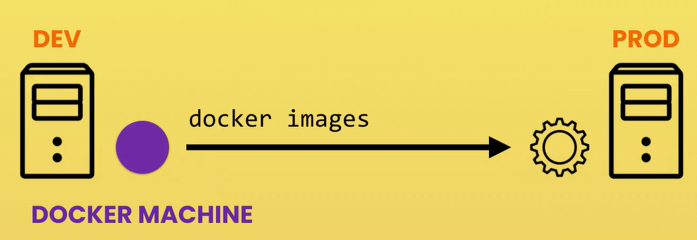

- github.com/docker/machine/releases
  - copy paste the install command to local computer's terminal

## 5- Provisioning a Host
- now we are going to use docker machine to create a virtual private server on digital ocean

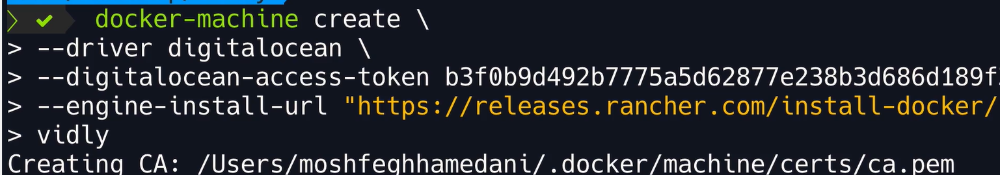

- driver: search on docs.docker.com/machine/drivers/
- api token, specific to digital ocean
- 第三行是因为最近有一个bug with digital ocean，we cannon install the latest docker engine on the server, you have to add this extra option when creating a docker machine, with this we can specify the engine install URL
- vidly: the name for the virtual machine

## 6- Connecting to the Host

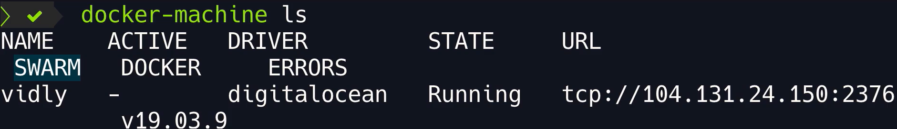

- docker-machine ls
  - driver: digitalocean
  - url: ip address of this machine
  - swam: whether it is a cluster or single server
  - docker: version of the docker engine
- to connect to this machine, we use ssh
  - ssh is short for secure shell, it is protocol for connecting with servers
  - using ssh or secure shell, we can open a secure shell session with our server
- docker-machine ssh vidly
  - login machine using ssh
  - 这个时候进入画面进入ubuntu界面，ls查看，就是ubuntu的基本配置

## 7- Defining the Production Configuration
- 80: because I want to type the host name in the brower and back, I want to see the application. so we want to map port 80 of the host to port 3000 of the container
```Dock
  web:
    build: ./frontend
    ports:
      - 80:3000
```
- restart
  - no: if the container crash, it is not going to be restarted, our application will be unavailable. so then we have to connet with our server using ssh and manully restart the container
  - more options: docs.docker.com/compose/compose-file/ 
    - version 3---> right side---> service configuration reference
  - always: always restart the container 
  - on failure: will only restarted if the container crashed
  - unless-stopped: similar with always, the difference is that it will only restart the container if we manually stop it

## 8- Reducing the Image Size
- dockerfile.prod
- nginx: one kind of web server, fast and popular web server

```Docker
COPY --from=build-stage /app/build /usr/share/nginx/html
```
- copy from build-stage /app/build to nginx
- this path here is a standard path for serving files using nginx, you can find this in nginx documentation on docker hub
- 80 port is the default port for web traffic
- docker build -t vidly_web_opt -f Dockerfile.prod .
- go to the production compose file

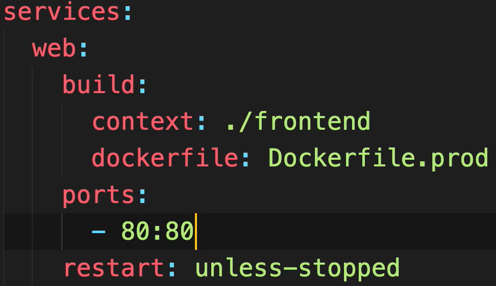

- docker-compose -f docker-compose.prod.yml build

## 9- Deploying the Application
- docker-machine env vidly
  - the seeing the environment variables that we need to set to talk to this vidly machine 
- eval go to execute all the environment variables
  - eval $(docker-machine env vidly)
    - the origin command for active ENV is now deleted: docker-machine activate vidly
    - after run the above command, the environment variables are set
    - any command we type in the ternimal will be sent to the docker engine on this vitual machine
    - so our docker client will be talking with the docker engine on this machine
    - type in docker images: there is no images, because in the docker machine vidly, there is no images so far
- docker-compose -f docker-compose.prod.yml up -d
- missing write access to /app error
  - it is because we are using an older version of docker engine
  - to solve it, add mkdir... command
  - chown: change the owner of the this directory
  - app:app---we are going to set the owner user to app and the owner group to app as well
  - /app: here is the directory

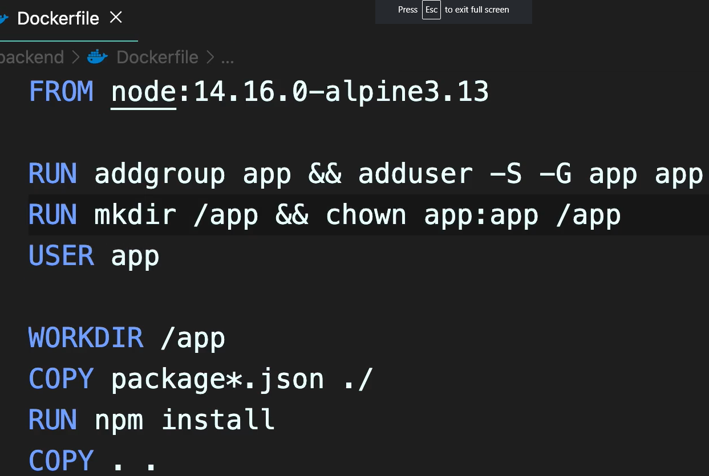

## 10- Troubleshooting Deployment Issues
- IP address of the web server on digital ocean: 104.131.24.250  
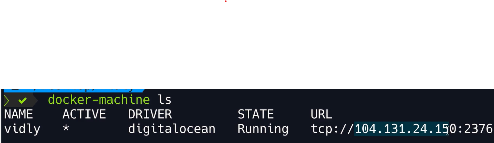

1. visit 104.131.24.250, nothing is here issue:
  - check backend app:
    - 104.131.24.250:3001/api
- back to our terminal, check the running containers: docker ps
  - vidly_web using nginx is constantly restarting, something is wrong in this container and it keeps crashing and restarting
- what we can do next is check logs
  - docker logs containerID
    - permission denied
    - it is because we are running nginx with a non root user
- back to the front end docker file
- the solution is delete the following command, althong it is not a good way
  - RUN addgroup app && adduser -S -G app app
  - USER app
- redeploy our application
  - docker-compose -f docker-compose.prod.yml up --build
- verify all containers are running: docker ps
2. go to front end, and the app is running but there is no movie issue:
- using chrome dev tools---> in the network tab--->select xhr to look at our api requests---> the get movie URL is http://localhost:3001/api/movies
- this issue is beacuse we didn't set the REACT_APP_API_URL environment variable
```JavaScript
const baseUrl = process.env.REACT_APP_API_URL || "http://localhost:3001/api";
```
- go to production docker file of frontend, set the ENV
```Docker
# Step 1: Build stage
FROM node:14.16.0-alpine3.13 AS build-stage
WORKDIR /app
COPY package*.json ./
RUN npm install
COPY . .
ENV REACT_APP_API_URL=HTTP://104.131.24.150:3001/api
RUN npm run build
```
- redeploy our application
  - docker-compose -f docker-compose.prod.yml up --build

## 11- Publishing Changes
- properly tagging images before deploy them 
- in docker-compose.prod.yml file
- additional to build we can also add the image property to tag this image
-   image: vidly_web:1(manually change tag every time of deploy)
```Docker
web:
  build: 
    context: ./frontend
    dockerfile: Dockerfile.prod
  image: vidly_web:1
  ports:
    - 80:80
  restart: unless-stopped
```

# my record
- docker container rm -f $(docker container ls -aq)
- docker image rm $(docker image ls -q)
- docker build -t <name> .
- docker run -d -p 3000:3000 <image>

- backend
  - docker run -d -p 8000:8000 global-mater-api
- frontend
  - docker run -d -p 3000:3000 global-mater-web


- docker image ls
- docker run -it react-app sh