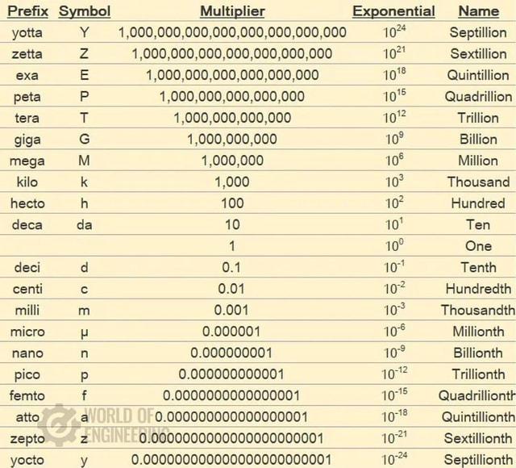

# Table of contents

- [Table of contents](#table-of-contents)
- [Title](#title)
- [一级标题](#一级标题)
  - [二级标题](#二级标题)
    - [三级标题](#三级标题)
      - [四级标题](#四级标题)
        - [五级标题](#五级标题)
          - [六级标题](#六级标题)
- [Paragraph](#paragraph)
- [Font](#font)
- [List](#list)
- [Block](#block)
  - [Nested Block](#nested-block)
  - [List in Block](#list-in-block)
  - [Block in List](#block-in-list)
- [Code](#code)
  - [如果是段落上的一个函数或片段的代码可以用反引号把它包起来（\`）](#如果是段落上的一个函数或片段的代码可以用反引号把它包起来)
  - [代码区块](#代码区块)
  - [\`\`\` 包裹一段代码，指定一种语言](#-包裹一段代码指定一种语言)
- [Link](#link)
- [Image](#image)
  - [specify image size](#specify-image-size)
- [Table](#table)
  - [表格的对其方式](#表格的对其方式)
- [Advanced Tips](#advanced-tips)
  - [支持的 HTML 元素](#支持的-html-元素)
  - [转义](#转义)
  - [公式](#公式)
- [TOC](#toc)
- [My Record](#my-record)

# Title

# 一级标题

## 二级标题

### 三级标题

#### 四级标题

##### 五级标题

###### 六级标题

普通内容

# Paragraph

方法一：使用空行分段

方法二：在段尾使用连续两个空格进行分段

# Font

_斜体文本_
_斜体文本_

**粗体文本**
**粗体文本**

**_粗斜体文本_**
**_粗斜体文本_**

# List

- 第一项
- 第二项
- 第三项

* 第一项
* 第二项
* 第三项

- 第一项
- 第二项
- 第三项

1. 第一项
2. 第二项
3. 第三项

4. 第一项：
   - 第一项嵌套的第一个元素
   - 第一项嵌套的第二个元素
5. 第二项：
   - 第二项嵌套的第一个元素
   - 第二项嵌套的第二个元素

# Block

> 区块引用（这部分利用连续两个空格进行分段）  
> 菜鸟教程  
> 学的不仅是技术更是梦想

## Nested Block

> 最外层
>
> > 第一层嵌套
> >
> > > 第二层嵌套

## List in Block

> 区块中使用列表
>
> 1. 第一项
> 2. 第二项
>
> - 第一项
> - 第二项
> - 第三项

## Block in List

- 第一项
  > 菜鸟教程
  > 学的不仅是技术更是梦想
- 第二项

# Code

### 如果是段落上的一个函数或片段的代码可以用反引号把它包起来（`）

`printf()`函数

### 代码区块

**四个空格**或者一个**制表符（Tab 键）**

    <?php
    echo 'RUNOOB';
    function test(){
        echo 'test'
    }

### ``` 包裹一段代码，指定一种语言

```javascript
$(document).ready(function () {
  alert("RUNOOB");
});
```

# Link

1. 方法一：  
   [链接名称](链接地址)

2. 方法二：  
   <链接地址>

例子：  
这是一个链接 [菜鸟教程](https://www.runoob.com)  
<https://www.runoob.com>

# Image




## specify image size


# Table

| 表头   | 表头   |
| ------ | ------ |
| 单元格 | 单元格 |
| 单元格 | 单元格 |

### 表格的对其方式

-: 设置内容和标题栏居右对齐。  
:- 设置内容和标题栏居左对齐。  
:-: 设置内容和标题栏居中对齐。

| 左对齐 | 右对齐 | 居中对齐 |
| :----- | -----: | :------: |
| 单元格 | 单元格 |  单元格  |
| 单元格 | 单元格 |  单元格  |

# Advanced Tips

### 支持的 HTML 元素

例子：  
使用 <kbd>Ctrl</kbd>+<kbd>Alt</kbd>+<kbd>Del</kbd> 重启电脑

### 转义

**文本加粗**  
\*\* 正常显示星号 \*\*

### 公式

更多解释：[菜鸟教程](https://www.runoob.com/markdown/md-advance.html)

$$
\begin{Bmatrix}
   a & b \\
   c & d
\end{Bmatrix}
$$

$$
\begin{CD}
   A @>a>> B \\
@VbVV @AAcA \\
   C @= D
\end{CD}
$$

# TOC

[Markdown Table of Contents Generator](https://luciopaiva.com/markdown-toc/)

# My Record

<span style="color: #1282DF">my color</span>

1. 蓝色：#1282DF
2. 紫色：#7912DF
3. 红色：#DF1212
4. 橙色：#DF7C12
5. 黄色：#DFDF12
6. 绿色：#63DF12
7. 灰色：#A09E9A
