# Table of contents

- [Table of contents](#table-of-contents)
- [Getting Started](#getting-started)
  - [2-What is JavaScript](#2-what-is-javascript)
  - [3-Setting up the development environment](#3-setting-up-the-development-environment)
- [Basics](#basics)
  - [1-Variables](#1-variables)
  - [2-Constants](#2-constants)
  - [3-Primitive Types](#3-primitive-types)
  - [4-Dynamic Typing](#4-dynamic-typing)
  - [5-Arrays](#5-arrays)
- [Operators](#operators)
  - [1-JavaScript Operators](#1-javascript-operators)
  - [2-Arithmetic Operators](#2-arithmetic-operators)
  - [3-Assignment Operators](#3-assignment-operators)
  - [4-Comparison Operators](#4-comparison-operators)
  - [5-Equality Operators](#5-equality-operators)
  - [6-Ternary Operators 三元](#6-ternary-operators-三元)
  - [8-Logical Operators with Non-booleans](#8-logical-operators-with-non-booleans)
- [Control Flow](#control-flow)
  - [5-Do...while](#5-dowhile)
  - [7-For...in](#7-forin)
  - [8-For...of](#8-forof)
  - [9-Break and Continue](#9-break-and-continue)
- [Objects](#objects)
  - [2-Factory-Functions](#2-factory-functions)
  - [3-Construtor Funcions](#3-construtor-funcions)
  - [4-Dynamic Nature of Objects](#4-dynamic-nature-of-objects)
  - [5-Constructor Property](#5-constructor-property)
  - [6-Functions are Objects](#6-functions-are-objects)
  - [7-Value vs Reference Types](#7-value-vs-reference-types)
  - [8-Enumberating Properties of an Object](#8-enumberating-properties-of-an-object)
  - [9-Clone an Object](#9-clone-an-object)
  - [10-Garbage Collection](#10-garbage-collection)
  - [11-Math](#11-math)
  - [12-String](#12-string)
  - [13-Template Literals](#13-template-literals)
  - [14-Date](#14-date)
- [Arrays](#arrays)
  - [2-Adding Elements](#2-adding-elements)
  - [3-Finding Elements(Primitives)](#3-finding-elementsprimitives)
  - [4-Finding Elements(Reference Types)](#4-finding-elementsreference-types)
  - [5-Arrow Functions](#5-arrow-functions)
  - [6-Removing Elements](#6-removing-elements)
  - [7-Emptying an Array](#7-emptying-an-array)
  - [8-Combining and Slicing Arrays](#8-combining-and-slicing-arrays)
  - [9-The Spread Operator](#9-the-spread-operator)
  - [10-Iterating an Array](#10-iterating-an-array)
  - [11-Joining Arrays](#11-joining-arrays)
  - [12-Sorting Arrays](#12-sorting-arrays)
  - [13-Testing the Elements of an Array](#13-testing-the-elements-of-an-array)
  - [14-Filter an Array](#14-filter-an-array)
  - [15-Mapping an Array](#15-mapping-an-array)
  - [16-Reducing an Array](#16-reducing-an-array)
- [Functions](#functions)
  - [1-Function Declarations vs Expressions](#1-function-declarations-vs-expressions)
  - [2-Hoisting](#2-hoisting)
  - [3-Arguments](#3-arguments)
  - [4-The Rest Operator](#4-the-rest-operator)
  - [5-Default Parameters](#5-default-parameters)
  - [6-Getters and Setters](#6-getters-and-setters)
  - [7-Try and Catch](#7-try-and-catch)
  - [8-Local vs Global Scope](#8-local-vs-global-scope)
  - [9-Let vs Var](#9-let-vs-var)
  - [10-The this Keyword](#10-the-this-keyword)
  - [11-Changing this](#11-changing-this)

# Getting Started

## 2-What is JavaScript

- ECMAScript: ECMAScript is just a specification（格式）
- JavaScript: JavaScript 是一种符合此规范的编程语言
- so we have this organization called ECMA, which is responsible for defining standards
- ES6 规定了很多新的规则

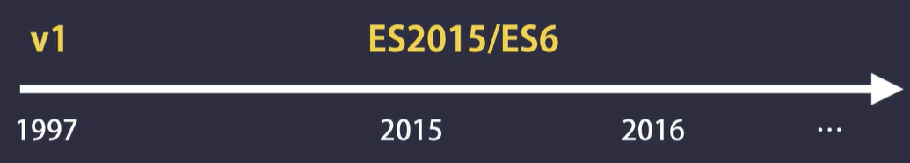

## 3-Setting up the development environment

- vs code
- node
- live server in vs code

# Basics

## 1-Variables

```JavaScript
let name;
console.log(name);
// undefined
/*
一般来说，JavaScript 中，变量初始值为 undefined
*/
```

- 变量名规定：
  - 不可以是保留字
  - 不能以数字开头
  - 不能包含空格或者-
  - 大小写敏感

## 2-Constants

const vs. let

## 3-Primitive Types

- js 有两种数据类型：

  - Primitives / Values Types
    - string, number, boolean, undefined, null
  - Reference Types
    - Object, Array, Function

- null：我们使用 null，当我们想 explicitly 明确地清除一个变量的值

## 4-Dynamic Typing

- 静态语言，一旦变量类型被规定，在运行时中，类型不可以被改变
- js：动态语言，变量类型可以在运行时改变
- js 中没有 float，没有多种 number，只有一种，就是 number，整数小数都叫 number
- undefined 既是 type 也是 value
  - let firstName = undefined;
  - typeof firstName: "undefined"
- let selectedColor = null;
  - typeof selectedColor: "object"

## 5-Arrays

- js 中 array 也是一种 object，它也包含很多 keys，比如说 length
- 可以利用 array.length 访问 array 的这个属性

# Operators

## 1-JavaScript Operators

- arithmetic 算术
- assignment 分配
- comparison
- logical
- bitwise 位运算

## 2-Arithmetic Operators

```JavaScript
let x = 10;
let y = 3;

console.log(x + y);
console.log(x - y);
console.log(x * y);
console.log(x / y);
console.log(x % y);
console.log(x ** y);


// Increment (++)
console.log(++x);   // 11
console.log(x++);   // 11 会先看到x本身，然后x才会被+1
console.log(x);     // 12

// Decrement (--)
console.log(--x);   // 11
console.log(x--);   // 11 会先看到x本身，然后x才会被-1
console.log(x);     // 10
```

## 3-Assignment Operators

```JavaScript
let x = 10;

x++;
x = x + 1;

x = x + 5;
x += 5;

x = x * 3;
x *= 3;
```

## 4-Comparison Operators

```JavaScript
let x = 1;

// Relational
console.log(x > 0);     // true
console.log(x >= 1);    // true
console.log(x < 1);     // false
console.log(x <= 1);    // true

// Equality
console.log(x === 1);   // true
console.log(x !== 1);   // false
```

## 5-Equality Operators

```JavaScript
// Strict Equality (Type + Value)
console.log(1 === 1);       // true
console.log('1' === 1);     // false

// Lose Equality
// 这种比较中，会自动看向操作符左侧，如果左侧的变量是string，会自动将右侧的变量转换成string，再进行比较。如果是Boolean，会自动将右侧的1，转换成boolean（true），再进行比较
console.log(1 == 1);        // true
console.log('1' == 1);      // true
console.log(true == 1);      // true
```

## 6-Ternary Operators 三元

```JavaScript
let points = 110;
let type = points > 100 ? 'gold' : 'siver';
```

## 8-Logical Operators with Non-booleans

- 逻辑运算的结果不总是 true or false
- 当 JS 引擎试着给一个表达式赋值的时候，它会看向两侧。如果一侧不是布尔型变量，它会试图翻译成 truthy or falsy
- Falsy
  - undefined
  - null
  - 0
  - false
  - ''
  - NaN: not a number，当计算结果不是一个数值的时候，这个值会被返回
- anything that is not Falsy -> Truthy

```JavaScript
false || 'Ching'    // "Ching"
false || 1          // 1
false || 1 || 2     // 1，返回第一个not falsy的值
```

# Control Flow

## 5-Do...while

- do...while 与 while 的区别是，不论条件判断结果为何（i <= 5），至少会执行一次

```JavaScript
let i = 0;

do {
  if (i%2 != 0) console.log(i);
  i++;
} while (i <= 5);


let i = 0;
while (i <= 5) {
  if (i%2 != 0) console.log(i);
  i++
}
```

## 7-For...in


## 8-For...of


## 9-Break and Continue

- break：直接跳出循环
- continue: java 引擎，看到 continue 就会 jump 到 loop 的开始位置，并且执行下一次循环

1. max of two numbers
2. Landscape or Portrait
3. FizzBuzz
4. Demerit Points
5. Even and Odd Numbers
6. Count Truthy
7. String Properties
8. Sum of Multiples of 3 and 5
9. Grade
10. Stars
11. Prime Numbers

# Objects

## 2-Factory-Functions

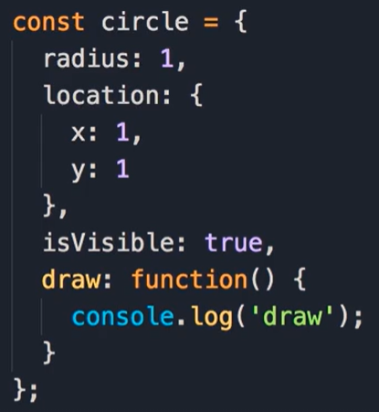

- 在现代 js 中，如果 key 和 value 是一样的，可以将他们合并，只保留 key
- 对于方法 draw，instead of defining it as a key value pair,可以直接写成下图中的样式
- 这很像是在 object 外定义 function
  - function draw() {}
- 下图中就是 factory function

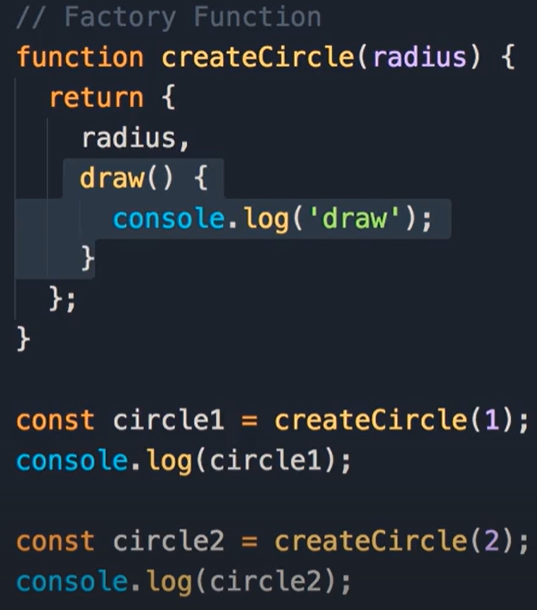

- factory function 并不是 create object 的唯一方法，下章讲解另一种方法，构造函数

## 3-Construtor Funcions

- Construtor Funcion: the job of this function is to construct or create an object
- 注意 naming convention 大驼峰
- 注意 this key word 的使用


- 因子函数和构造函数，没啥区别，不要纠结用哪种

## 4-Dynamic Nature of Objects

- Dynamic: 一个 object 被创建以后，可以随时添加新的 key 或者方法，也可以随时删除


- 有一点需要解释：const，一般指常量，但是 js 中，const 代表不可以被重复赋值，但可以修改。如果如下图所示，将 circle 给一个新的值{}，则会报错。若如上图所示，修改 circle 的 key，就不会报错


## 5-Constructor Property

- 每一个 js object 都有一个属性，叫做 constructor，这是指被用于构建这个 object 的 function
- 下图中，当使用因子函数新建 object 的时候 createCirle，利用 console 查看这个 circle.constructor，会发现是 f Object(){[native code]}. 这是因为，当使用 object literal syntax, internally js engine uses this contructor function（console 中显示的这个 function）


- 下图中，左边是正经新建一个 object，右边 comment 部分是 literal syntax, which is 更简洁。除此外，还有 let x = {} ,等同于 let x = new Object();
  

## 6-Functions are Objects

- Circle（是一个 function） 的本质是 Object。利用 Circle.可以查看很多 object 的属性，比如 name length, 也有 object 的方法，比如 apply bind call
  - Circle.length: return the number of arguments
  - Circle.constructor: the function used to create this object ---> Function
- 下图中，const Circle = new Function()，就是第一行中 function Circle(radius){}在 js 中的底层样子。换句话说，这两种表达一模一样。
  - Function 是一个 JS 内置的 constructor


- 下图中，Circl.call({}, 1) 与 最后一行，是一模一样的意思
- .call() 的第一个参数是这个 object 的 this，the object to be used as the current object
- new operator（最后一行）, 会自动新建一个{} object，并且 pass 它 as 第一个参数 to the call method。this object will determine the context of 'this', this will reference this object

  

- 如果不使用 new operator，this 会 default 指向 global object which is Window. 下图中两个语句，意思一模一样

  

- 还有一个方法是 apply，它与 call 功能相同。但是 instead of passing all the arguments explicitly we pass them in an array

## 7-Value vs Reference Types

  

- 注意 y 的值，不会随着 x 变化而变化


- y 与 x 的值一样了


- primitives are copied by their value
- objects are copied by their reference

- 下图中你以为结果是 11，其实不是，是 10. 因为，when we call increase function and pass this number variable, it's value is copied into this parameter that is local in this function. so the number variable inside the increase function is completely independent of the number let variable outside
  

- 如果把上述变量换成 object，结果就是 11 了。因为 object is passed by reference
  

## 8-Enumberating Properties of an Object

  

## 9-Clone an Object

- object.assign copies the properties and methods from 1 or more source objects into a target object, and we can use that to clone an object or combine multiple objects into a single object
- spread operator is used to spread an object, which basically means getting all its properties and menthods and putting them into another object
- 三种方法：
  

## 10-Garbage Collection

你不用操心 js 的垃圾回收问题，她说自动的

## 11-Math

- built-in object in JS
  - math object
- google javascript math
  - developer.mozilla.org
  - first reference for learning about all the objects in JS

```JavaScript
Math.roung(1.9)
// 2
Math.max(1,2,3,4,5)
// 5
Math.random()
// 0.0429858904327837
```

## 12-String

  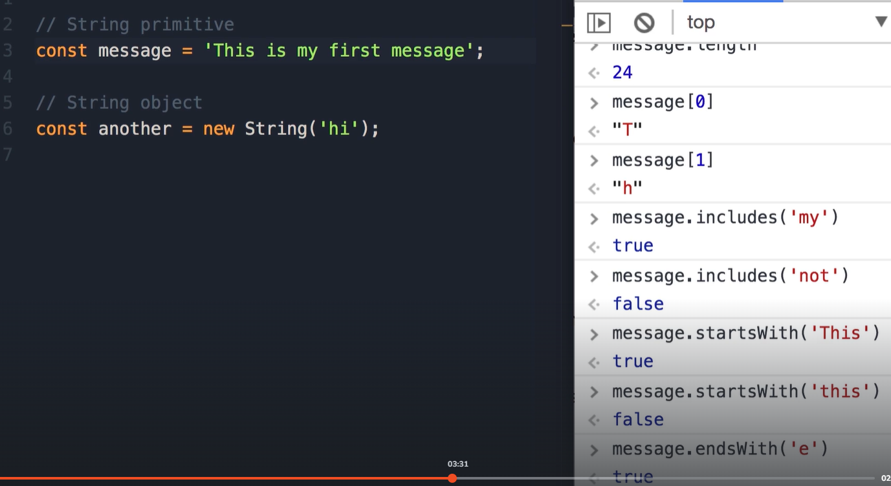

  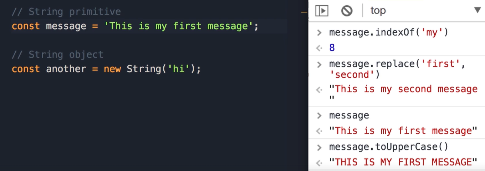

  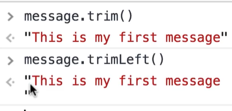

 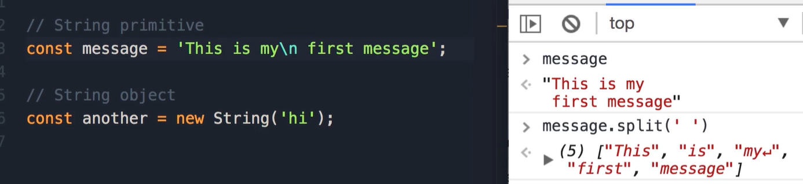

## 13-Template Literals

下图中中间 comment 掉的部分是其他种类的 object literals 对象字面量

 

 

## 14-Date

 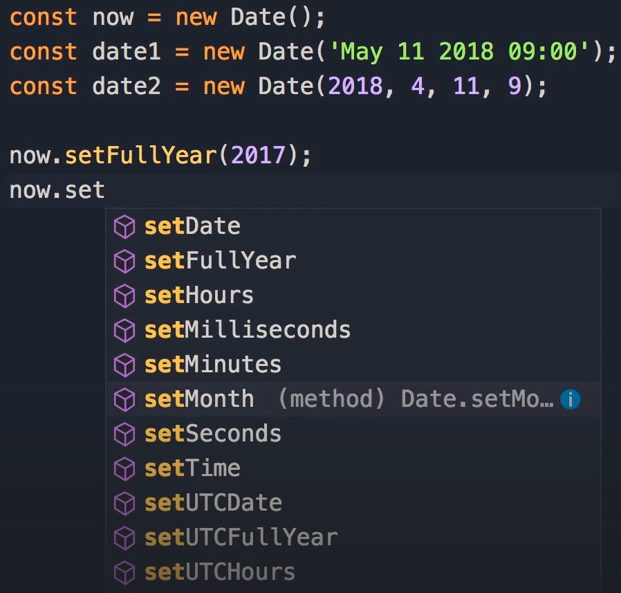

 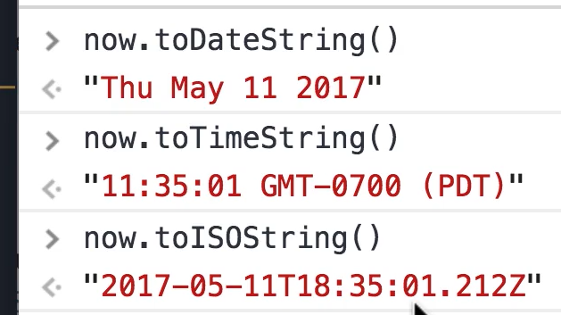

# Arrays

## 2-Adding Elements

array.splice(index, numberOfElementDelete, elementToAdd, anotherElementToAdd)

 

## 3-Finding Elements(Primitives)

numbers.indexOf(1,2): 1 is the element, 2 is search from which index. 所以第一个 console 的值是 3 不是 0，因为是从 index 2 开始找的

 

## 4-Finding Elements(Reference Types)

 

course is one element of courses. another method is findIndex

 

## 5-Arrow Functions

 

## 6-Removing Elements


## 7-Emptying an Array

- 方法一，不使用引用，another 依然是原 array，不会是空 array
- 方法四，存在性能问题
- 推荐方法二

  

## 8-Combining and Slicing Arrays


- 当 concat/slice 用在引用型 array 上的时候，结果都是引用，不是新建


## 9-The Spread Operator


## 10-Iterating an Array


## 11-Joining Arrays


## 12-Sorting Arrays


## 13-Testing the Elements of an Array

这两个方法都是新的，有些老式浏览器不支持


## 14-Filter an Array


## 15-Mapping an Array

filter/map 返回一个新 array，他们不会修改原 array


## 16-Reducing an Array


如果不设定初始值（0），则从第一个元素开始操作


# Functions

## 1-Function Declarations vs Expressions

注意分号，expression 有分号，declaration 一般不写分号


let move = run, 是引用型的，指向同一 function


## 2-Hoisting

- declaration 可以提前 call，expression 不能提前 call
- we can call a function that is defined using the function declaration syntax before it's definition
- 原因是：JS 引擎执行这些代码的时候，它会自动将所有 function declaration 移动到最上面，我们称这种执行为 hoisting 吊装

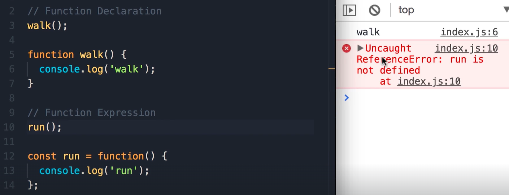

## 3-Arguments

- js 是自动语言，可以声明一个变量，设定它为 int，之后改变它的 type，将它变成一个 string
- 对于两个参数的 function，可以只传入一个，因为 b 会默认为 undefined
- 1 + undefined = NaN not a number
- 也可以传入多个（多于两个）参数，多出的位置的参数会自动忽略

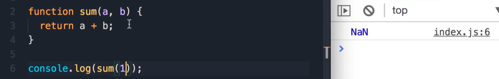

- 传入的参数集是动态的（varying number of parameter）的时候，利用 arguments 参数，检查参数
- arguments，不是一个 array，是一个 object，key 就是参数的 index。还有别的 key：length，callee

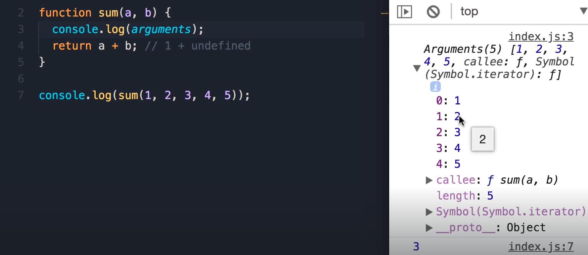

- arguments 是一个 object，一般来说没有 iterator 方法，不可以用 value of arguements, 但是 arguements 这个 object 特别，它含有迭代器，所以可以 for loop

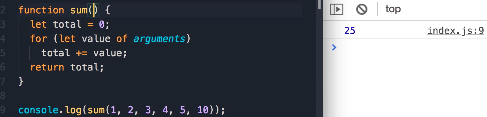

## 4-The Rest Operator

- 写了 rest operator，args 就是一个 array
- 当你写了一个 rest operator 在 function 参数集中的时候，我们可以传递变化数目的参数，rest operator 会将他们合成一个 array


- 如果不写 rest operator，args 就是第一个参数，1


- 一个例子，rest 参数是如何工作的


- 在 rest operator 之后再多一个参数，会报错：rest 参数必须是最后一个参数。这也是我们叫他 rest 的原因，它前面可以有无数参数，它就是其他参数


## 5-Default Parameters

- default parameter 最好是最后一个，或者它后面的 parameter 都是 default parameter


## 6-Getters and Setters

- 两种 fullName 都是在 objec 中定义 function 的方法
- 第二种简便很多


- 第一无法修改
- 第二.fullName()需要打括号，我们希望把它当成 property，不要 call function


- 在 console 中看到...意味着是一个 function，点一下，trigger 它，可查看返回值


## 7-Try and Catch


## 8-Local vs Global Scope

- let/const: scope limited to the block in which they are defined 下图中花括号里面的区域


- 第一个 color 是 global scope,任何位置都可以访问它
- start 中的第 6 行的 color 会覆盖掉（take precedence over ） red，所以 color 在 console 中是 blue
- 最好不要定义全局变量，他们是公用的，不知道谁改成啥样了


## 9-Let vs Var


- 第一个问题是：var 的 scope 不是 block 而是 function
- 注意 i 换成 var 后，var 的 scope 和 let 的不一样，4 之后，再 console，会显示 5
- var 的 scope：limited to the function(not block) in which it's defined。一般语言都不会这样，只有 JS，之前一直有这个奇怪的 var，所以少用 var


- 第二个问题是：在 var 和 let 作为 global 变量的时候，var 会自动 attach 到 window object 上
- 因为 window object 是公用的，如果你正使用一个第三方 library，用了跟 color 同样的变量名，那个变量会覆盖你的 color
- 实际上，全局定义的 function 也会自动 attach 到 window object 上，利用 window.sayHi()，可以直接 call


## 10-The this Keyword

- This：the OBJECT that is executing the current function
- 第一：如果一个 function 是一个 object 的一部分，我们称之为 method。在 method 中的 this：指向 method 所在的那个 object
- 第二：普通 function，this 指向 global object, which is window object in browsers and global in Node
- 第三：构造函数，指向 new 的时候新建的空 object {}


- 下图中两个 console 都指向 video


- 下图是一个 regular function 的例子，palyVideo 中的 this 指向 global object


- 构造函数，我们使用 new 操作符 call 构造函数
- 并不指向 global object，而是指向 Video object
- 因为 new operator 会 create a new empty object,并且 set 构造函数中的 THIS 指向这个新建的空 object


- 第 9 行的 this，指向 window object，为啥它不指向 video 呢，因为它不是 method，它是 regular function


- forEach method 可以有两个参数，第二个是：thisArg，所以可以 pass an object, and 在 forEach 中的第一个参数，callBack function 中的 THIS，就不会指向 global object，而是 will reference that object（传入的第二个参数）


## 11-Changing this

- 以下方法是第二种 access this 的方法，会经常看到（self 也会经常被命名为 that），明白就行，不要用这个方法


- 前两种方法，只是暂时改变 this 的内容
- bind 是生成一个新 function，永久改变新 function 的 this 的内容
- bind 同下述 the same
  - const fn = playVideo({ name:'Mosh' })
  - fn()


- 以下是方法三，利用 bind 改变前一个 function 的 this


- 方法四，箭头函数，箭头函数会从 containing function 中继承 THIS


