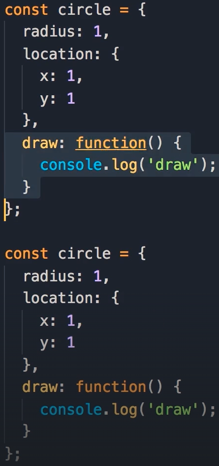
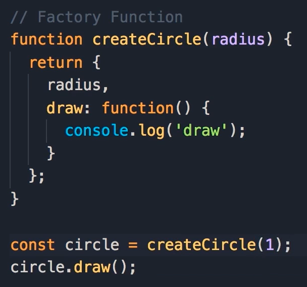
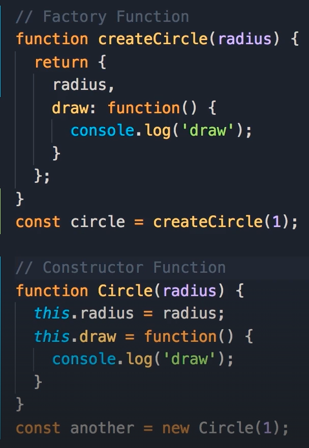

# Getting Started

## 2-Four Pillars of OOP

# Objects

## 2-Object Literals

- object literal is the simplest way to define an object
- 方法二：factories
- 方法三：constructors

## 3-Factories

- 如果一个 object 有一个或多个 method，我们称之为拥有 behavior
- 仅当 object 具有 behavior 时，使用 object literal 语法创建对象才会出现问题
- 因为 method 中如果有 bug，就需要维护多个 objects 中的相同的重复的，具有同样 bug 的 method

- 这最好使用因子或者构造函数，来创建 object

## 4-Constructors

- 如果是在一个 function 中 return 一个 object，我们称之为因子函数
- 如果使用 this key word，以及 new operator，我们称之为构造函数

## 5-Constructor Property

- js 中每个 object 都有一个 property，叫做 constructor,它指向构建/create 这个 object 的 function
- every object has a constructor property, and that references the function that was used to create the object

## 6-Functions are Objects

- 构造函数的本质是 Function 这种 object。看 console 中第三个，constructor 是 Function
- 第一个 Circle 构造函数，在 js 内部就相当于，第二个 new Function()

## 7-Value vs Reference Types

- primitives are copied by their value
- object are copied by their reference
- value types: number, string, boolean, symbol, undefined, null
- reference types: object, function, array

## 8-Adding or Removing Properties

## 9-Enumberating Properties

- enumerate all the members in an object: for loop
- get all the keys in an object: Object.keys()
- check for the existence of a property or a method in an object: in operator

## 11-Private Properties and Methods

- closure: 决定了，对于 inner function，哪些 variables 是 可访问的。一个 function 可以访问它自己内部的所有 variables（local variables），以及，它的父函数中定义的所有 variables
- scope: 在一个 function 中被定义的 variables，在 function 执行完，就会 go out-of-scope
- defaultLocation and compiteOptimumLocation are in scope of Circle function, and within the closure of inner function(this.draw = function(){})

## 12-Getters and Setters

# Prototypes(Parent)

## 2-Prototypes and Prototypical Inheritance

- 在 console 中新建一个空 object，访问它，你会看到它实际包含了一个叫做\_\_protp\_\_的 property

- 每一个在 js 中新建的 object，都直接或者间接继承于 objectBase

## 4-Property Descriptors

- 当利用各种方法循环访问 object 中的 property 的时候，你会发现 object 的组成元素是没有 toString 方法的
- 利用以下方法查看 object property 的 descriptor

- configurable is true: you can delete this memeber if we want to
- enumberable is false: 这是为什么，when we iterated over our person object, we couldn't see the toString method
- writable is true: 我们可以 over write this method，我们可以改变它的实现方式

- writable: false 不可改写

- enumerable: false 不可列举

- configurable: false 不可删除

## 5-Constructor Prototypes

- 三种方法 to get the prototype of an object
- 方法一：Object.getPrototypeOf(myObj)

- 方法二&三，以下两种写法，完全一致

## 6-Prototype vs Instance

- 我们不想,在 c1 c2 中重复 draw 方法，所以可以把它写在 prototype 中
- 可以直接利用 c1.draw() triggr 这个写在 prototype 中的方法
- Circle 中的元素叫做，instance members
- prototype 中的元素叫做，prototype members

- prototype 中的方法可以直接访问 Circle 中的方法。下图中 Circle.prototype.draw = function(){} 中的 this.move(), 就是直接访问 Circle 中的 this.move
- 相似的，Circle 中 move 中也可以直接访问 prototype.draw: this.move = function() { this.draw() }

## 7-Iterating Instance and Prototype Members

- 可以先 new Circle，再修改 Circle.prototype.draw,依然有效

## 8-Avoid Extending the Built-in Objects

DON'T modify objects you don't own

# Prototypical Inheritance

## 1-Creating Your Own Prototypical Inheritance

- Shape 的 prototype 是 ShapeBase（下图中第三行 Object）。ShapeBase 中包含 duplicate 方法

- ShapeBase 的 prototype 是 ObjectBase（下图中最后一行 Object）

- Circle 有着同样的结构，from CircleBase from ObjectBase
- 下图中，第一行是 CircleBase from ObjectBase
- 第二行是 CircleBase from ShapeBase
- Object.create(): a new object inheritance from
- 这个公式相当于 CircleBase = BaseOn(ShapeBase)

- 改写 Circle 的 prototype，让 Circle 继承于 ShapeBase

- 下图查看 c 的结构
- 第四行，Shape（CircleBase，the parent of Circle object），CircleBase 中有 draw 方法，并且包含它的 prototype，就是 ShapeBase（第六行的 proto）
- ShapeBase 中包含 duplicate 方法，并且包含它的 prototype，就是 ObjectBase（倒数第三行的 proto）
- c.draw, c.duplicate c 可以直接 call 这两个 method

## 2-Resetting the Constructor

- 两个 new 的作用效果是一模一样的

- 但是改变 Circle 的 base 后，constructor 也被变没了，只在下一级的 proto 中还有 constructor，但是这个指向的是 Shape 不是 Circle. 这时候，利用下图中 new 的时候，会发现新建了一个 Shape 而非 Circle

- 所以通常会再加一句，把 constructor 指向应该的位置

## 3-Calling the Super Constructor

- c 中只有自己的 radius 没有 shape 中的 color
- 方法一(不可行)：直接使用 Shape(color)
  - 并不会给 c color，而是给了 window 一个 color，因为没有使用 new operator 的时候，Shape 中的 this 指向 global variable---window
- 方法二(不可行)：new Shape(Color)
  - 我们不希望使用 new operator，因为这会新建另一个新的 object and then set the color property on that object. 我们想要使用一个被 Circle 中 THIS 指向的 object
  - 我们需要 call Shape function, and set THIS(Shape 中的 this.color 的 this) point to the new instance of the circle object
- 方法三：
  - 所以使用下图中的方法
  - 下图中阴影部分就是 JS call super construtor

## 4-Intermediate Function Inderitance

## 5-Method Overriding

- 在子 object 中，re-implement method
- 代码中倒数第二行的 Shape.prototype.duplicate.call(this)
  - simply call that(Shape.prototype.duplicate) like a regular function

## 6-Polymorphism

## 7-When to Use Inheritance

- 如果使用继承，最多一层继承，不要使用多层继承
- favor composition over inheritance

## 8-Mixins

# ES6 Classes

## 1-ES6 Classes

- babel: a JS compiler, 给他 modern JS code，他会 compile it down to ES5, 以便所有浏览器都能懂
- 注意下图中，console 中，move 和 draw 的位置，move 在 Circle 的属性/方法中，draw 在 Circle 的 prototype 中

## 2-Hoisting

- function declaration vs function expression
- class declaration vs class expression
  - class declaration 更方便用

## 3-Static Methods

- 在经典的面向对象语言中，我们有两种 method：instance method vs static method
- instance method: available on an instance of a class, which is an object
- static method: available on the class itself
  - 我们经常使用他们，建立 utility functions that are not specific to a given object

## 4-The This Keyword

- 第九行的 draw 指向 Circle 中的 draw 的引用

- 但是 call 第九行的 draw，打印出来的并不是 Circle 这个 object，而是 global object
- 因为第九行的 draw 不是一个 object 的一部分，而是一个 regular function

- use strict: 当使用 use strict mode 的时候，call regular function 的时候，this 不是指向 global object window，而是指向 undefined，是为了避免不小心修改 global object。当然，use strict 还有别的效果
- class body 的内容，不论你写不写 use strict，都会是 use strict 模式，这时 ES6 自动的

## 5-Private Members Using Symbols

- 在 ES6 中我们有一个新的 primitive 数据类型 Symbol
- a symbol is essentially 本质上 a unique identifier
- 用了以下方法后，我们就不能直接访问 Circle 的\_radius 或者 \_draw，因为他们已经不叫这个名字了，他们是 Symbol，名字是 unique 的并且隐藏的。但是依然可以通过下图中第 15 行的方法，访问到

## 6-Private Members Using WeakMaps

- WeakMap 本质上是一个 object，他们的 keys 是 weak 的，如果没有引用，这些 key 会被回收站回收
- 第六行，set(this, radius), this 是 key，radius 是 value

- strict mode: undefined
- not strict mode: global object window
- 箭头函数中，this 指向箭头函数所在的包裹 function
- 第十行的 this，从 constructor 中继承来的

- 也可以写成以下形式：

## 7-Getters and Setters

## 8-Inheritance

## 9-Method Overriding

- when access a property or a method, JS engine walks up this tree, from the child all the way to the parent

# ES6 Tooling

## 1-Modules

- 每个 file 就是一个 module

## 2-CommonJS Modules

## 3-ES6 Modules

## 4-ES6 Tooling

- 当使用 ES6/modern JS 的时候，我们需要两种工具，a transpiler and a bundler

## 5-Babel

- 我们需要安装 node，我们主要是需要一个跟 node 一起来的工具，NPM（node package manager）
- 我们使用 NPM 来安装第三方 library 和工具
- npm init --yes
  - 这条命令会，在目前文件夹下，创建一个，名字叫 package.json 的文件, 这个文件是我们项目的身份证，它包含名字，版本，描述等
- npm i babel-cli@6.26.0 babel-core@6.26.0 babel-preset-env@1.6.1 --save-dev

  - babel-cli@6.26.0: Babel's command line interface, this is the tool that we run from the command line, like npm. we run the command line, and give it the name of our JS file, and then it will convert or compile that JS code
  - babel-core@6.26.0: basically the core of Babel where all logic for transpiring code is implemented
  - babel-preset-env@1.6.1: in Babel, we have a plugin for every new JS feature starting from ES6. 如果你只想用其中一种或几种，你可以只安装那几种 plugin。this preset is basically the combination of all these plugins, so it understand all the new features in JS starting from ES6

- npm run babel

## 6-Webpack

- npm i -g webpack-cli@2.0.14
- webpack-cli init
- 当 will you be using ES2015 这个问题回答 Yes 以后，webpack-cli 会自动下载 babel，用来转换代码

- 下图是 webpack-cli 自动添加的 dependency
- 第一个是 install webpack-cli locally
- uglifyjs: for uglifying code, which basically means shortening the name of out identifier
- babel-core
- babel-loader: in web pack we use loaders to preprocess files, so this is like a plugin
- babel-preset-env
- webpack: itself

- npm init --yes
  - 生成 package.json 文件
  - script 中添加"build": "webpack"
- npm run build
- webpack runs our code through Babel, and it converted it to ES5
- 到 html 中，修改 script tag
  - 去掉 type="module"
  - 修改 src="dist/main.bundle.js"
- 回到 console，一切正常运行
- 每次修改源代码，我们都需要回去 npm run build
  - "build": "webpack -w"
  - w: watch
  - 修改源码，会自动重新 bundle
