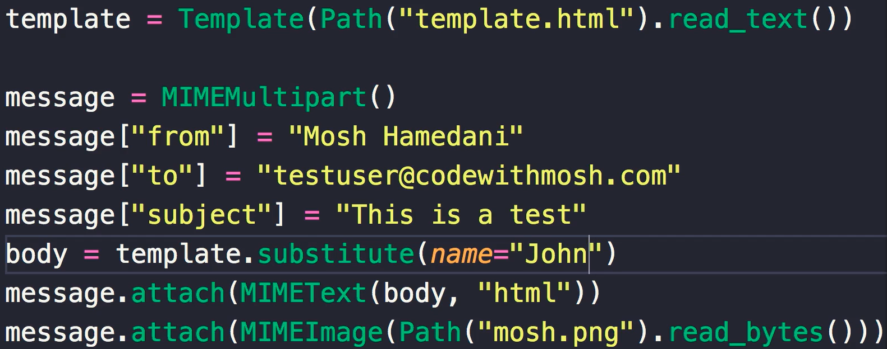
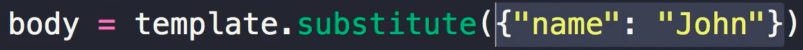
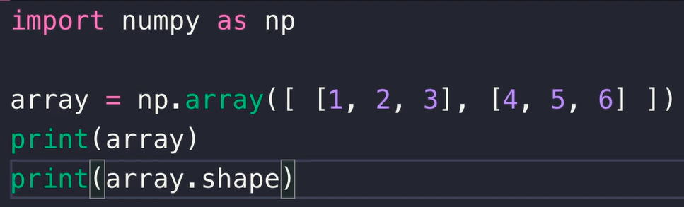

- [Custom Notes](#custom-notes)
- [VS code Python 快捷键](#vs-code-python-快捷键)
- [Python 编码规范](#python-编码规范)
- [1-Getting Started](#1-getting-started)
  - [Python Implementations](#python-implementations)
  - [How Python Code is Executed](#how-python-code-is-executed)
  - [Quiz](#quiz)
- [2- Primitive Types](#2--primitive-types)
  - [1- Variables](#1--variables)
  - [9- Type Conversion 转换](#9--type-conversion-转换)
  - [10- Quiz](#10--quiz)
  - [正则表达式](#正则表达式)
  - [r''](#r)
- [3- Control Flow](#3--control-flow)
  - [4- Logical Operators](#4--logical-operators)
  - [7- Quiz](#7--quiz)
  - [11- Iterables](#11--iterables)
- [7- Classes](#7--classes)
  - [枚举](#枚举)
  - [枚举别名 \& 装饰器](#枚举别名--装饰器)
  - [定制 \& 扩展枚举](#定制--扩展枚举)
  - [描述符](#描述符)
  - [new 方法](#new-方法)
- [8- Modules](#8--modules)
  - [python 文件夹 package 层级管理](#python-文件夹-package-层级管理)
  - [1- Creating Modules](#1--creating-modules)
  - [2- Compiled Python Files](#2--compiled-python-files)
  - [3- Module Search Path](#3--module-search-path)
  - [4- Packages](#4--packages)
  - [5- Sub-packages](#5--sub-packages)
  - [6- Intra-package References](#6--intra-package-references)
  - [7- The dir Function](#7--the-dir-function)
  - [8- Executing Modules as Scripts](#8--executing-modules-as-scripts)
- [9- Python Standard Library](#9--python-standard-library)
  - [2- Working With Paths（Files）](#2--working-with-pathsfiles)
  - [3- Working with Directories](#3--working-with-directories)
  - [4- Working with Files](#4--working-with-files)
  - [5- Working with Zip Files](#5--working-with-zip-files)
  - [6- Working with CSV Files](#6--working-with-csv-files)
  - [7- Working with JSON Files](#7--working-with-json-files)
  - [8- Working with a SQLite Database](#8--working-with-a-sqlite-database)
  - [9- Working with Timestamps](#9--working-with-timestamps)
  - [10- Working with DateTimes](#10--working-with-datetimes)
  - [11- Working with Time Deltas](#11--working-with-time-deltas)
  - [12- Generating Random Values](#12--generating-random-values)
  - [13- Opening the Browser](#13--opening-the-browser)
  - [14- Sending Emails](#14--sending-emails)
  - [15- Templates](#15--templates)
  - [16- Command-line Arguments](#16--command-line-arguments)
  - [17- Running External Programs](#17--running-external-programs)
- [10-Python Package Index](#10-python-package-index)
  - [Pypi](#pypi)
  - [Pip](#pip)
  - [Virtual Environments](#virtual-environments)
  - [Pipenv](#pipenv)
  - [Virtual Environments in VSCode](#virtual-environments-in-vscode)
  - [Pipfile](#pipfile)
  - [Managing Dependencies](#managing-dependencies)
  - [Publishing Packages](#publishing-packages)
  - [Docstrings](#docstrings)
  - [Pydoc](#pydoc)
- [11- Popular Python Packages](#11--popular-python-packages)
  - [4- Searching for Businesses](#4--searching-for-businesses)
  - [5- Hiding API Keys](#5--hiding-api-keys)
  - [6- Sending Text Messages](#6--sending-text-messages)
  - [7- Web Scraping](#7--web-scraping)
  - [8- Browser Automation](#8--browser-automation)
  - [9- Working with PDFs](#9--working-with-pdfs)
  - [10- Working with Excel Spreadsheets](#10--working-with-excel-spreadsheets)
  - [11- Command Query Separation Principle](#11--command-query-separation-principle)
  - [12- NumPy](#12--numpy)
- [12- Building Web Applications with Django](#12--building-web-applications-with-django)
- [13- Machine Learning with Python](#13--machine-learning-with-python)
  - [4- Importing a Data Set](#4--importing-a-data-set)
  - [5- Jupyter Shortcuts](#5--jupyter-shortcuts)

# Custom Notes

- datetime
  - from datetime import timedelta, datetime as dt
  - import datetime
  - from 中的 datetime 与第二行 import 中的 datetime 等价
  - datetime as dt 中的 datetime 是他们的子集

# VS code Python 快捷键

ctrl + alt + n = run code  
py -m pip install autopep8

# Python 编码规范

模块/文件/函数/变量，小写+下划线  
类，大驼峰

# 1-Getting Started

## Python Implementations

python language: defines a set of rules and grammar for writing python code  
python implementation: a program that understands those rules and can execute python code  
download python from python.org, which is the default implementation of python called CPython. it is a program written in C  
还有不同的 implementation，他们都是居于 CPython 的，同样的 python code 在不同的 implementation 中运行结果一样。它们就像不同的浏览器，操作系统，程序语言。Jython java, IronPython C#, PyPy subset of Python  
Jython：允许 reuse some existing java code in a python program

## How Python Code is Executed

如果你有一些 code written in C, 你需要 convert it to machine code, which is the job of a C Complier. However this mathine code is specific to the type of CPU of a computer, so if you compile a C program on a Windows machine we can't execute it on a Mac. Because Windows and Mac have different machine code.  
java came to solve this problem. Java compiler doesn't compiler java code into machine code, instead it compiler it into a portable language called JavaBytecode. JavaBytecode is not specific to a hardware platform like Windows or Mac. 之后，依然需要将 JavaBytecode 转换为 machine code。So jave also comes with a program called java virtual machine, or JVM for doning this. 当一段 java code 在执行的时候，JVM 就会工作，it loads a JavaBytecode and then at run time, it will convert each instruction to machine code.  
python 同样如此： python--->CPython--->python bytecode--->python virtual machine--->machine code
java: java code ---> java compiler ---> JavaByteCode ---> JVM ---> machine code

## Quiz

what is expression: a piece of code that produces a value

# 2- Primitive Types

## 1- Variables

- when we run this program, python interpreter will allocate some memory and store this number 1000 in that memory space
- and then it will have this variable reference that memory location
- this variable is just like a label for that memory location
- case sensitive

## 9- Type Conversion 转换

- Falsy (when we use the following values in a boolean context, we will get 'False'. anything else will be 'True')
  - ""
  - 0
  - None (the absence of a value)
- 关于 None
  - python 中使用 none 而非 null
  - None 是 Python 中用来表示空值或缺失值的特殊关键字。
  - 在 Python 中，当一个变量没有被赋予任何值时，它的默认值就是 None。
  - None 是一个 Python 对象，可以用来检查一个变量是否被赋值
  - 通常用于初始化变量，表示变量暂时没有值，或者用来清除变量的值

## 10- Quiz

- what are the primitive types in Python?
  - string
  - number (integer, float, complex numbers)
  - boolean

## 正则表达式

1. 验证电子邮件地址：通过正则表达式可以验证用户输入的电子邮件地址是否符合合法格式，例如检查是否包含@符号和域名。

```Python
import re

pattern = r'^[a-zA-Z0-9._%+-]+@[a-zA-Z0-9.-]+\.[a-zA-Z]{2,}$'
email = "user@example.com"
if re.match(pattern, email):
    print("有效的电子邮件地址")

```

2. 提取 URL 链接：从文本中提取所有的 URL 链接，以便进一步处理或分析。

```Python
import re

text = "Visit our website at https://www.example.com for more information. For support, go to https://support.example.com."
urls = re.findall(r'https?://\S+', text)
print(urls)
```

3. 文本替换：使用正则表达式来替换文本中的特定模式，例如将所有的制表符替换为空格。

```Python
import re

text = "This\tis\ta\ttab-separated\ttext."
modified_text = re.sub(r'\t', ' ', text)
print(modified_text)
```

4. 提取电话号码：从文本中提取所有的电话号码，以便进一步处理或分析。

```Python
import re

text = "Contact us at +1 (555) 123-4567 or 123-555-7890 for assistance."
phone_numbers = re.findall(r'\+?\d{1,3} \(\d{3}\) \d{3}-\d{4}|\d{3}-\d{3}-\d{4}', text)
print(phone_numbers)
```

5. 密码强度验证：使用正则表达式来确保用户创建的密码具有足够的复杂性，例如要求包含大写字母、小写字母、数字和特殊字符。

```Python
import re

password = "MySecureP@ssw0rd"
if re.match(r'^(?=.*[A-Z])(?=.*[a-z])(?=.*\d)(?=.*[@#$%^&+=])[\w@#$%^&+=]{8,}$', password):
    print("密码强度符合要求")
```

6. 拆分文本：使用正则表达式来拆分文本成不同的单词或段落。

```Python
import re

text = "This is a sample sentence. Another sentence follows."
sentences = re.split(r'[.!?]', text)
print(sentences)
```

## r''

在 Python 中，当你使用字符串字面值（即包含在引号内的文本）时，通常需要注意转义字符的处理。然而，如果你使用了一个原始字符串（raw string），可以通过在字符串前面加上字母"r"来告诉 Python 不要处理字符串中的转义字符，直接将字符串按照原样处理。

例如，正则表达式经常包含反斜杠（\），这是一个特殊字符，用于表示转义序列。如果你不使用原始字符串，那么需要在正则表达式中的每个反斜杠前面再添加一个反斜杠来转义它。但是，如果使用原始字符串，你就不需要这么做。

在下面的示例中，使用了原始字符串（以字母"r"开头的字符串），所以反斜杠字符"\n"被视为普通的字符而不是转义字符。这在处理正则表达式、文件路径、JSON 字符串等需要保留转义字符的情况下非常有用。

```Python
# 普通字符串中的反斜杠需要转义
normal_string = "This is a line with a newline character: '\\n'"
print(normal_string)  # 输出: This is a line with a newline character: '\n'

# 使用原始字符串，不需要额外的转义
raw_string = r"This is a line with a newline character: '\n'"
print(raw_string)  # 输出: This is a line with a newline character: '\n'
```

# 3- Control Flow

## 4- Logical Operators

- and
- or
- not

## 7- Quiz

- "bag" > "apple" ---> True

## 11- Iterables

- print(type(range(5))) ---> <class 'range'>
- range object is iterable

# 7- Classes

[Python 面向对象教程](https://www.youtube.com/watch?v=L1L-ocCBY4k&list=PLvQDgAXJ4ADNoPbhRSD_s9HkyYsVnITbh)
[源代码](https://github.com/stevencn76/python_oop)

### 枚举

```Python
from enum import Enum

class Gender(Enum):
  MALE = 1
  FEMALE = 2

class Student:
  def __init__(self, gender: Gender):
    self.gender = gender

def main():
  print(type(Gender.MALE))
  print(Gender.MALE.name)
  print(Gender.MALE.value)

  # method one
  student = Student(Gender.FEMALE)

  # method two
  s_gender = "MALE"
  student.gender = s_gender      # this is wrong, because here need a Gender not a string
  student.gender = Gender[s_gender]

  # method three
  i_gender = 2
  student.gender = i_gender      # this is wrong, because here need a Gender not a integer
  student.gender = Gender(i_gender)

  if student.gender == Gender.MALE:
    print('male')
  else:
    print('female')

if __name__ == '__main__':
  main()

""" 根据成员取值，根据值取成员 """
print(Gender["MALE"])
print(Gender(2))

""" 遍历枚举: 枚举本身是可迭代的 """
for gender in Gender:
  print(gender)
```

### 枚举别名 & 装饰器

```Python
from enum import Enum

@enum.unique
class Status(Enum):
  SUCCESS = 1
  OK = 1
  FAIL = 2
  WRONG = 2

def main():
  # SUCCESS and FAIL
  for s in status:
    print(s.name)

if __name__ == '__main__':
  main()
```

### 定制 & 扩展枚举

- 定制**str**函数
- 定制**eq**函数
- 定制**It**函数
- auto()函数

### 描述符

描述符是一个特殊的类，要求实现如下一些方法。至少要实现 setname 和其他三种中的一个

```Python
__set_name__(self, owner, name)
__get__(self, instance, owner)
__set__(self, instance, value)
__delete__(self, instance)
```

```Python
class Student1:
    def __init__(self, first_name: str, last_name: str):
        self.first_name = first_name
        self.last_name = last_name

    @property
    def first_name(self):
        return self.__first_name

    @first_name.setter
    def first_name(self, first_name):
        if not isinstance(first_name, str):
            raise Exception("First name is not a string")

        if len(first_name) == 0:
            raise Exception("First name is empty")

        self.__first_name = first_name

    @property
    def last_name(self):
        return self.__last_name

    @last_name.setter
    def last_name(self, last_name):
        if not isinstance(last_name, str):
            raise Exception("Last name is not a string")

        if len(last_name) == 0:
            raise Exception("Last name is empty")

        self.__last_name = last_name
from chapter_18.student_1 import Student1
from chapter_18.student_2 import Student2


def main():
    student_1 = Student1("Jack", "Ma")
    # student_1.last_name = ""

    student_2 = Student2()
    student_2.first_name = "Jack"  #first_name.__set__(student_2, "Jack")
    student_2.last_name = "Ma"

    student_3 = Student2()
    student_3.first_name = "   Tom"
    student_3.last_name = "Li"

    print(student_2.first_name)
    print(student_3.first_name)


if __name__ == '__main__':
    main()
```

```Python
from chapter_18.required_string import RequiredString


class Student2:
    first_name = RequiredString(True)
    last_name = RequiredString(True)
    password = RequiredString(False)

class RequiredString:
    def __init__(self, trim: bool):
        self.__trim = trim

    def __set_name__(self, owner, name):
        self.__property_name = name

    def __set__(self, instance, value):
        if not isinstance(value, str):
            raise Exception(f"{self.__property_name} is not a string")

        value = value.strip()
        if len(value) == 0:
            raise Exception(f"{self.__property_name} is empty")

        instance.__dict__[self.__property_name] = value

    def __get__(self, instance, owner):
        if self.__property_name in instance.__dict__:
            return instance.__dict__[self.__property_name]

        return None
```

### new 方法

```Python
person = Person("Jack")

person = object.__new__(Person, "Jack")
person.__init__("Jack")
```

# 8- Modules

## python 文件夹 package 层级管理

- 运行 python 脚本，需要在 project（最大的项目根目录） 文件夹下，利用 main.py 作为入口运行
- 否则，不是所有的.py 文件都能被找到，即使有**init**.py，也找不到
- 使用 import sys print(sys.path) 可以看到哪些 path 可以被当前环境识别，这些 path 中就包括这个脚本（main.py）所在的 path (project/)
- （如果这个脚本在 project 下，project 任何位置的.py 都可以被识别。反之，这个脚本在 project 的子文件夹下，与它同级别的其他文件夹中的.py 文件就无法被 sys path 找到，就需要添加 sys.path.append）

```Python
# Get the directory of the current script
current_dir = os.path.dirname(os.path.abspath(__file__))

# Add the parent directory to sys.path
parent_dir = os.path.dirname(current_dir)
sys.path.append(parent_dir)
```

- 当 read excel 文件的 .py 脚本，不是程序入口时，file_path 需要特别注意
- TestFile 与 .py 脚本同在 project/file_to_SQL/ folder 之中
- 因为 .py 不是程序入口，所以直接写 file_path = "TestFile.xlsx"，会找不到 excel 文件

```Python
# 方法一
# 获取当前Python脚本所在的文件夹路径
current_directory = os.path.dirname(__file__)
# 创建一个完整的文件路径
file_path = os.path.join(current_directory, 'TestFile.xlsx')

# 方法二
file_path = "file_to_SQL/TestFile.xlsx"

# 方法三 以下方法会改变工作目录，导致上面那个问题，找不到其他folder(public/util)中的.py文件
# 获取当前工作目录
current_directory = os.getcwd()
# 将当前工作目录更改为一个新的目录
os.chdir(os.path.join(current_directory, "file_to_SQL"))
subprocess.call(["python", "script.py"])
file_path = "TestFile.xlsx"
```

## 1- Creating Modules

```python
# file sales:
def calc_tax():
    pass

def calc_shipping():
    pass
```

```python
# file app:

# metho one:
from sales import calc_shipping, calc_tax
# import * is not best practice, some of those objects may overwrite some objects with the same name in the current module
from sales import *


calc_shipping()
calc_tax()

# metho two:
import sales

sales.calc_shipping()
```

## 2- Compiled Python Files

- if you run python app.py, then there will be a new folder '\_\_pycache\_\_', a file 'sales.cpython-37.pyc'
- this is the complied files
- so currently we have the complied version of the sales module
- the reason python stores these complied files in this stored folder is to speed up module loading


## 3- Module Search Path

- when python sees the import statement, it will search all these directories to find this module
- all the search directories: sys.path

```python
import sys

print(sys.path)
```

## 4- Packages

- move sales file to sub folder ecommerce
- to import a module(file) from a sbu folder, we use packages
- when we have \_\_init\_\_.py in this folder, python will treat this folder as a package, a package is a container for one or more modules
- in file system terms, the package is mapped to a directory and a module is mapped to a file

```python
import ecommerce.sales

ecommerce.sales.calc_shipping()

from ecommerce.sales import calc_shipping

calc_shipping()

from ecommerce import sales

sales.calc_shipping()
```

## 5- Sub-packages

- ecommerce/shopping/sales.py
- do not forgot add \_\_init\_\_.py file in sub folder shopping

```python
from ecommerce.shopping import sales

sales.calc_shipping()
```

## 6- Intra-package References

- ecommerce/customer/contact.py
- ecommerce/shopping/sales.py, in the sales module, we want to use the contact module
- one . is current folder, two .. is one level up

```python
# file ecommerce/shopping/sales.py
# method one: absolute import
from ecommerce.customer import contact

contact.contact_customer()

# method two: relative import
from ..customer import contact
```


## 7- The dir Function

- powerful built-in function 'dir': we can get the list of attributes and methods defined in an object

```python
import sales

print(dir(sales))
# result: an array, all the attributes and methods defined in an object

# name of the module: ecommerce.shopping.sales
print(sales.__name__)
# name of the package: ecommerce.shopping
print(sales.__package__)
# the path to this file in the file system: /Users/moshfe/Dropbox/Python/Demo/HelloWorld/ecommerce/shopping/sales.py
print(sales.__file__)
```


## 8- Executing Modules as Scripts

- when import ecommerce.sales
- the print in ecommerce folder \_\_init\_\_.py, will excute firstly
- then is the print int sales.py file
- but if we want to use sales separately, we use if \_\_name** == "\_\_main**":
- if this module is imported by other module, \_\_name\_\_ will be 'ecommerce.shopping.sales'

```python
if __name__ == "__main__":
    print('Sales started')
    calc_tax()
```

# 9- Python Standard Library

## 2- Working With Paths（Files）

- search on google: python 3 pathlib, all the members of path class
- home returns the home dir of the current user


```python
from pathlib import Path

path = Path("ecommerce/__init__.py")

path.exists()
path.is_file()
path.is_dir()

# __init__.py
print(path.name)
# __init__
print(path.stem)
# .py
print(path.suffix)
# the parent folder: ecommerce
print(path.parent)

# create a new path object not a new file, it is change the file name to file.txt
path = path.with_name("file.txt")
# ecommerce/file.txt
print(path)
# /Users/moshf/Dropbox/helloworld/ecommerce/file.txt
print(path.absolute())

path = path.with_suffix(".txt")
print(path)
```

## 3- Working with Directories


- iterdir(): returns one file and three diretories at this path


- list iterdir()
- pathlib is based on two classed: PosixPath(Unix) and Windows


result:  


- two limitations:
  - cannot search by pattern
  - doesn't search recursively
  - so use glob


result:  


- recursively: use rglob


method-2:  


result:  


## 4- Working with Files

- unlink: delete; stat: info of the file


- result of stat()
  - st_size: the size of this file in bytes
  - st_atime: the last access time
  - st_mtime: the last modiry time
  - st-ctime: the creation time
  - all these time values are in seconds after epic which is the start time on a computer. that is platform dependent for example on unix systems the epic time is january 1st, 1970


- human readable time:
  - result is: Tue Nov 20 12:31:48 2018


```python
# return the content of the file as bytes object when representing binary data
path.read_bytes()

# return the content of the file as a string
# read_text: all the magic(with open("__init__.py", "r") as file) happens inside the method(read_text)
path.read_text()

# with to make sure it can close
# r: the mode
with open("__init__.py", "r") as file:
    pass

path.write_text("...")
path.write_bytes()
```

copy-file-tidious-way:  


easier way:  


## 5- Working with Zip Files

- w: write, because we are going to write to the zip file
- create a zip file, which contains all the files in directory of ecommerce


- ecommerce/\_\_init\_\_.py is one file in the namelist()
- extract all the files in zip to another folder 'extract'


## 6- Working with CSV Files

- CSV: comma separated value, it looks like a simplified spread sheet stored as a plain text file
- open the file in 'w' write mode, because we want to write data to it


- if we don't comment out 'list(reader)', we cannot print row, because: the reader object has a index or a position that is initially set to the beginning of the file. when we convert this reader (list(reader)) to a list, that position goes to the end of the file. so at that point, when we iterate over it we are already at the end of the file, that is why we cannot iterate this reader twice


## 7- Working with JSON Files

- JSON: javascript object notation, it is a popular way to format data in a human readable way


## 8- Working with a SQLite Database

- if db.sqlite3 file dones't exist, the sqlite3.connect("db.sqlite3") method will create it for us


- error: because we are dealing with an empty database this database doesn't have any tables so we need to create the Movies table first
- google: db browser for sqlite. use the app to visit sqlite database. create Movies table


- when we read data from a database, it will return a cursor. a cursor is an iterable object


- return all the rows in this table in one row
- if not comment out for row in cursor, we get no result. because after we iterate over this cursor, we get to the end of the cursor, so we won't be able to read anything


## 9- Working with Timestamps

- number of seconds after 1970-01-01


- this is tha amount of the time it took to execute this function


## 10- Working with DateTimes

- google: python 3 strptime, for more %Y, %M...
- strptime: convert a string to a date time object
- strftime: formatting date times, opposite of strptime, convert a date time object to a string


## 11- Working with Time Deltas


## 12- Generating Random Values

- returns a string that inclueds all the upper case and lower case letters


- returns 0-9 all the numbers


- choices(string.ascii_letters, k=4)
- 产生任意前面的 array 中的 4 个，组合成一个 string


## 13- Opening the Browser


## 14- Sending Emails


- smtp.ehlo()
  - tell the smtp server that I am a client, I want to send an email
  - this is part of smtp protocol
  - the communication between the client and smtp server should start with the hello message
- smtp.starttls
  - this puts the smtp connection in tls mode
  - tls: stands for transport layer security, with this all the commands we send to the smpt server will be encrypted


## 15- Templates







## 16- Command-line Arguments


## 17- Running External Programs


- executing this other python script as a child process
- so it is going to be a completely different memory space
- this is different from importing that script and executing it here
- so these two scripts will be two different processes and they will not share the same variables


- capture_output: 将 terminal 上的 output，不要打在 terminal 上
- text：不要以二进制的格式，而是 string 的格式保存 output
- check：省去了自己写以下这段的麻烦


# 10-Python Package Index

## Pypi

- python standard library doesn't have everything
- Pypi: python package index
- like npm(node package manager) for js
- a python package repository
- pypi.org

## Pip

- to install a package from Pypi, we need a tool called pip
- on Mac, similar with python, we should use pip3
- install a previous version:  
   pip install requests==2.9.0
- pip uninstall requests

## Virtual Environments

- in another project, we want to use an earlier version of some packages, with the current structure, we cannot have two versions of any of these packages side by side. we can only have a single version. we need to created an isolated virtual environment
- python -m venv env
  - create a virtual environment
  - by convention, we use env as the direcotry for containing this virtual environment
  - in the project directory, we have a new folder(env), inside which we have a config file(pyvenv.cfg)
- env folder
  - pyenv.cfg
    - home (the directory where my python interpreter is installed)
    - version (the interpreter's version)
  - bin folder
    - a bunch of tools (activate, pip, python)
  - lib
    - site-packages (where we install the packages for this application)
- a virtual directory is a isolated environment where we have a specific python interpreter
- activate virtual environment
  - env\bin\activate.bat (in Windows)
  - source env/bin/activate (in Mac/Linux)
  - after activate, we can install packages isolated in this venv
- deactivate (the command to de-activate venv)

## Pipenv

- combine pip and venv into a single tool chain
- equal to npm, dependency manager
- pip install pipenv
- delete env folder
- pipenv install requests
  - create Pipfile
  - create Pipfile.lock
- pipenv --venv
  - display the path of venv direcotry
  - the venv folder is not a part of the project, this is a deliberate dicision
  - because the venv will be thousands of file, we need to exclude this folder from our project
- pipenv shell (activate the venv)
- exit (de-activate venv)

## Virtual Environments in VSCode

- tell code runner to use the python interpreter in the venv
  - settings--->code-runner.executorMap, find the python path, use the venv path replace the origin one
- tell vs code to use which interpreter
  - left down corner of the screen
- if we cannot find the venv from vscode, we need go to settings--->"python.pythonPath":"venv path"

## Pipfile

- \* means: the latest version
- if the venv folder is deleted, we can use 'pipenv install' to re-install this folder
- pipenv install --ignore-pipfile
  - pipfile record: request \*, pipfile.lock record: request 2.10.1
  - chances are pipfile record different version from Pipfile.lock, we need to ignore pipfile, and use pipfile.lock

## Managing Dependencies

- pipenv graph
  - all the dependency installed
  - generate a tree of dependency
- pipenv uninstall requests
  - requests will be uninstall, however the dependencies of 'requests' are still there
  - on another machine, run pipenv install, the remainning dependencies won't install, because pipfile didn't record 'requets', so its dependencies won't be installed
- pipenv update --outdated
  - pipenv install requests==2.9.\*
  - pipfile: requests==2.9.\*
  - pipfile.lock: requests==2.9.2
  - requests won't be update, because in pipfile, we ask for the most recent version compatible with 2.9
- pipenv update requests
  - update a specific package

## Publishing Packages

- to publish packages on pypi.org
  - pip install setuptools wheel twine
- we need README.md file and LISENCE file
  - choosealicense.com, sharing improvements, copy and paste
- code in setup.py:

```Python
import setuptools
from pathlib import Path

"""name is package name
packages: exclude tests and data folder"""
setuptools.setup(
    name="chingpdf",
    version=1.0,
    long_description=Path("README.md").read_text(),
    packages=setuptools.find_packages(exclude=["tests", "data"])
)
```

- generate a distribution package
  - python setup.py sdist bdist_wheel
  - source distribution
  - build distribution
- we will have two new direcotries: build and dist
- inside dist folder:
  - wheel file: build distribution
  - .tar.gz file: source distribution
- upload them to pypi.org
  - twine upload dist/\*
- in another project install chingpdf
  - pipenv install chingpdf

```Python
"""two .py file pdf2text.py pdf2image.py"""
from chingpdf import pdf2text

pdf2text.convert()
```

## Docstrings

- """
  - what parameters are
  - what this function does
  - what returns
- \#
  - why we have done things in a certain way

```Python
""" One line description

    A more detailed explanation
"""
```

```Python
""" This module provides functions to convert a PDF to text."""

def convert(path):
    """ Convert the given PDF to text

    Parameters:
    path (str): The path to a PDF file.

    Returns:
    str: The content of the PDF file as text.
    """
    print("pdf2text")
```

## Pydoc

- commend line to see the doc: pydoc math
- write doc to html: pydoc -w chingpdf.pdf2text
- open doc to a port:
  - pydoc -p 1234
  - open doc on port 1234
  - we can see all the modules
  - we can see the the modules in our app

# 11- Popular Python Packages

## 4- Searching for Businesses

- pipenv install requests


## 5- Hiding API Keys


## 6- Sending Text Messages

- pipenv install twilio


## 7- Web Scraping

- we refer to this kind of program as a web crawler(履带式/爬行者) or a web spider(蜘蛛)
- pipenv install beautifulsoup4
- response.text: returns the html content of this webpage


## 8- Browser Automation

- pipenv install selenium
- a driver: is a piece of software to automate a specific browser. for all these popular browsers like chrome, firefox, and so on, we have a web driver that we need to manully download
- go to website: pypi.org ---> search for selenium ---> find dirver ---> download
- Wins：需要将 diver(chromedriver)放在 C 盘下，MAC：cp chromedriver /usr/local/bin
- google python selenium for more documentation


## 9- Working with PDFs

- pipenv install pypdf2
- writer.addPage(page): add page object at the end of this new pdf
- writer.insertPage(page, index): add pages in specific indexes
- writer.insertBlankPage()


## 10- Working with Excel Spreadsheets

- pipenv install openpyxl
- wb.create_sheet("Sheet 2", 0)
  - 0 is to insert the sheet before sheet one


- excel-two-way-to-access-cell


- excel-loop-all-cells


- excel-cell-column-cells


- excel-add-row-save-file


## 11- Command Query Separation Principle

- Command Query Separation
  - this principle state that out methods or functions should either be commands that perform an action to change the state of a system
  - or queries that return an answer to the caller without changing the state or causing side effects
  - so our methods should either commnads or queries, but not both


- the reason is in the for loop, we iterate over the first 10 rows to get the cell in the first column
- cell = sheet.cell(row, 1)
  - if the cell doesn't exist, this method will create it for us, 这就是一个违反规则的典型例子
- 回答问题不应该修改答案！

## 12- NumPy

- NumPy, is heavily used in scientific computations
- if you want to get to data science and machine learning, this is the package you should be using quite often
- pipenv install numpy



- numpy-create-zero-array
- 0. is float


- numpy-create-zero-array-int


- numpy-create-one-array-int


- numpy-create-5-array-int


- numpy-create-random-array


- numpy-filter


- numpy-create-new-array-after-filter
  - returns a new array with only the values that are greater than 0.2


```python
# all 3*4 values will be sum
np.sum(array)
# 0.
np.floor(array)
np.ceil(array)
# the result is in the following
np.round(array)
```


# 12- Building Web Applications with Django

# 13- Machine Learning with Python

## 4- Importing a Data Set

- ML 模拟数据来源: kaggle.com
- Shape 返回一个元二 array，行数和列数
- description 返回这个 df 的大概情况，count：每一列的行数，平均数，标准差，最小值
- Values,返回二元数组，第一个元素是一个数组，其中的元素是每行内容，这是大概的 overview of the df

## 5- Jupyter Shortcuts

Esc 退出 edit mode 进入 command mode，之后再点击 h，能看到所有快捷键  
在 command mode 中，a/b 在上面/下面添加一个输入框  
Dd 删除输入框 cell  
df 后加点，点击 tab 能看到这个 df 的所有方法和属性  
当光标在某个位置，点击 shift+tab，能看到这个方法的 doc  
Ctrl+enter = run
