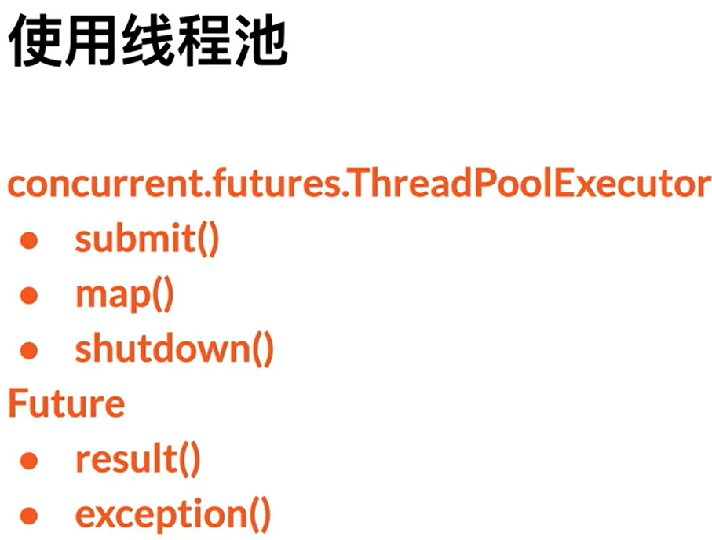

# 15 - 并发编程 - 线程

- 线程与进程
  - 进程: 操作系统中运行的一个任务
    - 操作系统都支持, 多进程并发
    - 进程拥有, 独立的 CPU,内存,等资源
  - 线程: 一个进程中运行的一个任务
    - 一个进程中,同样可以同时并发多个任务
    - 线程之间, 共享进程的 CPU,内存,等资源

```Python
from threading import Thread


def task(count: int):
    for n in range(count):
        print(n)

""" 以下两行是原始方法,分别一个一个的执行,效率低下 """
task()
task()

thread1 = Thread(target=task, args=(10,))
thread2 = Thread(target=task, args=(20,))

thread1.start()
thread2.start()

""" thread1.join(): 等待这个线程结束.这一行结束,才会执行下一行thread2.join() """
thread1.join()
thread2.join()

print("Main threads is end")
```

# 16 - 并发编程 - 线程进阶

1. 通过继承创建线程

```Python
class MyThread(Thread):
    def __init__(self, name: str, count: int):
        super().__init__()

        self.setName(name)
        self.count = count

    def run(self) -> None:
        for n in range(self.count):
            print(f"{self.getName()} - {n}\n", end='')
            time.sleep(0.01)


t_1 = MyThread("A", 10)
t_2 = MyThread("B", 10)

t_1.start()
t_2.start()

t_1.join()
```

2. 守护线程
   1. 守护线程: 主线程结束了，守护线程会自动结束
      1. 守护线程一般用于非关键性的线程，比如日志
      2. t_1 t_2 只会分别打印一次，因为主线程已经在 t_2.start() 位置停止了，守护线程会跟着自动停止
      3. 如果添加一句，t_1.join()。效果是，t_1 会一直打印，t_2 会视情况打印，跟随 t_1,但是如果 t_1 结束了，t_2 也会结束，t_1 会确保都打印出来，t_2 不一定
   2. 非守护线程：主线程必须等到，所有的非守护线程完成，主线程才会结束
      1. 主线程会停在 t_2.start()，等待 t_1 t_2 完成。t_1 t_2 完成之后，主线程就自动结束了

```Python
""" 方法一 """
thread1 = Thread(target=task, daemon=True)

""" 方法二 """
class MyThread(Thread):
    def __init__(self, name: str, count: int):
        super().__init__()

        self.setName(name)
        """ setDaemon 就是把这个线程变成，守护线程 """
        self.setDaemon(True)
        self.count = count
```

3. 线程安全队列
   1. 一个，线程安全的，队列
   2. 刚才的列子，就是线程不安全的。打印的时候有回车，两个线程的内容，打在同一行上面。第一个线程执行的时候，会有别的（第二个）线程插入
   3. 一个队列，会有存取两种操作。线程一，向队列中放一个数据，线程二，从队列中取一个数据。如果不安全，就很可能，线程一的东西没放进去，线程二就取了，数据丢失。例子：对列中原本有个 a，线程一向其中存入 b，线程二从其中取出 a。但是线程二慢了，取走了 b，记住了取出的 index（a 的 index），删除了 a
   4. 利用 python 提供的 queue，可以不考虑锁等保证线程安全的方法。因为 queue 已经帮助实现了线程安全


- block false: 如果 put 的时候 queue 满了，并不 block，不等待
  - block true：如果 put 的时候 queue 满了，一直等待，被 block 住
  - timeout = 3：如果 put 的时候 queue 满了，等待 3 秒

4. 生产者消费者实例，线程同步

```python
class MsgProducer(Thread):
    def __init__(self, name: str, count: int, queue: Queue):
        super().__init__()

        self.setName(name)
        self.count = count
        self.queue = queue

    def run(self) -> None:
        for n in range(self.count):
            msg = f"{self.getName()} - {n}"
            self.queue.put(msg, block=True)
            print(f"{msg}\n", end='')


class MsgConsumer(Thread):
    def __init__(self, name: str, queue: Queue):
        super().__init__()

        self.setName(name)
        self.queue = queue
        self.setDaemon(True)

    def run(self) -> None:
        while True:
            msg = self.queue.get(block=True)
            print(f"{self.getName()} - {msg}\n", end='')


queue = Queue(3)
threads = list()
threads.append(MsgProducer("PA", 10, queue))
threads.append(MsgProducer("PB", 10, queue))
threads.append(MsgProducer("PC", 10, queue))

threads.append(MsgConsumer("CA", queue))
threads.append(MsgConsumer("CB", queue))

for t in threads:
    t.start()
# 结果是打印了 30 条消息
```

# 17 - 并发编程 - 线程锁

```python
def task(name: str):
   for n in range(2):
       print(f"{name} - round {n} - step 1\n", end='')
       print(f"{name} - round {n} - step 2\n", end='')
       print(f"{name} - round {n} - step 3\n", end='')


t1 = Thread(target=task, args=("A",))
t2 = Thread(target=task, args=("B",))
t3 = Thread(target=task, args=("C",))

t1.start()
t2.start()
t3.start()

# 以上代码会产生结果：
# A - round 0 - step 1
# A - round 0 - step 2
# A - round 0 - step 3
# A - round 1 - step 1
# B - round 0 - step 1
# ...
# 现在是print，感觉顺序错乱没问题，但是如果是在写数据，b 插在 a 前面就会有错乱/误写/丢失/覆盖
```

```python
# 用以下lock方法，就能保证一直是123，123，123...
task_lock = Lock()


def task(name: str):
    global task_lock
    for n in range(2):
        task_lock.acquire()
        print(f"{name} - round {n} - step 1\n", end='')
        print(f"{name} - round {n} - step 2\n", end='')
        print(f"{name} - round {n} - step 3\n", end='')
        task_lock.release()


t1 = Thread(target=task, args=("A",))
t2 = Thread(target=task, args=("B",))
t3 = Thread(target=task, args=("C",))

t1.start()
t2.start()
t3.start()
```

- 在 put 和 get 上加锁，避免 put 的时候，get 被 call，出现错乱
- 使用 condition 是因为它其中包含\_\_item_lock.wait()方法
- .notify()随机通知一个，让它醒来

```python
class SafeQueue:
    def __init__(self, size: int):
        self.__item_list = list()
        self.size = size
        self.__item_lock = Condition()

    def put(self, item):
        with self.__item_lock:
            while len(self.__item_list) >= self.size:
                self.__item_lock.wait()

            self.__item_list.insert(0, item)
            self.__item_lock.notify_all()

    def get(self):
        with self.__item_lock:
            while len(self.__item_list) == 0:
                self.__item_lock.wait()

            result = self.__item_list.pop()
            self.__item_lock.notify_all()

            return result


class MsgProducer(Thread):
    def __init__(self, name: str, count: int, queue: SafeQueue):
        super().__init__()

        self.setName(name)
        self.count = count
        self.queue = queue

    def run(self) -> None:
        for n in range(self.count):
            msg = f"{self.getName()} - {n}"
            self.queue.put(msg)


class MsgConsumer(Thread):
    def __init__(self, name: str, queue: SafeQueue):
        super().__init__()

        self.setName(name)
        self.queue = queue
        self.setDaemon(True)

    def run(self) -> None:
        while True:
            msg = self.queue.get()
            print(f"{self.getName()} - {msg}\n", end='')


queue = SafeQueue(3)
threads = list()
threads.append(MsgProducer("PA", 10, queue))
threads.append(MsgProducer("PB", 10, queue))
threads.append(MsgProducer("PC", 10, queue))

threads.append(MsgConsumer("CA", queue))
threads.append(MsgConsumer("CB", queue))

for t in threads:
    t.start()
```

# 18 - 并发编程 - 线程池

- 线程的创建和销毁比骄傲昂贵
- 线程池便于管理线程和提高性能



[参考代码](https://github.com/stevencn76/python_advance/blob/main/threadpool/__main__.py)

# 19 - 并发编程 - 多进程

- python 规定，多进程，子进程只能在**main**中启动
- 主进程 + 资源监控进程 + process 2 中的三个进程 = 一共 5 个进程

[参考代码](https://github.com/stevencn76/python_advance/blob/main/multiprocesses/__main__.py)

# 20 - 并发编程 - 进程池

# 21- 异步 IO - 协程

- 协程（Coroutine）是一种计算机程序的构造，类似于线程，但比线程更加轻量级。协程允许在一个函数执行到一半时暂停执行，并将控制权交还给调度器，以便稍后从暂停的地方继续执行。这种特性使得协程非常适合用于并发编程，尤其是在处理 I/O 操作和其他长时间运行的任务时。
- asyncio 模块
- 一个添加了 async 关键字的函数，被称为协程
- 在同步代码中，time.sleep(1)是阻塞的，意味着在等待 1 秒期间，程序无法执行其他任务。
- 在异步代码中，await asyncio.sleep(1)是非阻塞的，意味着在等待 1 秒期间，事件循环可以执行其他协程任务。

**异步版本**：

```python
import asyncio

async def say_hello():
    print("Hello")
    await asyncio.sleep(1)
    print("World")

async def main():
    await asyncio.gather(say_hello(), say_hello())

# 运行协程
asyncio.run(main())
```

**同步版本**：

```python
import time

def say_hello():
    print("Hello")
    time.sleep(1)
    print("World")

def main():
    say_hello()
    say_hello()

# 运行函数
main()
```

在异步版本中，总执行时间大约是 1 秒，而在同步版本中，总执行时间大约是 2 秒，因为异步版本中的两个`say_hello`协程可以并发执行，而同步版本中的两个`say_hello`函数需要顺序执行。

# 22- 异步 IO - 创建任务

在异步编程中，`asyncio.gather`和`asyncio.create_task`都有助于并发执行多个协程，但它们的使用场景和行为略有不同。以下是它们的区别：

### 使用 `asyncio.gather`

```python
import asyncio

async def say_hello():
    print("Hello")
    await asyncio.sleep(1)
    print("World")

async def main():
    await asyncio.gather(say_hello(), say_hello())

# 运行协程
asyncio.run(main())
```

在这个示例中，`asyncio.gather`会并发运行传递给它的所有协程，并在所有协程完成后返回它们的结果。如果其中任何一个协程引发异常，`asyncio.gather`会立即传播该异常。

### 使用 `asyncio.create_task`

```python
import asyncio

async def say_hello():
    print("Hello")
    await asyncio.sleep(1)
    print("World")

async def main():
    task1 = asyncio.create_task(say_hello())
    task2 = asyncio.create_task(say_hello())
    await task1
    await task2

# 运行协程
asyncio.run(main())
```

在这个示例中，`asyncio.create_task`将协程封装成任务（`Task`对象），这些任务会立即提交给事件循环并开始执行。你需要显式地`await`这些任务，以确保它们完成。

### 主要区别

1. **行为方式**：

   - `asyncio.gather`：接收多个协程作为参数，并发运行它们，等待所有协程完成后返回结果。
   - `asyncio.create_task`：将协程封装成任务，立即调度执行，需要显式地`await`这些任务。

2. **异常处理**：

   - `asyncio.gather`：如果任一协程引发异常，`gather`会立即传播该异常，且所有协程的结果都会被取消。
   - `asyncio.create_task`：你可以单独处理每个任务的异常，更灵活地管理错误。

3. **适用场景**：
   - `asyncio.gather`适用于需要等待一组协程全部完成的情况，且希望简化代码结构。
   - `asyncio.create_task`适用于需要独立管理多个任务的情况，如需要取消任务、检查任务状态等。

这两个示例在功能上非常相似，但`asyncio.create_task`提供了更灵活的任务管理能力。如果你需要在创建任务后进行进一步的操作，比如取消任务或检查任务状态，那么`create_task`会更合适。如果你只是想并发运行多个协程并等待它们完成，那么`gather`可能是更简洁的选择。

# 23- 异步 IO - 任务进阶

- 取消任务
  - task.done()
  - task.cancel()

```python
async def play_music(music: str):
    print(f"Start playing {music}")
    await asyncio.sleep(5)
    print(f"Finished playing {music}")

    return music

async def my_cancel():
    task = asyncio.create_task(play_music("A"))

    await asyncio.sleep(3)

    if not task.done():
        task.cancel()

# Start playing A
# 不会打印 Finished playing A
# 因为 await asyncio.sleep(3) 后，task还没有结束就被取消了
if __name__ == "__main__":
    asyncio.run(my_cancel())
```

- 超时取消任务：你给我干活，如果 3 秒钟没干完，就别干了
  - asyncio.wait_for(taskm timeout=超时时长)
- 任务异常

```python
async def play_music(music: str):
    print(f"Start playing {music}")
    await asyncio.sleep(5)
    print(f"Finished playing {music}")

    return music

async def my_cancel_with_timeout():
    task = asyncio.create_task(play_music("B"))

    try:
        await asyncio.wait_for(task, timeout=2)
    except TimeoutError:
        print("timeout")

if __name__ == "__main__":
    asyncio.run(my_cancel_with_timeout())
```

- 超时却不想取消 task，利用.shield 盾牌将 task 保护起来

```python
async def play_music(music: str):
    print(f"Start playing {music}")
    await asyncio.sleep(5)
    print(f"Finished playing {music}")

    return music

async def my_timeout():
    task = asyncio.create_task(play_music("B"))

    try:
        await asyncio.wait_for(asyncio.shield(task), timeout=2)
    except TimeoutError:
        print("timeout")
        await task

# Start playing B
# 2 秒后，timeout
# 5 秒后，Finishing playing B (因为有在 await task)
if __name__ == "__main__":
    asyncio.run(my_timeout())
```

- gather 函数

```python
async def my_gather():
    results = await asyncio.gather(play_music("A"), play_music("B"))
    print(results)

# 如果没有return_exceptions=True，程序直接奔溃，有了return_exceptions=True，会返回一个结果list，最后结果一个是异常
async def my_gather_with_exception():
    results = await asyncio.gather(play_music("A"), play_music("B"), call_api(),
                                   return_exceptions=True)
    print(results)
```
