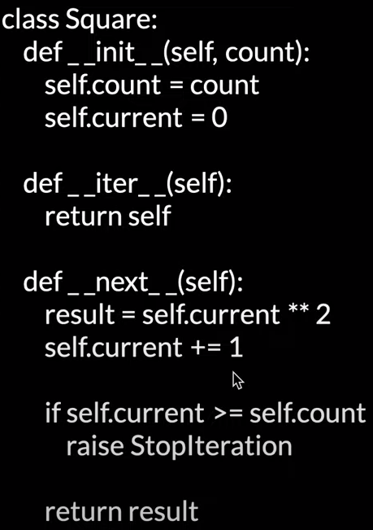

[Python 高级编程教程](https://www.youtube.com/watch?v=Fm_IdR3JWX0&list=PLvQDgAXJ4ADMzlySkwIGomEA9j1Vgq5uS&index=2)  
[Python 高级编程源代码](https://github.com/stevencn76/python_advance/blob/main/decorator/__main__.py)

# 1-装饰器

- 目的是为了把大家都需要的逻辑，提取出来，放在装饰器里面
- 避免每个函数中都写一遍 print welcome

```Python
def welcome(fn):
    def wrapper(*args, **kwargs):
        print("Welcome")
        result = fn(*args, **kwargs)
        return result
    return wrapper

@welcome
def my_fun(messsage: str):
    print(f"Hello {message}")

@welcom
def my_fun_2():
    print("My fun 2")

# 方法一
f1 = welcome(my_fun)
f1("Jack")

# 方法二
my_fun("Jack")
# Welcome
# Hello Jack
```

- @welcome("Tom") 这部分的看法：welcome("Tom")这是个带参数的函数，它的返回值是一个装饰器，@这个装饰器
- @wraps(fn) 是为了不改变传入的 function 的属性，因为装饰器会在传入函数外包裹一层，传入函数信息会被覆盖掉

```Python
def welcome(name):
    def decorator(fn):
        @wraps(fn)
        def wrapper(*args, **kwargs):
            print(f"Welcome {name}")
            result = fn(*args, **kwargs)
            return result

        return wrapper
    return decorator


@welcome("Tom")
def my_fun(message: str):
    print(f"Hello {message}")

my_fun("Jack")
# Welcome Tome
# Hello Jack
```

# 2-生成器

- 当一个函数包含了 yield 语句的时候，他就不是一个普通函数了，他是一个生成器
- 这个函数的任务是生成东西
- yield 与 return 的区别：
  - return 只能一次，在结束的时候
  - yield 类似 return，向调用者返回一个结果，区别就是可以多次
- 包含 yield 的函数，不能直接被 call，需要迭代的形式执行
- 有几个 yield 就能生成几个数据

```Python
# ------------------------------- topic one  ----------------------------------
def hello():  # an iteratable object
    print("step 1")
    yield 1
    print("step 2")
    yield 2
    print("step 3")
    yield 3

# 方法一
g = hello()
res = next(g)
print(res)
res = next(g)
print(res)
res = next(g)
print(res)
# console 结果
# step 1
# 1
# step 2
# 2
# step 3
# 3

# 方法二：利用 for loop 取生成器中的值
g = hello()
for res in g:
    print(res)

# ------------------------ topic two: 利用生成器，制作迭代器  ---------------------

# 利用生成器，制作迭代器
def squares(count: int):
    for n in range(count):
        yield n ** 2

# 下面的console结果是： 0 1 4
for num in squares(3):
    print(num)

# ------------------ topic three: 能用生成器，就不要用以下方式  ---------------------
# 生成器没有将所有值都生成
# 以下方式，将所有值都生成，形成一个列表，返回出来，并且存在内存中，效率不如生成器
def my_fun():
    result = []
    for n in range(3):
        result.append(n ** 2)

    return result

```

- 利用生成器，制作迭代器，对比下图，利用类制作迭代器，前者只需三行代码，简便很多

```Python
# 利用生成器，制作迭代器
def squares(count):
    for n in range(count):
        yield n**2
```



# 2-2-yield from

- yield from 用法一： 在一个生成器中 yield 另一个生成器的内容

```python
def magic_number(exponent: int):
    for n in range(3):
        yield (n + 1) ** exponent


def magic_data():
    yield from magic_number(2)
    yield from magic_number(3)

# console result: 1 4 9 1 8 27
for n in magic_data():
    print(n)

# yield from magic_number(2)
# 相当于:
# for n in magic_number(2):
#     yield n
```

# 3-上下文管理器

```Python
# context 就是上下文管理器

with context as ctx:
    # 使用这个上下文对象
# 上下文对象已经被清除

# 上下文管理器的具体例子:
instance = open("mydata.txt", "w")
instance.write("Hello this is a test file")
instance.close()

with open("mydata.txt", "w") as instance:
    instance.write("Hello this is a test file")


print("The end")
```

- 一个上下文管理器需要实现如下方法
  - enter() 安装上下文,可以返回对象
  - exit() 清除/释放 对象
- 上下文管理器一般用在如下场景
  - 开/关
  - 锁/释放
  - 启动/停止
  - 改变/重置

```Python
import time

start = time.per_counter()
nums = []
for n in range(100000):
    nums.append(n**2)
stop = time.perf_counter()
elapsed = stop - start
print(elapsed)
```

```Python
# 改良,使用上下文管理器,记录开始和停止的时间
import time

class Timer:
    def __init__(self):
        self.elapsed = 0

    def __enter__(self):
        self.start = time.perf_counter()
        return self

    def __exit__(self, exc_type, exc_val, exc_tb):
        self.stop = time.perf_counter()
        self.elapsed = self.stop - self.start
        return False


with Timer() as timer:
    nums = []
    for n in range(10000):
        nums.append(n ** 2)

print(timer.elapsed)
```

# 4-type 类

- 任何 class 在内存中就是一个 type 类的对象
- python 使用 type 类来创建其他的 class
  - type(class_name, parentes, class_dict)
- 理论上来讲,可以使用 type 来动态创建 class

```Python
# 使用 type, python 软件可以动态扩展
# 将 code 写在文本文件中, 动态加载
# class_body 相当于外部文本文件的内容
class_body = """
def greeting(self):
    print('Hello customer')

def jump(self):
    print('jump')
"""
class_dict = {}
# 下面一行是将文本文件内容转换为字典
exec(class_body, globals(), class_dict)
# 下面一行是利用type动态创建一个新的类
Customer = type("Customer", (object,), class_dict)

c = Customer()
c.greeting()
c.jump()
```

# 5-metaclass

- 一个 metaclass 就是用来创建其他类的类
- type 就是所有类默认的 metaclass
- 你可以在定义类的时候是制定 metaclass

```Python
class Human(type):
    @staticmethod
    def __new__(mcs, *args, **kwargs):
        class_ = super().__new__(mcs, *args)
        # class_.freedom = True
        if kwargs:
            for name, value in kwargs.items():
                setattr(class_, name, value)
        return class_


class Student(object, metaclass=Human, country="China", freedom=True):
    pass


print(Student.country)
print(Student.freedom)
```

# 6-metaclass 实例

[metaclass 实例](https://www.youtube.com/watch?v=dFoZ0Sux8pI&list=PLvQDgAXJ4ADMzlySkwIGomEA9j1Vgq5uS&index=6)

```Python
class Prop:
    def __init__(self, attr):
        self._attr = f'_{attr}'

    def get(self, obj):
        if not hasattr(obj, self._attr):
            return None

        return getattr(obj, self._attr)

    def set(self, obj, value):
        setattr(obj, self._attr, value)


class Human(type):
    @staticmethod
    def __new__(mcs, *args, **kwargs):
        class_ = super().__new__(mcs, *args)
        for property_name in class_.props:
            prop = Prop(property_name)
            p_obj = property(fget=prop.get, fset=prop.set)
            setattr(class_, property_name, p_obj)

        return class_


class Student(object, metaclass=Human):
    props = ["name", "age"]


def human(cls):
    return Human(cls.__name__, cls.__bases__, dict(cls.__dict__))


@human
class Man:
    props = ["name", "age"]


man = Man()
print(man.name)
man.name = "Tom"
print(man.name)


student = Student()
print(student.name)
student.name = "Jack"
print(student.name)
```

# 7-dataclass

```Python
import operator
from dataclasses import dataclass, field

@dataclass
class Student:
    name: str
    age: int

s_1 = Student("Jack", 20)
print(s_1)

s_2 = Student("Jack", 20)
print(s_2)

# -------------------------------- 比较 --------------------------------
# 以下结果位 true，因为数据类的实例，比较方法是，每个属性的值都一致，就是相等的
print(s_1 == s_2)

# ------------------------------- 缺省值 -------------------------------
@dataclass
class Student:
    name: str
    age: int = 18

s_1 = Student("Jack", 20)
print(s_1)

s_2 = Student("Jack")
print(s_2)
# ---------------------------- 不可变对象 -------------------------------
# 在对象创建完之后不能改变属性的值
@dataclass(frozen=True)
class Student:
    name: str
    age: int

student = Student("Jack", 20)
student.age = 22 # 这里会产生异常
# ------------------------- 定制属性的行为 -------------------------------
# 希望这个属性存在，又不希望它出现在我的构造里面
# default=False     默认值为 false
# init=False        在构造方法中不加入这个属性
# repr=True         在打印这个类的实例对象的时候，会调用它的toString方法，false就是说不要调用它的repr，不要把它变成字符串

@dataclass
class Student:
    name: str
    age: int
    independent: bool = field(default=False, init=False, repr=True)

    """ 初始化结束后，下面这个方法会被trigger """
    def __post_init__(self):
        self.independent = self.age > 19
        self.sort_index = self.age
# ------------------------------- 排序 ---------------------------------
@dataclass(order=True)
class Student:
    sort_index: int = field(init=False, repr=False)

    name: str
    age: int = 19
    independent: bool = field(default=False, init=False, repr=True)

    def __post_init__(self):
        self.independent = self.age > 19
        self.sort_index = self.age


s_1 = Student("Jack", 20)
print(s_1)

s_2 = Student("Tom")
print(s_2)

students = [s_2, s_1]
sorted_students = sorted(students)
print(sorted_students)

''' 方法二 '''
students.sort(key=operator.attrgetter('age'))
print(students)
```

# 8-变量范围

- 本地：函数内部
- “全局”：同一个文件中
- 引入，可以将一个文件中的变量，引入到另一个文件中

```Python
# ------------------------------------------------
count = 10

print(count)

def greeting(flag: bool):
    if flag:
        count = 20
    print(count)


greeting(False)
# 会报错
# 编译可以通过，因为local变量 count已经声明过
# 但是运行时会报错，因为没有给count 赋值，因此无法打印
print(count)

# ------------------------------------------------
# 如果就是想修改 global count怎么办
# 使用global关键字
# 但是不推荐这种方法，最好不要这样搞

count = 10

print(count)


def greeting(flag: bool):
    global count
    if flag:
        count = 20

    print(count)


greeting(True)

print(count)
```

# 9-nonlocal 范围

nonlocal 范围: 就是指向，内部函数，所在的函数，的范围

```Python
message = "module"


def outer():
    message = "outer"

    def inner():
        nonlocal message

        message = "inner"
        print(message)

    inner()
    print(message)


outer()

print(message)
```

# 10-Mixin 模式

# 11-类与装饰器

# 12-闭包

# 13-单例模式

# 14-使用正则表达式
