# 1- Django Fundamentals

- pip install --upgrade pipenv
- pipenv install
- 根据提示选择 python 版本
- 查看虚拟环境位置: pipenv --venv
- 添加 interpreter /bin/python
- 删除虚拟环境 pipenv --rm
- $env:PIPENV_IGNORE_VIRTUALENVS="1" 在 vscode 中设置
- pipenv shell = select interpreter

# 我的总结

- pip install --upgrade pipenv
- pipenv install
- 删除虚拟环境 pipenv --rm
- pipenv --python 'C:\Users\Qing Ye\AppData\Local\Programs\Python\Python312\python.exe'
- pipenv install
- 删除 Pipfile.lock + Pipfile 文件
- pipenv lock
- pipenv install

## 5- Creating Your First Django Project

- pip3 install pipenv
- pipenv install django
- pipenv shell

一个已有项目，加载环境：  
Pipenv install  
如果找不到 python，需要  
pipenv --python 'python location'
pipenv install  
python 位置 C:\Users\Qing Ye\AppData\Local\Programs\Python\Python312

新建项目：  
django-admin startproject storefront  
会形成三个文件夹：

1.  最外层我们自己建的
2.  中间一个 for project  
    最里面一个 for core application

用以下命令则不会形成过多的文件夹：  
django-admin startproject storefront .  
最后这个点是： this tells django to use the current direcotry as the project directory

Manage.py: 代替 admin-django 了，利用 admin-django runserver 会报错，说是不知道 setting 的情况，但是 python manage.py runserver 就不会报错

## 6- Using the Integrated Terminal in VSCode

Vscode 命令版：Python interpreter  
再 vscode 选择 interpreter，首先通过上述命令，找到虚拟环境地址，然后照以下输入，重点是最后/bin/python

## 7- Creating Your First App

新建一个 app: python manage.py startapp playground  
在主 app 中声明这个新的 app playground: INSTALLED_APP = ['playground']

## 11- Debugging Django Applications in VSCode

- debug

  - Step over：执行当前行
  - Step into：当前行是一个函数，执行函数，行 by 行
  - Step out：函数太长了，不想都看完，就 step out 回到（当前行是一个函数）

- 拿到一个项目后，运行前准备：
  - 在目标文件夹下 Git clone 'url'
  - 目标文件下会有一个子文件夹（本项目），进入这个子文件夹后， 安装新建虚拟环境所需的 dependency：
    - Pip3 install pipenv
  - 新建虚拟环境：
    - Pipenv install
  - 激活虚拟环境
    - Pipenv shell
  - 最后 run：
    - Python manage.py runserver
  - 如果项目中有很多黄色波浪
    - 通过 vscode 的 python interpreter 选择虚拟环境所在的位置，Deactivate

# 2- Building a Data Model

## 7- Defining One-to-one Relationships

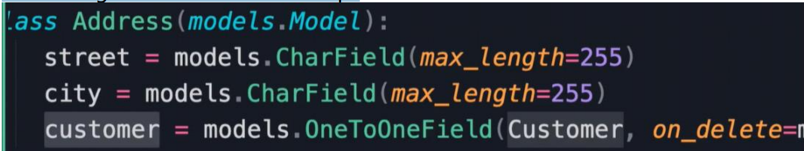

- on_delete = models.CASCADE: parent 被删除，child 也直接被删除
- on_delete = models.SET_NULL: 如果这个 child field 接受 null 值，当 parent 被删除，这条 child 不会被删除，但是它的
  customer 这个 attribute 会被设为 null
- on_delete = models.SET_DEFAULT: 我们这个不接受空值，所以可以写成以下
- on_delete = models.PROTECT: Prevent delete，不可以 delete parent，必须先 delete child
- 一对一关系，不需要两个位置（parent/child）都写，只需要写其中之一，django 会自动补全

## 9- Defining Many-to-many Relationships

当有多对多建立时，django 会自动建立另一边，默认名字是 product_set,如果不想用这个名
字，可以添加一个属性 related_name，那么 django 就会自动在另一边（promotion）中建立
products（related_name 设置的名字），而非 product_set（默认名字）

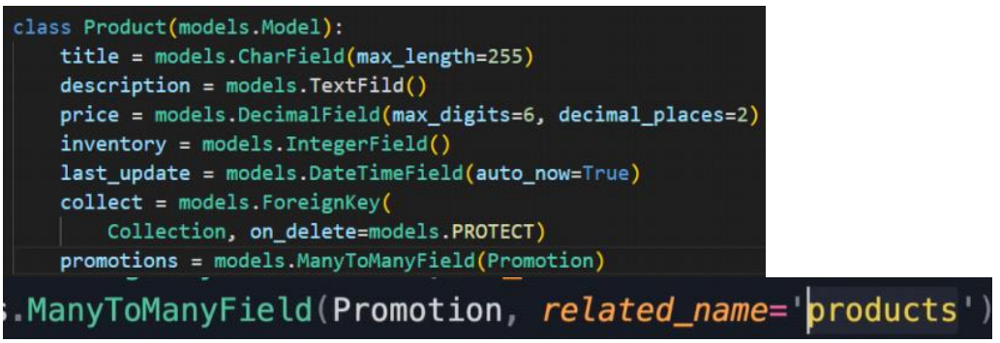

## 10- Resolving Circular Relationships

首先，如果 many to many 两个，先声明的那个（Collection）引用的时候（引用 Product，
product 是写在 collection 后面的）需要打引号'Product'

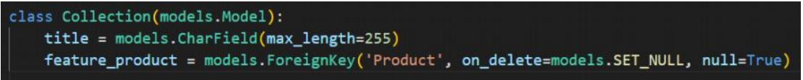

# 3- Setting Up the Database

[Django migration 原理](https://www.kawabangga.com/posts/3647)

## 3- Creating Migrations

Ctrl + T  
Ctrl + alt + O  
每次对数据 model 进行变化，都需要 make migration  
Python manage.py makemigrations

## 4- Running Migrations

Python manage.py migrate  
安装 sqlite extension，在命令行打开 database，就会看到 sqlite explorer  
Ctrl + shift + p: >SQLite: open database

查看 store 这个 app 的第 0003 号 migrate 的时候，send 给 sql 的实际的 sql query 的样子，命令行：  
Python manage.py sqlmigrate store 0003

## 5- Customizing Database Schema

元数据：对于数据本身的规定, 查看 django model metadata

## 6- Reverting Migrations

想要 revert 0004：  
步骤一： python manage.py migrate store 0003  
步骤二：并且 delete 掉 migrations 文件夹中的 0004 号文件，否则运行命令 migrate 的时候，还是会运行 0004  
步骤三：利用 git 恢复一次 commit，以确保文件中的内容也被 revert

## 9- Using MySQL in Django

Pipenv install mysqlclient

## 10- Running Custom SQL

想要在 migrate 的时候，执行特定的 sql 语句  
首先进行一次空的 migration: python manage.py makemigrations store --empty  
然后打开 0004_auto_20210610_1442 文件，在 operations 中添加语句  
第一个 insert sql 是执行 sql，第二个 delete sql 语句是 revert 这次 migrate 的时候执行的（与第一个正好相反）  
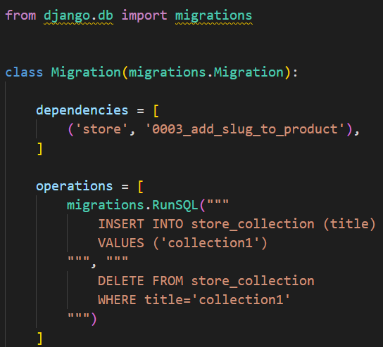

## 11- Generating Dummy Data

mockaroo.com

Clone database to a file  
Inspectdb > legacy.py

# 4-Django ORM

## 2- Django ORM

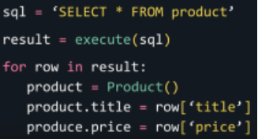

## 4- Managers and QuerySets

```Python
query_set = Project.objects.all()

# method one:
for product in query_set:
	print(product)

# method two:
list(query_set)

# method three:
query_set[0:5]
```

Query set 是 lazy 的，在 product.object.all()这个语句的时候并不访问 sql server，需要这个 query set 被用到的时候才跟数据库互动。比如下图中，如果
query set 不是 lazy 的那么 filter 的时候就会立即 filter，会造成多是访问数据库。

```Python
query_set = Project.objects.all()
query_set.filter().filter().order_by()
```

## 5- Retrieving Objects

- pk primary key

```Python
from django.core.exceptions import ObjectDoesNotExist

try:
	product = Product.objects.get(pk=0)
except ObjectDoesNotExist:
	pass
```

- 方法二：如果没有 pk 为 0 的元素则返回 none，就也不会报错

```Python
# None
product = Product.objects.filter(pk=0).first()
```

- 方法三：返回 Boolean

```Python
product = Product.objects.filter(pk=0).exists()
```

## 6- Filtering Objects

- 更多方法请查看：queryset api ---> Field lookups

```Python
queryset = Product.objects.filter(unit_price__gt=20)
queryset = Product.objects.filter(unit_price__range=(20,30))
# all the products in collection number one
queryset = Product.objects.filter(collection__id=1)
queryset = Product.objects.filter(collection__id__range=(1,2,3))
# i is for size insensitive
queryset = Product.objects.filter(title__icontains='coffee')
```

## 7- Complex Lookups Using Q Objects

```Python
# Products: inventory < 10 AND price < 20
queryset = Product.objects.filter(inventory__lt=10, unit_price__lt=20)
# methd two:
queryset = Product.objects.filter(inventory__lt=10).filter(unit_price__lt=20)

# 要使用or进行query
from django.db.models impot Q
# Products: inventory < 10 OR price < 20
queryset = Product.objects.filter(Q(inventory__lt=10) | Q(unit_price__lt=20))
# ~代表not，&代表and
queryset = Product.objects.filter(Q(inventory__lt=10) & ~Q(unit_price__lt=20))
```

## 8- Referencing Fields using F Objects

以下需求没有意义，只是个例子。找到 product 中两个 field（inventory，unit_price）相等的条目

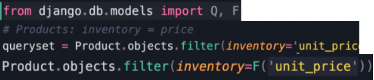

## 9- Sorting

```Python
# 以title降序排列，-减号代表降序
queryset = Product.objects.order_by('-title')
# 多重排序，先unit_price升序排列，再title降序排列
queryset = Product.objects.order_by('unit_price', '-title')
# 排序后取第一个元素的两种方法
queryset = Product.objects.order_by('unit_price')[0]
queryset = Product.objects.earliest('unit_price')
```

## 10- Limiting Results

```Python
# 0,1,2,3,4
queryset = Product.objects.all()[:5]
```

## 11- Selecting Fields to Query

```Python
# 只想看一部分属性，不用全部all()，使用values()。以下就是只select id 和 title
queryset = Product.objects.values('id', 'title')
# 查询relative field
queryset = Product.objects.values('id', 'title', 'collection__title')
```

- 一个很好的练习例子
- select products that have been ordered and sort them by title
- 查看可知，在 orderitem 这个表中有 product id，代表了已经被 order 的 product 信息

```Python
query_set = Product.objects.filter(id__in=OrderItem.objects.values('product_id').distinct()).order_by('title')
```

## 12- Deferring Fields 延迟，推迟

```Python
# only 的结果是：get instances of the product class
# value 的结果是：dictionary
queryset = Product.objects.only('id', 'title')
```

```Python
# 使用only的时候要小心，因为如果以下场景，only了id，unit price需要重新query，就会有1000条query（1000个product）

<li>{{ product.title }} ${{ product.unit_price }}

```

```Python
# 与only正相反的是defer，是不要相关项。不要description。defer的使用也应该小心，如果针对query set的for loop中有description，就会有1000条query去重新抓取description信息

queryset = Product.objects.defer('description')
```

## 13- Selecting Related Objects

```Python
# 如果不写以下select related这句，利用product拿到collection信息的时候，就会多出1000条query

queryset = Product.objects.select_related('collection').all()

# 利用prefetch_related会产生两个query，第一个是针对product的，第二个是针对promotion的

queryset = Product.objects.prefetch_related('promotions').all()

# get the least 5 orders with their customer and items (incl product)

queryset = Order.objects.select_related('customer').prefetch_related('orderitem_set__product').order_by('-placed_at')[:5]
```

- Select_related: product 中的 collection（多对一），一个 product 只有一个 collection
- Prefetch_related:product 中的 promotion（多对多），一个 product 有多个 promotion
- select_related(1)
- prefetch_related(n)

## 14- Aggregating Objects

```Python
# {'count': 1000, 'min_price': Decimal('1.06')}

result = Product.objects.aggregate(count=Count('id'), min_price=Min('unit_price'))

# how many orders do we have

result = Order.objects.aggregate(count=Count('id'))

# how many units of product 1 have we sold

result = OrderItem.objects.filter(product__id=1).aggregate(units_sold=Sum('qunatity'))

# how many orders has customer 1 placed

result = Order.objects.filter(customer__id=1).aggregate(count=Count('id'))

# what is the min, max and avg price of products in collection 1
result = Product.objects.filter(collection__id=3).aggregate(min_price=Min('unit_price'), avg_price=Avg('unit_price'), max_price=Max('unit_price'))
```

## 15- Annotating Objects 注释

```Python
# 新建一个column叫is_new，值为true

query_set = Customer.objects.annotate(is_new=Value(True))

# 新建一个column叫new_id，值为id这个field（column）的值/的值加一

query_set = Customer.objects.annotate(is_new=F('id'))
query_set = Customer.objects.annotate(is_new=F('id')+1)
```

如果直接写 true，不写 value(true)，会报错：传入不是 expression
expression 包括：value（number, boolean, string…）F（field in the same table or another table）func, aggregate(count, sum, max, min)

## 16- Calling Database Functions

Call function 'concat'，新建一个 column full_name

```Python
# 方法一：Func()
query_set = Customer.objects.annotate(full_name=Func(F('first_name'), Value(' '), F('last_name'), function='CONCAT'))

# 方法二：django database functions，这个方法中有一些常用common的functions，但是每个database engine还有一些自己特殊的函数，需要利用方法一中的Func()来使用那些unique的函数
from django.db.models.functions import Concat
queryset = Customer.objects.annotate(
	# CONCAT
	full_name=Concat('first_name', Value(' '), 'last_name')
)
```

## 17- Grouping Data

```Python
# 新建一个column order_count，看看每个customer order了多少order
query_set = Customer.objects.annotate(order_count=Count('order'))
# ORDER_COUNT
# 5
# 1
# 1
# 6
# ...
```

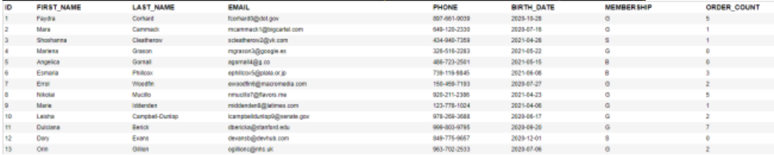

```Python
# aggregate是总计的意思
query_set = Customer.objects.agggregate(order_count=Count('order'))
# ORDER_COUNT
# 1000
```

## 18- Working with Expression Wrappers

```Python
# f('unit_price')乘以0.8如果直接写会报错，错是没有规定output_field类型，这时就需要利用expressionWrapper
discounted_price = ExpressionWrapper(F('unit_price') * 0.8, output_field=DecimalField())
queryset = Product.objects.annotate(discounted_price=discounted_price)
```

```Python
# Customers and their last order ID
queryset = Customer.objects.annotate(last_order_id=Max('order__id'))

# Collections and count of their products
queryset = Collection.objects.annotate(products_count=Count('Product'))

# Customers with more than 5 orders
queryset = Customer.objects.annotate(orders_count=Count('order')).filter(orders_count__gt=5)

# Customers and the total amount they've spent
queryset = Customer.objects.annotate(total_spent=Sum(
	F('order__orderitem__unit_price')*
	F('order__orderitem__quantity')))

# Top 5 best-selling（销售额最高） products and their total sales
queryset = Product.objects.annotate(
	total_sales=Sum(
		F('orderitem__unit_price')*
		F('orderitem__quantity')
	)
).order_by('-total_sales')[:5]
```

## 19- Querying Generic Relationships

- 会有两个 query，第一个是找到 content type。
- 下面第一行是找到 product 的 content type 的信息，第二行开始是找到 product 这种 content type 的 tagged item 的信息。Object_id=1 是 id 为 1 的
  product 的意思。找到 id 为 1 的 product 的 tag 信息：

```Python
ContentType.objects.get_for_model(Product)
TaggedItem.objects
	.select_related('tag')
	.filter(
		content_type=content_type,
		object_id=1
	)
```

## 20- Custom filters

- 上一章中 content type 部分太啰嗦，步骤一：把他提炼出来写在 models 中

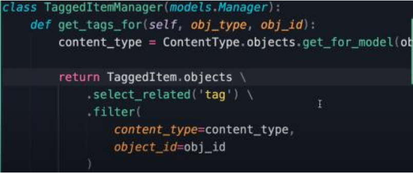

- 步骤二：在 tagged item 中加一个 objects 属性

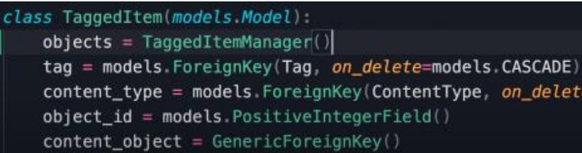

- 步骤三：直接使用 get_tags_for

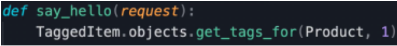

## 21- Understanding QuerySet Cache

下图中 queryset[0]这句和 list 这句会 query 两次，因为第一句不是全部只要了第一位，但是如果两句换位置，就只会 query 一次，因为有 cache，list 这
句 query 了全部数据，存在了 cache 中，零这句直接会用 cache 中的数据

```Python
queryset = Product.objects.all()
querysedt[0]
list(queryset)
```

## 22- Creating Objects

```Python
# method 1
collection = Collection()
collection.name = 'Video Games'
collection.featured_product = Product(pk=1)
collection.save()

# method 2
ProjectHeader.objects.create(
	project=project_master,
	status=LKUProjectStatus.objects.get(id=3),
	contract_holding_office=Office.objects.get(
		id=self.context['office_id']))
```

## 23- Updating Objects

```Python
# 方法一：缺点是会需要先读一遍数据
collection = Collection.objects.get(pk=11)
collection.feature_product = None
collection.save()

# 方法二：不需要读取，直接update，但是不能自动联想/自动更改属性名
Collection.objects.filter(pk=11).update(feature_product=None)
```

## 24- Deleting Objects

```Python
# 两种方法delete object：方法二是要delete所有id大于5 的collection
collection = Collection(pk=11)
collection.delete()

Collection.object.filter(id__gt=5).delete()
```

```Python
# Createing a shopping cart with an item
cart = Cart()
cart.save()

item1 = CartItem()
item1.cart = cart
item1.product_id = 1
item1.quantity = 1
item1.save()

# updating the quantity of an item
item1 = CartItem.objects.get(pk=1)
item1.quantity = 2
item1.save()

# Removing a cart
cart = Cart(pk=1)
cart.delete()
# because we've enabled cascading in the relationship between
# cart and ite items, deleting a cart automatically causes
# deletion of its items. So we don't need to delete each item
# individually.
```

## 25- Transactions

- 把多个 save 打包在一起，只有每个都成功了，才会给数据库 commit
- from django.db import transaction
- 用法一：在一部分代码上用 with：

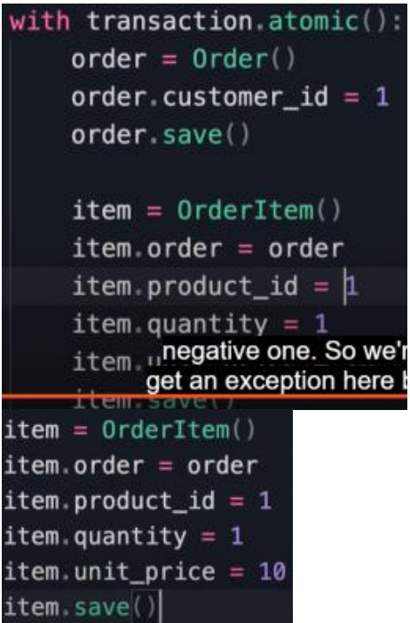

- 用法二：@，包裹整个 def

```Python
@transaction.atomic()
def say_hello(request):
```

## 26- Executing Raw SQL Queries

- queryset = Product.objects.raw('SELECT \* FROM store_pro')
- 有时，我们想访问数据库，但是不与 model 中的 object 链接或对应：
- from django.db import connection
- 写法一：最好利用 try final blcok 包裹，以确保最后能 close cursor

```Python
cursor = connection.cursor()
cusor.excute('')
cursor.close()
```

- 写法二：利用 with

```Python
with connection.cursor() as cursor:
	cursor.excute()
```

- 最好是利用 call procedure 方法，把 query 主体写在一个 stored procedure 中（这在 sql 课程中介绍）

```Python
with connection.cursor() as cursor:
	cursor.callproc('get_customers', [1,2,'a'])
```

# 5-The Admin Site

## 2- Setting Up the Admin Site

- qingye
- 890411\*!
- 在 store/url.py 中添加 site_header & index_title
