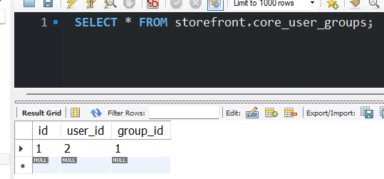
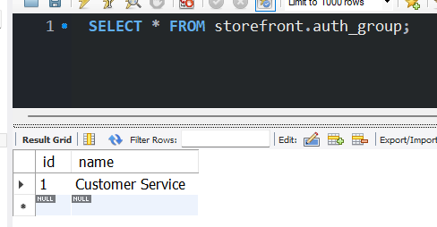
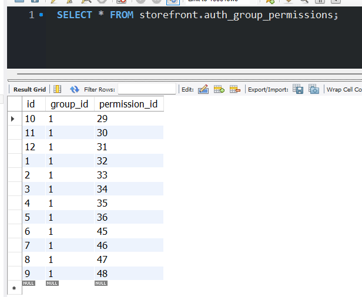
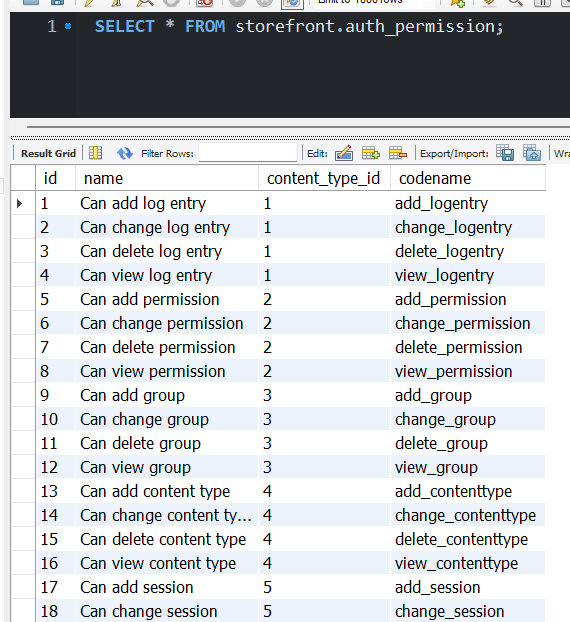
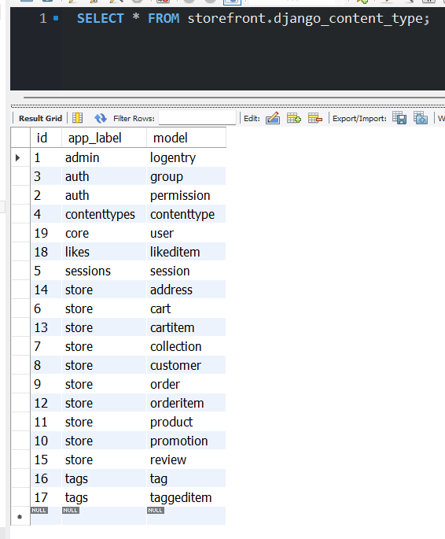

# 6- Building RESTful APIs with Django REST Framework
## 7- Creating API Views
- 以下是django自带，原始的是httprespense，django是response，可以生成可视化api，方便开发
```Python
@api_view(['GET', 'POST'])
return Response(serializer.data)
```

## 8- Creating Serializer
- render接收dictionary，返回json
- serializer: to convert a model instance, like a product object to Python dictionary
- serializer doc: django-rest-framework.org--->serializer fields

## 10- Creating Custom Serializer Fields
- API model是外部链接，相当于遥控器按键
- Data model是app内部结构，相当于集成电路（这部分变化问题不大，外部看不到，api升级是大事，因为会影响外部）

# 9- Django Authentication System
## Django Authentication System
Middleware是用来接收request,可以添加一点东西,继续传到下一个middleware,也可以直接返回一个response。django的authentic middleware的作用之一是,获取request的信息,添加user的信息  
Authentica middleware的作用: middleware is to read the user information from the request and set the user attribute on the request object  

core_user_groups中,是定义的一个user对应group1  
  
group中,是customer service,新定义的group  
  
group_permissions中,是给的到这个groupe的允许操作,group id都是1  
  
permission中,是所有操作,其中id是29,name: Can add customer,conten_type_id: 8  
  
conten_type中是这个django项目的所有app的所有model,8是app store model customer  
  

## Applying Model Permissions
the app permissions:  
- for all apis: is admin or read only
- for customer api: is admin or no, /me is authenticated

# 10- Securing APIs
## Token-based Authentication
django.contrib.auth is django authentication system(user/group/permission)  
is_superuser: is the user has all privileges  
is_staff: this user can log into the admin area  

why we use djoser: django authenticate system(django.contrib.auth) doesn't include an API layer, so we don't have any endpoint for users to register/login/reset password. We only have some models and database tables
djoser is a package which include the anth API layer  

## Adding the Authentication Endpoints
djoser replies on an authentication backend, or an authentication engine to do the actual work  
becuase djoser is just an API layer, a bunch of views, serializers and routes  
So we need an authentication engine to do the actual work  

we have two choices for auth engine:  
1. token-based authentication   
    - built in django rest framework
    - use a database table to store tokens
    - every time we recieve a http request on a server to validate the token, this backend is going to the database to make sure this is a valid token. this will incur a database call for every request
2. JSON web token authentication 
    - implemented in a separate library
    - every token is a digital signature, and on the server we can use the signature to ensure this is a valid token

```Python
"""JWTAuthentication is the auth engine"""
"""permission_class control the visit limitation, the default is AllowAny. The code under is the rule in project Lilly, which is IsAuthenticated, which means all the api need IsAuthenticated to visit"""
REST_FRAMEWORK = {
    'DEFAULT_AUTHENTICATION_CLASSES': (
        'rest_framework_simplejwt.authentication.JWTAuthentication',
    ),
    'DEFAULT_PERMISSION_CLASSES': [
        'rest_framework.permissions.IsAuthenticated'
    ]
}
```

## Building the Profile API
all the api/endpoint provided by djoser are for managing users and authentication  
djoser doesn't have any endpoint for user profiles  
because profiles are specific for apps, djoser won't know that we have an app called sales, and in that app we have a profile called customer    
so we need to build the customer API or the profile API