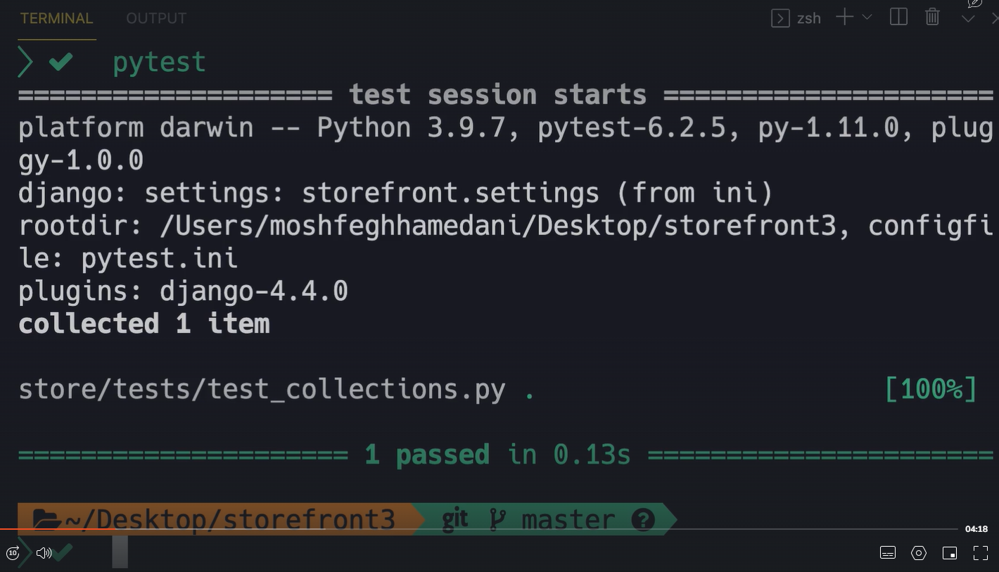
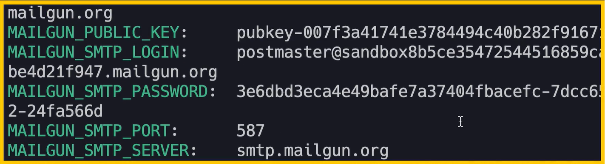

# 12- Uploading Files

## Managing Media Files

- folder media
- settings: specify the media folder path

```Python
MEDIA_URL = '/media/'
MEDIA_ROOT = os.path.join(BASE_DIR, 'media')
```

- urls: add url

```Python
urlpatterns = [
    path('admin/', admin.site.urls),
    path('playground/', include('playground.urls')),
]
# ] + static(settings.MEDIA_URL, document_root=settings.MEDIA_ROOT)

if settings.DEBUG:
    urlpatterns += static(settings.MEDIA_URL,
                          document_root=settings.MEDIA_ROOT)
```

- after above several steps, the result is: when the media folder contain something, we can access it from url

# 14- Running Background Tasks

## 2- Introduction to Celery

- with celery, we can start several workers to execute tasks in the background
- whenever we want to execute a long running task, we send it to a queue that all these workers are watching, each worker will pick a task from the queue, then executed
- with celery, we can also schedule periodic tasks

步骤 1: 在 Django 应用中，当需要执行一个耗时的任务时（例如，用户请求生成一个报告），这个任务会被发送到 Celery。Django 不会直接执行这个任务，而是将任务信息发送到消息代理。

步骤 2: Celery 使用 Redis 作为消息代理。当 Django 应用发送一个任务到 Celery 时，这个任务首先被发送到 Redis。Redis 保存这个任务在队列中，直到一个 Celery 工作进程可用来处理它。

步骤 3: Celery 工作进程监视 Redis 队列。当队列中出现新任务时，一个 Celery 工作进程会取出任务并开始执行。这个过程是异步的，这意味着 Django 应用可以继续处理其他请求，而不需要等待任务完成。

步骤 4: 一旦 Celery 工作进程完成了任务，它可以将结果发送回 Django 应用，或者将结果保存在数据库中，这取决于任务的具体要求。如果需要，Django 应用可以检索和显示这些结果给用户。

## 3- Message Brokers

- queue is part of some kind of software we call 'Message Broker(middle man)'
- sometimes we have multiple message brokers
- we use message brokers to reliably deliver message between apps
- there multiple message brokers(redis, rabbitMQ)
- redis is not a message broker, it is a in-memory data store, we can use it as a database  
  
- application: django
- message broker: redis
- worker123: celery worker
- rabbitMQ 是进阶版的 redis

## 4- Installing Redis

- docker run -d -p 6379:6379 redis
  - -d (detached, detached mode, meaning in the background)
  - -p (specify a port mapping)
  - we are going to run Reids inside a Docker container
  - this container is technically a process on your machine
  - this process is a little bit different, it is inside an isolated environment
  - as an analogy, you can think of it as a lightweight virtual machine
  - we are going to run Rdis inside a lightweight virtual machine
  - but for us to access that virtual machine
  - we need to specify a port mapping, we need to map a port a local host to a port on that virtual machine or container
  - so we can send traffic to that Docker container  
    
  - the first 6379: map port 6379 of localhost to
  - the second 6379: port 6379 of that Docker container, and this is the standard port that Redis listens
  - finally, we specify the image, which is Redis
- after run the command line above, Redis is running inside the container
- the last line in the ternimal now is container ID
- we should also install redis as a dependency in out django project: pipenv install redis
- now we are ready to install celery

## 6- Setting Up Celery

- pipenv install celery
- mosh-complete ---> frontstore ---> celery.py
- load the module celery inside the init module of current package, otherwise python is not going to execute the code insie celery.py
  - frontstore folder ---> **init**.py ---> from .celery import celery
- celery -A storefront worker --loglevel=info
  - to start a celery worker process, in vscode ternimal, run this commandline
  - storefront: specify the prodject
  - worker: the type of process we want to start in this case
  - --loglevel=info: debugging or testing
  - after run this commandline: in the end of termianl, we can see celery is ready: celery@Mosh.local ready  
    
  - 8: the number of CPU cores on the computer  
    
- gunicorn lily_backend_prototype.wsgi --timeout 600 & celery -A lily_backend_prototype worker --loglevel=info
- celery -A storefront worker --loglevel=info --pool=solo
  - 排除可能的并发问题

## 7- Creating and Executing Tasks

- 会直接返回‘Hello Ching Yip’，不会等待 10 秒

playground.tasks

```Python
from time import sleep
from celery import shared_task

@shared_task
def notify_customers(message):
    print('Sending 10k emails...')
    print(message)
    sleep(10)
    print('Emails were successfully sent!')
```

playground.views

```Python
def say_hello(request):
    notify_customers.delay('Hello')
    return render(request, 'hello.html', {'name': 'YIP, Ching'})
```

- 会在 celery 的 terminal 中显示  
  
- celery 即使停止了，对主程序依然没有影响，redis 会记录这个指令，等待 celery 正常以后，再给 celery 发送执行

## 8- Scheduling Periodic Tasks

- celery beat: task scheduler

settings.py

```Python
from celery.schedules import crontab

CELERY_BEAT_SCHEDULE = {
    'notify_customers': {
        'task': 'playground.tasks.notify_customers',
        # 'schedule': 5,
        'schedule': crontab(day_of_week=1, hour=7, minute=30),
        'args': ['Hello World'],
    }
}
```

- notify_customers: task
- 5: every 5 seconds
  - 15 \* 60: 15 mins
  - crontab(day_of_week=1, hour=7, minute=30): 每周一早上 7：30
  - crontab(minute='\*/15'): every 15 minutes
  - celery doc: configurate celery beat
- celery -A storefront beat

## 9- Monitoring Celery Tasks

- tool Flower
- pipenv install flower
- celery -A storefront flower
- localhost:5555
- localhost:5555/broker

# 15- Automated Testing

## 3- Test Behaviours, Not Implementations

- 200 OK
- 201 Created
- 202 Accepted
- 203 Non-Authoritative Information
- 204 No Content
- 205 Reset Content
- 206 Partial Content
- 400 Bad Request
- 401 Unauthorized
- 402 Payment Required
- 403 Forbidden
- 404 Not Found
- 405 Method Not Allowed
- 406 Not Acceptable

100 - 用于在请求期间在客户端和服务器之间中继信息的信息代码。 示例 100 代码：服务器收到请求标头并确定客户端可以继续发送请求正文。  
200 - 成功代码。 这些表明发出的请求已成功完成。  
300 - 重定向代码。 这些代码用于告诉浏览器或服务器需要执行一些其他操作才能完成先前的请求。  
400 - 客户端错误。 这些代表请求者指示错误。  
500 - 服务器错误。 这些表明服务器出现错误。


## 4- Tooling

- unittest
- pytest
  - more features
  - tons of plugins
  - less boilerplate(样板)
    - tests will be shorter and more concise(简洁的)
- pipenv install --dev pytest
- pipenv install --dev pytest-django

## 5- Your First Test

- in store folder(global_manage folder), create a new folder 'tests'(tests is convention，可以被修改，但是需要改动 settings，不建议这样做)
- create a file, the file should start in 'test\_'
- in the test file 'test_collections.py'


## 6- Running Tests

- to run the first test, we need to tell the pytest where our settings module is
  - we have to create a configuration file
  - in the root folder, create a file pytest.ini


- then go to the terminal, run: pytest
- we don't have a permission, our API endpoint is trying to create a colletion. so it needs database access, and by default pytest prevents that, so we need to mark or decorate our test function with Django DB decorator
  - import pytest
  - @pytest.mark.django_db
  - pytest 会自动创建 test_origin_database，当所有的 test 都结束的时候，也会自动 drop 这个 database




- 只单独跑一个 test：
  - pytest store/tests/test_collections.py::TestCreateCollection::test_if_user_is
- 只想跑那些有 anonymous 在他们的名字中的 test：
  - pytest -k anonymous

## 7- Skipping Tests


## 8- Continuous Testing

- pipenv install --dev pytest-watch
- ptw
  - pytest watch
  - whenever change code, it will re-run test

## 9- Running and Debugging Tests in VSCode

## 10- Authenticating the User


## 11- Single or Multiple Assertions


- 3-15-11-invalid-data


- 3-15-11-valid-data


## 12- Fixtures

- new conftest.py file
- when a function is a fixture, it can be added to each test as a parameter, so api_client is a fixture, 自动产生一个 APIClient()
- 3-15-12-api-client


- 3-15-12-conftest


- 3-15-12-create-collection


- 3-15-12-re-write


## 13- Creating Model Instances

- 需要先 create 一个新的 object，然后 retrieve 它。这个测试不应该依赖于 post 的测试，否则，如果这个先开始，就会因为没有 object 而报错
- model_bakery 是帮助简化 create 过程的 dependency
- pipenv install --dev model_bakery
- from model_bakery import baker


# 16- Performance Testing

## 3- Installing Locust

- pipenv install --dev locust

## 4- Creating a Test Script

- in root folder create a new folder: locustfiles(the name doesn't matter)
- inside folder locustfiles, create a file: browse_products.py
- 3-16-4-view-products
  - when we run this tests, for each URL that have here, we're going to have a separate row in the report. and this is going to make our report too verbose. so need to add all the URLs to a particular group to simplify our reports. f'store/products/?collection_id={collection_id}' 这部分 URLs 太多了，为此需要 name
  - name is the endpoint we should do the test on.
  - wait_some: locust will randomly wait one to five seconds between each task


- 3-16-4-view-product
  - task 4: a user is twice more likely to execute this task than view_products(which is task 2)


- 3-16-4-add-to-cart
  - task 1


- 3-16-4-on-start
  - this is not a task, it is a lifecycle hook
  - it will be trigger when a new user starts to browser the website


- when we run this test, for each user, we want to simulate locut is going to create an instance of this class(WebsiteUser), and it will repeatedly call this task, and apply a wait time after each task

## 5- Running a Test Script

- locust -f locustfiles/browse_products.py
  - then locust will running on the http://locolhost:8089
  - set user 1, spawn rate 1(add one user one second), host http://localhost:8000
- http://locolhost:8089 页面中，name 是/global_manage/project_masters/:id/，如果不设置 name，这里就会有多个/global_manage/project_masters/27/，/global_manage/project_masters/32/......

## 7- Performance Optimization Techniques

- 90%的问题都是 query 或者说数据库
- 优化 django code
  - Project.objects.select_related('...')
  - Project.objects.prefetch_related('...')
  - Product.objects.only('title')
  - Product.objects.defer('description'): the reverse of only
- if you don't need any behavior on djanog model, like creating, updating, deleting...you'd better use values or values_list
  - Product.objects.values()
    - dict
  - Product.objects.values_list()
    - list
- the right way to count is Product.objects.count() not len(Product.objects.all())
- 优化 app 的方法
  - 优化 python code，以上 ORM
  - 重写 query，如果利用对的 ORM，query 依然很慢，我们可以写纯种 query
  - 重新设计数据库
  - 缓存结果
  - 买硬件

## 8- Profiling with Silk

- silk is what we call a profiling tool: we can use it to get an execution profile of our application 我们可以用它来获取应用程序的执行配置文件. so we can see how each function gets executed what queries are sent to the database, what time is spent on those queries and so on
- with lucust we can identify our slow endpoints
- most of the time, the issue lies in the query or in the database. this is where we use another amazing tool to identify the source of the issue.django silk
- steps:
  - pipenv install --dev django-silk
  - middleware
    - 放在 debug 中
    - if DEBUG: middleware += ['silk.middleware.SilkyMiddleware']
  - installed_apps = ['silk']
  - url
    - 放在 debug 中
    - if settings.DEBUG: urlpatterns += [path('silk/', include('silk.urls', namespace='silk'))]
  - python manage.py migrate
- 访问 localhost:8000/silk/
  - if you start browsing out application, silk is going to intercept 截距 every request, and it will collect some information

## 10-Stress Testing

- number of users: 1000
- 每秒加 10 个人
- 最好是使用 production 环境测试
- 700 个用户开始，app 开始出现 fail
- failures/s: 1.5 (意味着，failure rate 是每秒 1.5)，随着时间（和用户）的增加，这个 rate 增加到每秒 11.4
- RPS（request per second），一开始每秒可以处理 139.6（看下图），随着 app 的崩坏，这个值变成每秒 10.8


# 17- Caching

## 2- What is Caching

- if you have a complex query that takes a while to execute, we can use caching to boost our applications
- so the first time the query is executed on the database, then we get the result and stored in the memory
- getting the data from the memory is often faster than getting it from a database
- so we will serve subsequent requests using the data in the cache
- so the future requests will have a shorter response time and our web and database wervers will be freed up to process more requests
- 这就产生了一个问题，如果数据库中的数据被改动了，cache 没有跟着改动。一般需要给缓存设置一个过期时间，根据这个数据多久会被 updated 设置。
- 如果我们需要从 3rd-party API 获取 data，那么也可以使用缓存
- 不要过度使用缓存，虽然读取速度变快，但是它会占用内存，变相减低 app 效能。需要进行性能测试，以确定缓存的设置是否合理

## 3- Cache Backends

- 可选择的缓存后端
  - local memory (default)
  - memcached
  - redis
  - database 将 query 结果存在数据库中，这比每次执行复杂的 query 要节省时间，但是没有存在内存中的数据快。如果没有一个缓存后端作为 server，也可以使用这种方法
  - file system

## 7- Configuring Caching

- pipenv install django-redis
- settings.py 里面设置缓存后端

```python
CACHES = {
    'default': {
        'BACKEND': 'django_redis.cache.RedisCache',
        'LOCATION': 'redis://redis:6379/2',
        'TIMEOUT': 10 * 60,
        'OPTIONS': {
            'CLIENT_CLASS': 'django_redis.client.DefaultClient',
        }
    }
}
```

## 8- Using the Low-level Cache API

- 这个 api，会慢 2 两秒，再给返回值
- 如果有 cache，就直接返回 cache 的值
- 如果没有 cache，就访问 api，存储返回值给 cache，最后返回 cache 的值

```python
from django.core.cache import cache
from django.shortcuts import render
import requests

def say_hello(request):
  key = 'httpbin_result'
  if cache.get(key) is None:
    response = requests.get('https://httpbin.org/delay/2')
    data = response.json()
    cache.set(key, data)
  return render(request, 'hello.html', {'name', cache.get(key)})
```

## 9- Caching Views

- decorator cache_page 5 min 过期时间
- if cache.get(key) is None: 这是 low-lever cache API
- 我们不需要考虑 low-level complexity: 类似 8 中的查看是否存在 key，如果不存在存储，如果存在读取。这些步骤都直接由 @cache_page 做了

```python
from django.core.cache import cache
from django.shortcuts import render
from django.views.decorators.cache import cache_page
import requests

@cache_page(5 * 60)
def say_hello(request):
  response = requests.get('https://httpbin.org/delay/2')
  data = response.json()
  return render(request, 'hello.html', {'name', data})
```

- class based view
- 直接写 @cache_page 会报错，需要在外面再加一层

```python
from django.core.cache import cache
from django.shortcuts import render
from django.utils.decorators import method_decorator
from django.views.decorators.cache import cache_page
from rest_framework.views import APIView
import requests


class HelloView(APIView):
  @method_decorator(cache_page(5 * 60))
  def get(self, request):
    response = requests.get('https://httpbin.org/delay/2')
    data = response.json()
    return render(request, 'hello.html', {'name', data})
```

## 11- Managing Redis Cache Content

- 命令行打开 redis 对话:
  - docker exec -it dfeab redix-cli
    - -it 交互式
    - dfeab redis 的 container ID
- in redis cli
  - select 2
    - 选择第二个数据库，第一个是 celery，第二个是 cache
  - keys \*
    - 查看所有的 key
  - del key_name
  - flushall
    - 删除所有 key

# 18- Preparing for Production

## 2- Adding the Home Page

- core/url

```python
from django.views.generic import TemplateView
from django.urls import path
from . import views

# URLConf
urlpatterns = [
    path('', TemplateView.as_view(template_name='core/index.html'))
]
```

- in the core app/folder, add a folder templates, 在其中新建 index.html。因为 namespace and templates 原理, 如果别的 app 或者说 folder 中有别的 index.html，那么这个 template 可能会覆盖掉 core 中 index.html。所以可以在 template 以下，在建一个 folder core

## 3- Adding Static Assets

- statice files: 图片，css 文件，js 文件
- 在 core/static/core/路径下，放置 static files
- 在 index.html 最顶部添加：
- \<link ref="stylesheet" href="" />

## 4- Colleting Static Assets

- 在 dev mode（debug is turn on） 下，django 会迅游每一个 app，如果发现 static 文件夹，就会将它拷贝到一个硬盘上的特别位置。所有 app 的 static 文件夹，都会被 copy 到同一个位置
- for production, 我们有一个专门的 commend，收集所有 static files from different apps。为了实现这个，我们需要 config setting
- MEDIA_URL + MEDIA_ROOT
  - MEDIA_ROOT: full path to a folder on disk that contains user uploaded files
  - we take all these files and serve them from MEDIA_URL endpoint
- 与 media 同理，添加
  - STATIC_URL = '/static/'
  - STATIC_ROOT = os.path.join(BASE_DIR, 'static')
- terminal 命令行
  - python manage.py collectstatic
  - 这句之后，就会在与各个 app 同级的文件夹层级上，生成一个新的 static 文件夹
  - 这个文件夹包括所有 apps，在 setting 中 installed_apps 列表中的，如果忘记在列表中添加某个 app，在 collect static 的时候，django 不会 copy 这个 app 的 static files
- 在 production 版本中，每次 deploy 的时候，都应该 collect static
- 可以在 gitignore 中添加/static/

## 5- Serving Static Assets

- django doesn't support serving static files in production
- so even though we have a command for collectiong these static files, we cannot serve them
- to add this feature to django, we have to install a library called white noise
- pipenv install whitenoise

  - add whitenoise middleware, should as higher as possible, but should under security
  - 'whitenoise.middleware.WhiteNoiseMiddleware',

## 6- Configuring Logging

- file
  - general.log
  - 会生成一个文件 general.log,记录 log 信息
- level
  - debug
  - info
  - warning
  - error
  - critical
- 'level': os.environ.get('DJANGO_LOG_LEVEL', 'INFO')
  - the logger will only handle the log messages at this level or higher
  - 如果前者没有内容，就利用 default 值：INFO
- verbose 冗长的
- format; google python logging attributes
- {asctime} ({levelname}) - {name} - {message}
  - name: module name
- '{'
  - transfer to str.format()
  - {asctime} ({levelname}) - {name} - {message} 会被转换为 str.format()
  - 'style': '$'
    - string.Template

```python
LOGGING = {
    'version': 1,
    'disable_existing_loggers': False,
    'handlers': {
        'console': {
            'class': 'logging.StreamHandler'
        },
        'file': {
            'class': 'logging.FileHandler',
            'filename': 'general.log',
            'formatter': 'verbose'
        }
    },
    'loggers': {
        '': {
            'handlers': ['console', 'file'],
            'level': os.environ.get('DJANGO_LOG_LEVEL', 'INFO')
        }
    },
    'formatters': {
        'verbose': {
            'format': '{asctime} ({levelname}) - {name} - {message}',
            'style': '{'
        }
    }
}
```

## 7- Logging

- \_\_name\_\_: playground.views
  - 以下这些内容是写在 playground/views 文件中
- logger.info()
  - 不要滥用,以免不好 maintain
  - 不要在其中写敏感信息,不安全
- gitignore 中添加 general.log

```python
from django.core.cache import cache
from django.shortcuts import render
from django.utils.decorators import method_decorator
from django.views.decorators.cache import cache_page
from rest_framework.views import APIView
import logging
import requests

# this is where our logger bucket comes in
logger = logging.getLogger(__name__)

class HelloView(APIView):
    def get(self, request):
        try:
            logger.info('Calling httpbin')
            response = requests.get('https://httpbin.org/delay/2')
            logger.info('Received the response')
            data = response.json()
        except requests.ConnectionError:
            logger.critical('httpbin is offline')
        return render(request, 'hello.html', {'name': 'Mosh'})

```

## 8- Managing Development and Production Settings

- 将 dev 和 pro 分开

  1.  新建 settings folder
  2.  将原 settings 文件改名为 common
  3.  新建 dev.py and prod.py
  4.  全文搜索 DJANGO_SETTINGS_MODULE， 将 lily_backend_prototype.settings 修改为 lily_backend_prototype.settings.dev，加.dev. 在 production 中,我们需要设置这个环境变量 DJANGO_SETTINGS_MODULE 为 storefront.settings.prod
      1. os.environ.setdefault('DJANGO_SETTINGS_MODULE', 'storefront.settings.dev')
      2. 以上这句话的意思是,如果有 DJANGO_SETTINGS_MODULE 这个环境变量就用这个,如果没有就用第二个参数(默认值)
  5.  最后一步, 添加一个.parent 给原 setting 中的一个变量,以下:
      1. BASE_DIR = Path(**file**).resolve().parent.parent.parent

- allowed_hosts = []
  - with this setting, we can specify the server or the servers that can run this application
  - this is only required when the debug is turned off

## 9- Serving the Application with Gunicorn

- 我们一直使用的都是 dajngo 自带的 develop web server, 在 production 环境中, 我们需要一个 faster and robust web server, 因此我们使用 Guinicorn
- Guinicorn: green unicorn
- pipenv install gunicorn
- gunicorn storefront.wsgi
  - wsgi: web server gateway interface

# 19- Deployment

## 2- Hosting Options

- hosting opritons:
  - virtual private server, VPS.
    - often less expensive, but require more knowledge and effort to set up
  - platform-as-a-server, PaaS
    - Heroku, Digital Ocean, MS Azure, Google Cloud

## 4- Getting Started with Heroku

- 新建 heroku account
- 下载 heroku CLI
- 下载安装好后查看安装情况: heroku --version
- command: heroku login

## 5- Creating a Heroku App

- create heroku app
  - heroku create app-name
  - 到 prod.py 中设置: allowed_hosts = ['moshbuy-prod.herokuapp.com']

## 6- Setting Environment Variables

- website for generate api key: djecrety.ir
- heroku config:set SECRET_KEY='API_Key'
  - 以上是一个命令行
- heroku config:set DJANGO_SETTINGS_MODULE=lily_backend_prototype.settings.prod

## 7- Creating a Procfile(process file)

- Procfile for heroku is the same as startup.sh for azure, which is startup file
- Procfile 文件内容:
  - release: python manage.py migrate
  - web: gunicorn lily_backend_prototype.wsgi
  - worker: celery -A lily_backend_prototype worker

## 8- Provisioning 配置 a MySQL Database

- dashboard.heroku.com/apps
  - 从这里可以看到我们 account 中有的 apps
- 进入 app 中,点击 Config Add-ons
- 在搜索区,查找 clearbd mysql,添加
- 回到本地 console,输入 heroku config 命令,查看所有的 config settings or 环境变量.这时,会有一个新的环境变量,CLEARDB_DATABASE_URL.复制这个 url,除了最后一部分(?reconnect=true),这部分只为了 ruby on real applications. 它不是为了 django 的
- 继续命令行输入: heroku config:set DATABASE_URL=刚才节选的 CLEARDB_DATABASE_URL
- pipenv install dj_database_url
  - 这个 package 是为了 prod 中 DATABASES 的设置

```python
# .config() is looking for DATABASE_URL 环境变量
DATABASES = {
    'default': dj_database_url.config()
}
```

## 9- Provisioning a Redis Instance

- dashboard.heroku.com/apps
  - 从这里可以看到我们 account 中有的 apps
- 进入 app 中,点击 Config Add-ons
- 在搜索区,查找 Redis,添加 Heroku Redis
- heroku config
  - 我们又有了一个新的变量: REDIS_URL
- 我们有两处使用 redis 数据库的地方 CELERY_BROKER(1)和缓存(2). 但是在 prod 版本中, 我们可以只配置一个 redis, 因为与关系型数据库不同,redis 是 key-value stores, 是一大堆键值对,它们可以 merge 到同一个数据库, 这么做没有什么问题.

## 10- Provisioning an SMTP Server

- heroku add on service
- choose mailgun
- command: heroku config  
  

```Python
EMAIL_HOST = 'localhost'
EMAIL_HOUT_USER = ''
EMAIL_HOST_PASSWORD = ''
EMAIL_PORT = 2525
```


## 11- Deploying the Application

- git push heroku master
- 如果 deploy 过程太慢, 会自动 fail
- heroku 更喜欢 PostgreSQL 数据库
- 查看 deployed files
  - heroku run bash: 这是一个命令行,会在生产环境中打开一个 terminal window
  - 在打开的 terminal(bash terminal) 中输入 ls,就可以查看所有 files 了
    - celerybeat-schedule.db, core, general.log, likes, locustfiles, manag.py, media, Pipfile, Pipfile.lock, playground, Procfile, pytest.ini, requirement.txt, runtime.txt, static, store, storefront, tags
  - 输入 exit 可以退出
- 命令行 heroku run python manage.py createsuperuser
  - 利用 run command,可以 run any command on production server
- heroku open 可以直接打开网站

## 12- Populating the Database 填充数据库

- 方法一
  - 查看 store/management/commnad/see_db.py, 这个文件会执行它的下一个文件 seed.sql 的内容
  - heroku run python manage.py seed_db
- 方法二: grab out connection string and open it in data grip. 这个方法,我们可以有数据库的全部权限
  - 拿到数据库 url: heroku config:get DATABASE_URL
  - 打开 data grid(mysql 操作界面)
  - 点击添加一个新的 data source, 选择 mysql
  - connection type 从 default 变成 URL only
  - 在下方的 URL 输入项中,原来内容是 jdbc:mysql://localhost:3306,改成 jdbc:DATABASE_URL
  - 就会有所有的 tables,之后可以将种子文件在这个数据库中执行

## 13- Dockerizing the App

- 四个文件
  - docker-compose.yml
  - docker-entrypoint.sh
  - Dockerfile
  - wait-for-it.sh
- docker-compose.yml
  - 包括了所有 service：web, mysql, redis, smtp4dev
  - with this file, we can tell all the services out application needs
  - when we start out app using Docker, Docker will run each service inside a separate container or virtual machine
  - the name of the container is going to be based on the name of the service
  - 我们会有几个 container，分别叫做 web, mysql, redis, smtp4dev
- 如果利用 docker 运行 app，需要在 dev.py 中修改一些部分
  - CELERY_BROKER_URL = 'redis://localhost:6379/1'
  - 改成
  - CELERY_BROKER_URL = 'redis://redis:6379/1'
  - DATABASES = {
    'default': {
    'HOST': 'localhost',
    }
    }
  - 改成
  - DATABASES = {
    'default': {
    'HOST': 'mysql',
    }
    }
  - django debug tool 会消失， 添加 DEBUG_TOOLBAR_CONFIG
- 修改完 dev，就需要将所有，与 django app 相关的，正在运行的 service 都关停。因为 docker 中的，比如说，mysql，会与真实的 mysql，使用同一个 port，如果真实的不关停，会报错说，that port is already taken
- 运行 docker 文件： docker-compose up --build
  - to make sure you have the latest code in your web container
- ctrl + c 停止
- 运行 docker 文件： docker-compose up -d --build
  - -d：后台运行 backgroung 运行，就看不到很多很多的 log 了
- 为了看 log，可以单独查看一个 container 的 log
  - docker-compose logs web
  - docker-compose logs -f web
    - -f following log, 如果有任何变化，我们就不需要重新运行 docker-compose logs web 这句话了，follow 模式可以自动跟着改变
- 我们需要在 web container 中 run seed command
  - docker-compose run web bash
    - run: run command inside any container
    - web: web container
    - bash: onpen a bash terminal window inside web contaienr
  - ls: 查看 web container 中所有的文件
  - exist：退出 bash
  - docker-compose run web python manage.py seed_db
