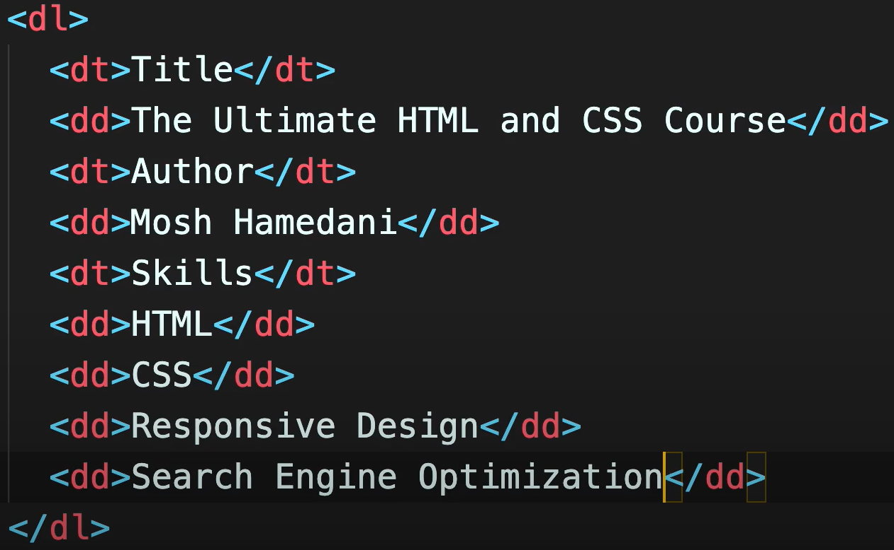
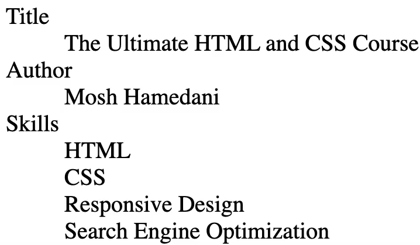
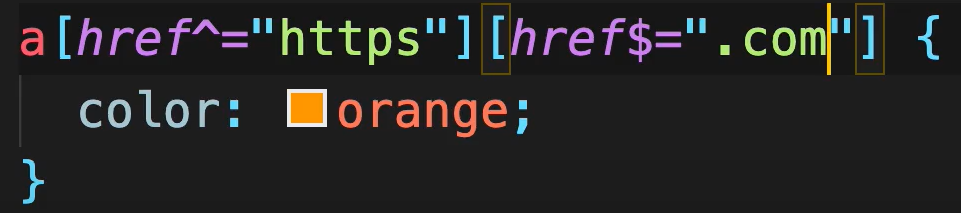

# Table of contents

- [Table of contents](#table-of-contents)
- [Web Development Fundamentals](#web-development-fundamentals)
  - [4- Inspecting HTTP Requests and Responses](#4--inspecting-http-requests-and-responses)
  - [5- HTML Basics](#5--html-basics)
  - [8- Inspecting Pages Using DevTools](#8--inspecting-pages-using-devtools)
  - [9- Validating Web Pages](#9--validating-web-pages)
- [HTML Basics](#html-basics)
  - [2- The Head Section](#2--the-head-section)
  - [3- Text](#3--text)
  - [4- Entities](#4--entities)
  - [5- Hyperlinks](#5--hyperlinks)
  - [6- Images](#6--images)
  - [7- Video and Audio](#7--video-and-audio)
  - [8- Lists](#8--lists)
  - [9- Tables](#9--tables)
  - [11- Semantic Elements](#11--semantic-elements)
  - [12- Structuring a Web Page](#12--structuring-a-web-page)
- [CSS Basics](#css-basics)
  - [3- Normalizing CSS](#3--normalizing-css)
  - [4- Basic Selectors](#4--basic-selectors)
  - [5- Relational Selectors](#5--relational-selectors)
  - [6-Pseudo-class Selectors](#6-pseudo-class-selectors)
  - [7-Pseudo-element Selectors](#7-pseudo-element-selectors)
  - [8-Selectors Spcificty](#8-selectors-spcificty)
  - [9-Inheritance](#9-inheritance)
  - [11-Gradients](#11-gradients)
  - [12-Borders](#12-borders)
  - [13-Shadows](#13-shadows)

# Web Development Fundamentals

## 4- Inspecting HTTP Requests and Responses

Develper tool 中 network，是全部的 http request，dev tool 的最下栏有 request 的数量，和输送 data 的总量 amount 94kilobytes

## 5- HTML Basics

- 在 index.html 中: 输入< + tab
- 127.0.0.1: represent the current computer
- 5500: the port number on which our web server is listening.我们的 web server 正在 waiting for http request on this port

## 8- Inspecting Pages Using DevTools

当浏览器接受到 html 文件后，会建立一个 DOM

## 9- Validating Web Pages

- 利用下面的网址，check html 中有没有 error: validator.w3.org/nu/#file
- css calidate website: jigsaw.w3.org/css-calidator/
- 利用 dev tool，查看 DOM。点击一个位置，查看 source code，修改 css，确定好看后，定位 source，修改数据。

# HTML Basics

## 2- The Head Section

- 在 header 输入 meta 就可以看大所有的可选 meta 信息
- 以下是便于搜索引擎搜索的关键字，但是现在越来越比重变小
  - <meta name="keywords" content="HTML, CSS">
- 以下这个是在 google 上搜索这个 webpage 的时候，显示在下面的内容（discover the innovative world…）
  - <meta name="descritption" content="...">

## 3- Text

- 在 vscode 中看页面： 'Simple Browser: Show'
- 利用 ctrl+shift+P，命令 wrap a…，将所选区域，用输入的 html 元素（比如 em），包裹住

## 4- Entities

- Html entities
  - <>这个符号是 html 的保留字，如果想打印，需要写成以下形式：&lt;HTML&gt;! &copy; ---> <HTML>! @(圈圈 c not a)
  - google： Html entities, character entity reference chart
- 自动产生火星文：添加数字代表需要的字符数量
  - lorem
- Non breaking space 意思是前后两个词不分开，不会在两行，而会打包出现在同一行
  - dicta&nbsp;iusto

## 5- Hyperlinks

```HTML
<!-- target的意思是打开一个新页面，否则会在原页面上跳转 -->
<a href='https://google.com' target='_blank'>Google</a>
<!-- 自动打开电脑的邮箱工具，to 指定邮箱，需要client自己写邮件内容 -->
<a href='mailto:programmingwithmosh@gmail.com'>Email Me</a>
```

## 6- Images

- 下载好看的图片: unsplash.com/s/photos/coffe
- 图片会充满所在的 container，原来是图片被撕扯变形，加了这句，就只显示图片的一部分
  - object-fit: cover;

## 7- Video and Audio

- video & photo website: pexels.com
- 以下后三个属性都是布尔型，写上就意味着 true:

```HTML
<video src="../videos/ocean.mp4" controls autoplay loop></video>
```

- 相对路径：../../ 上升，两个点点是一个 folder
- 绝对路径：以/开头，全场都写
- Can I use 测试各种浏览器是否可以显示各种 html 元素 website: caniuse.com

## 8- Lists

- detail list:  
  
  
- ul: unordered list
- ol: ordered list

## 9- Tables

- table element should be only used for displaying tabular data

## 11- Semantic Elements

- 语义元素，有意义的元素： artical, figure, time, mark, figcaption

## 12- Structuring a Web Page

- HTML 的结构：
  - main
  - section
  - header
  - footer
  - aside

# CSS Basics

## 3- Normalizing CSS

- website: normalize.css

## 4- Basic Selectors

- selectors:
  - Element Type (body, a, h1)
  - ID (id='product' ---> #product)
  - Class (class='product' ---> .product)
  - Attributes (href='https://...' ---> a[href='https://...'])
- 选择 a/link，属性 href，以 https 开头，以点 com 结尾  
  

## 5- Relational Selectors

- section#products (enter tab will generate section with id 'products')

```CSS
/* id products 包裹中的“第一个” paragraph （child） */
#products > p {
    ...
}

/* id products 相邻下面的“第一个” paragraph （sibling）*/
#products + p {
    ...
}

/* id products 相邻的“ALL” paragraph （sibling）*/
#products ~ p {
    ...
}
```

## 6-Pseudo-class Selectors

就像我们有类选择器一样，我们也有伪类选择器

```CSS
/* 奇数的list */
ul li:nth-child(odd){
  color: red;
}

/*
  all anchors that are vistied
  all anchors that are links, all hyperlinks
*/
a:visited,
a:link {
  color: red;
}

/* 鼠标从上面经过，和利用tab key聚焦 */
a:hover,
a:focus {
  color: red;
}
```

## 7-Pseudo-element Selectors


```CSS
/* 一整段paragraph中的第一个字母 */
p::first-letter {
  font-size: 140%;
  font-weight: bold;
}

p::first-line {
  font-size: 140%;
  font-weight: bold;
}

/* 用户选择这段话的一个部分，默认值是背景颜色变成蓝色 */
p::selection {
  background-color: pink;
}

/*
  这段paragraph之前，添加内容...
  display: block;之后，这几个点单独成一行了
*/
p::before {
  content: "...";
  display: block;
}

```

## 8-Selectors Spcificty

user agent stylesheet: chrome 自带的，不可更改  
要尽量少使用 important，因为不容易维护

## 9-Inheritance

排版方面的 property 会有继承属性。font, font size,vertical space between lines, the alignment of text, the color of the text

```CSS
p {
  color: blue;
  border: 1px solid black;
}

strong {
  color: initial;
  border: inherit;
}
```

## 11-Gradients

```CSS
.box {
  width: 200px;
  height: 200px;

  /* 从左上到右下 */
  background: linear-gradient(to bottom right, blue, red);
  /* 45度角，从左下到右上角 */
  background: linear-gradient(45deg, blue, red);
  /* 红色从1/3的位置开始，蓝色只占1/3，剩下是红色 */
  background: linear-gradient(blue, red 30%);
  /* 三种颜色 */
  background: linear-gradient(45deg, blue, red, tomato);

  /* 中心是白色，一圈是黄色，渐变 */
  background: radial-gradient(white, yellow);
  /*
    如果不是正方形，中心会是外围的型状。
    利用circle规定中心必须是原型.
  */
  background: radial-gradient(circle at top left, white, yellow)；
}
```

## 12-Borders

```CSS
.box {
  width: 200px;
  height: 200px;
  background: green;

  border: 10px dashed yellow;
  border-top: 10px;
  border-width: 10px 20px;
  border-width: 1px;
  border-style: none;
  border-color: none;
  border-radius: 10px;
  /*
    得到一个圆
    google 搜索 css shape，可以看到利用css生成各种shape的方法
  */
  border-radius: 100%;
}
```

## 13-Shadows

```CSS
.box {
  width: 200px;
  height: 200px;
  background: green;

  /*
    box-shadow：这个属性用于在元素的框架周围添加阴影效果。
    10px -10px：这两个值指定阴影的水平（10px）和垂直（-10px）偏移量。正值表示阴影会向右（水平）或向下（垂直）偏移，负值则表示向左或向上偏移。在这个例子中，阴影将向右偏移10像素，向上偏移10像素。
    30px：这个值指定阴影的模糊半径。值越大，阴影的边缘就会越模糊。这里是30像素，意味着阴影将有较大的模糊效果。
    grey：这个值指定阴影的颜色。在这个例子中，阴影颜色为灰色。
  */
  box-shadow: 10px -10px 30px grey;
}

h1 {
  color: white;
  /*
      text-shadow：这个属性用于在文本的文字周围添加阴影效果。
      3px 3px：这两个值指定阴影的水平（3px）和垂直（3px）偏移量。正值表示阴影向右（水平）或向下（垂直）偏移。在这个例子中，阴影将向右偏移3像素，向下偏移3像素。
      5px：这个值指定阴影的模糊半径。值越大，阴影边缘越模糊。这里是5像素，意味着阴影将有一个轻微的模糊效果。
      rgba(0,0,0,0.2)：这个值指定阴影的颜色和透明度。rgba的前三个值（0,0,0）代表颜色（在这个例子中是黑色），最后一个值（0.2）代表透明度，范围从0（完全透明）到1（完全不透明）。这里的透明度为0.2，意味着阴影将是相对较淡的黑色。
  */
  text-shadow: 3px 3px 5px rgba(0,0,0,0.2);
}
```
