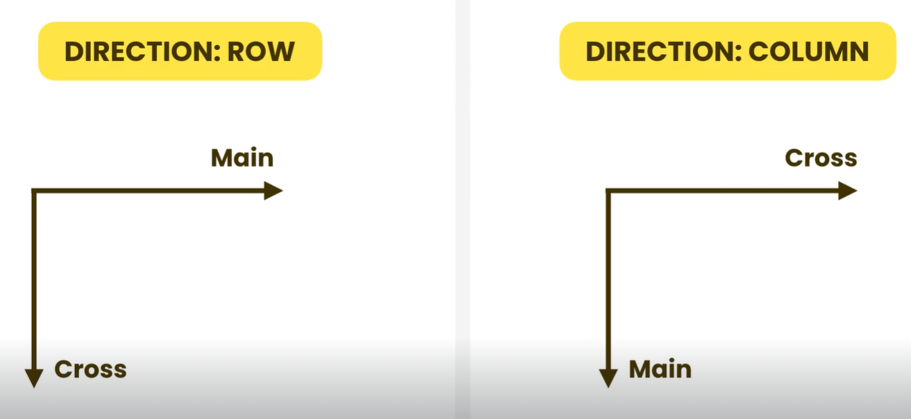
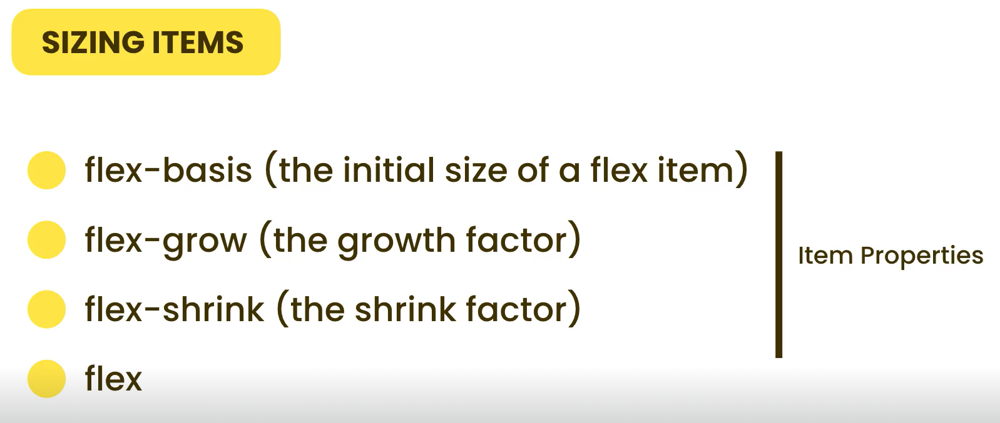
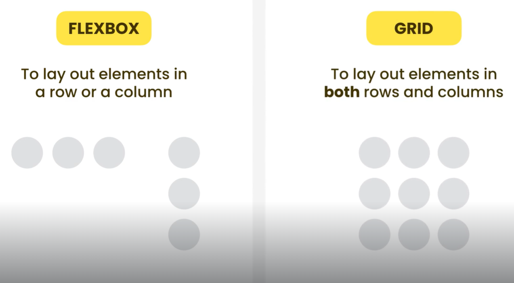
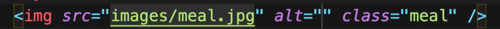
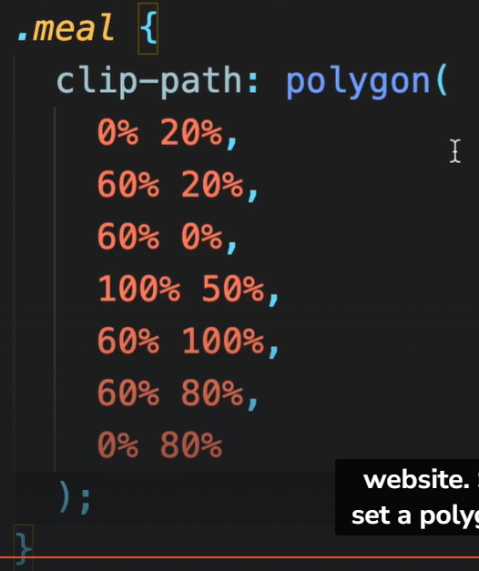

# Table of contents

- [Table of contents](#table-of-contents)
- [Layout](#layout)
  - [2-The Box Model](#2-the-box-model)
  - [3-Sizing elements](#3-sizing-elements)
  - [4-Overflowing](#4-overflowing)
  - [5-Measurement Units](#5-measurement-units)
  - [6-Positioning](#6-positioning)
  - [7-Floating Elements](#7-floating-elements)
  - [8-FlexBox](#8-flexbox)
  - [9-Grid](#9-grid)
  - [10-Hiding Elements](#10-hiding-elements)
  - [11-Media Queries](#11-media-queries)
- [Typography](#typography)
  - [1-Introduction](#1-introduction)
  - [2-Styling Fonts](#2-styling-fonts)
  - [3-Enbedding Web Fonts](#3-enbedding-web-fonts)
  - [4-Flash of Unstyled Text](#4-flash-of-unstyled-text)
  - [5-Font Services](#5-font-services)
  - [6-System Font Stack](#6-system-font-stack)
  - [7-Sizing Fonts](#7-sizing-fonts)
  - [8-Vertical Spacing](#8-vertical-spacing)
  - [9-Horizontal Spacing](#9-horizontal-spacing)
  - [10-Formatting Text](#10-formatting-text)
- [Images](#images)
  - [1-Introduction](#1-introduction-1)
  - [2-Image Types and Formats](#2-image-types-and-formats)
  - [3-Content Images](#3-content-images)
  - [4-Background Images](#4-background-images)
  - [5-CSS Sprites](#5-css-sprites)
  - [6-Data URLs](#6-data-urls)
  - [7-Clipping](#7-clipping)
  - [8-Filters](#8-filters)
  - [9-Supporting High-density Screens](#9-supporting-high-density-screens)
  - [10-Resolution Switching](#10-resolution-switching)
  - [11-Using Modern Image Formats](#11-using-modern-image-formats)
  - [12-Art Direction](#12-art-direction)
  - [13-Scalable Vector Graphics](#13-scalable-vector-graphics)
  - [14-Font Icons](#14-font-icons)
- [Forms](#forms)
  - [1-Introduction](#1-introduction-2)
  - [2-Creating a Basic Form](#2-creating-a-basic-form)
  - [3-Styling Forms](#3-styling-forms)
  - [4-CSS Frameworks](#4-css-frameworks)
  - [5-Text Fields](#5-text-fields)
  - [6-Data Lists](#6-data-lists)
  - [7-Dropdown Lists](#7-dropdown-lists)
  - [8-Check Boxes](#8-check-boxes)
  - [9-Radio Buttons](#9-radio-buttons)
  - [10-Sliders](#10-sliders)
  - [11-File Inputs](#11-file-inputs)
  - [12-Grouping Related Fields](#12-grouping-related-fields)
  - [13-Hidden Fields](#13-hidden-fields)
  - [14-Data Validation](#14-data-validation)
  - [15-Submitting the Form](#15-submitting-the-form)
- [Transformations, Transitions, and Animations](#transformations-transitions-and-animations)
  - [1-Introduction](#1-introduction-3)
  - [2-Transformations](#2-transformations)
  - [3-3D Transformations](#3-3d-transformations)
  - [4-Transitions](#4-transitions)
  - [5-Animations](#5-animations)
  - [6-Reusable Animations](#6-reusable-animations)
- [Writing Clean, Maintainable CSS](#writing-clean-maintainable-css)
  - [1-Introduction](#1-introduction-4)
  - [2-CSS Best Practices](#2-css-best-practices)
  - [3-Variables](#3-variables)
  - [4-Object-oriented CSS](#4-object-oriented-css)
  - [5-BEM(Block Element Modifier)](#5-bemblock-element-modifier)
  - [6-Summary](#6-summary)

# Layout

## 2-The Box Model

```CSS
p {
  padding: 10px 20px; /* trbl */
}
```

## 3-Sizing elements

- div 中包含 content
- padding 和 border 会增加下面代码皮中 box 的大小
- margin 不会改变 box 的 size，但是会使这个 box 移动位置
- padding 和 border 如何直接增加元素的总尺寸，而 margin 则负责元素与其他元素之间的间距，但不影响元素本身的大小。
- box-sizing: content-box
  - default
- box-sizing: border-box
  - padding 和 border 不会增加 box 的 size
  - 内容会缩小，以满足 width 和 height
- ::before 的内容任然是这个 element 的一部分，不是在 element 之前，而是在 element 的最前面
- width & height 只会应用在 block 元素上，它会把它所在的行，全占上，同行中不会出现别的元素

```CSS
.box {
  width: 100px;
  height: 100px;
  background-color: gold;
  padding: 20px;
  border: 10px solid orange;
  box-sizing: border-box;
}
```

## 4-Overflowing

- overflow: visible
- defautl value is visible, 内容会溢出容器框并且仍然可见
- hidden: 溢出的内容会被裁剪，且不会显示滚动条
- scroll: 可以滑动查看
- auto: scroll bar only appear when overflow happens
- clip：类似于 hidden，溢出的内容会被裁剪，但是对于 inline 方向，内容可以继续显示在下一行或上一行
- 类似 overflow 的另外两种属性
  - overflow-x: visiable
  - overflow-y: hidden
- overflow: hidden auto ---> x 和 y 分别是 hidden and auto

## 5-Measurement Units

- absolute: is fixed, the value doesn't change
  - px, pt, in, in, cm, mm
- relative:
  - %: relative to the size of the container
  - vw, vh: ralative to the viewpoint
    - 100vh: 100% of the height of the viewport
    - 50vw: 50% of the width of the viewport
  - em, rem: relative to the font size
    - 10 \* font of size of the current element
    - 10 \* font of size of the root element
- default height is 0

"viewport"（视口）是一个关键的网页设计概念，指的是用户浏览器内部的可视区域。不同于整个网页的大小，视口仅指当前用户能够看到的网页部分。视口的大小会随着设备的屏幕大小和用户缩放页面（比如通过缩放功能或改变设备方向）而变化。

    vh（Viewport Height）：视口高度的单位，1vh等于视口总高度的1%。
    vw（Viewport Width）：视口宽度的单位，1vw等于视口总宽度的1%。
    vmin：视口宽度和高度中较小的那个的单位，1vmin等于当前视口宽度或高度中较小值的1%。
    vmax：视口宽度和高度中较大的那个的单位，1vmax等于当前视口宽度或高度中较大值的1%。

## 6-Positioning

- relative: relative to the element's normal position
  - 改变第二个的 position 变成 relative，其他两个 box 的位置不会改变
- absolute: relative 其最近的非 static parent
  - 第二个 box 变成 absolute 后，第三个 box 会移动（仿佛没有第二个一样）
- fixed: relative to the viewpoint

static 无特殊定位，top，right 等属性不会被应用. 这是 default value  
relative 遵循文件流，根据原本位置以及 bottom，left 等属性，进行位置偏移。  
absolute 脱离文件流使用 top 等绝对定位。相对于 static 定位以外的第一个父元素进行定位  
fixed 以窗口为参考定位，当出现滚动条，对象不会滚动，会一直保持在窗口中

static

    默认值。元素按照正常的文档流进行布局，即它的位置会基于它在HTML中的顺序。
    不会受到top、right、bottom、left属性的影响。

relative

    元素的位置是相对于其正常位置进行调整的。
    设置top、right、bottom、left属性会使元素相对于其在文档流中的原位置移动，但不会改变文档流本身。即，即便元素移动了，它原本所占的空间仍然保留。

absolute

    元素的位置相对于其最近的非static定位的祖先元素进行定位。
    如果没有这样的祖先元素，则相对于文档的<html>元素定位。
    元素会从文档流中完全脱离，仿佛没有这个元素一样
    通过top、right、bottom、left属性来确定元素的位置。

fixed

    元素的位置相对于浏览器窗口（视口）进行定位。
    即使页面滚动，元素也会保持在指定的位置，不随之移动。
    元素会从文档流中脱离，不占据任何空间，仿佛没有这个元素一样
    同样通过top、right、bottom、left属性来确定元素的位置。

## 7-Floating Elements

- tweet: 推特
- avatar: 头像


```CSS
.avatar {
  width: 5rem;
  height: 5rem;
  background-color: gold;
  /* 只写以上这些，paragraph在黄色box下面，因为p是block的，会另起一行 */
  /*
    float: left; will float avartar element to the left side of its container(tweet)
    作为结果，all the subsequent elements will flow around it
    如果paragraph足够长，你会发现，它会绕着黄色的box（avatar）
  */
  float: left;
}
```

将下述 clear 类，添加给第二个 p，第二个 p 就不会受到 float 的影响，会另起一行

```CSS
.clear {
  clear: both;
}
```

每次使用 float，都应该利用 clear 帮助 parent container 适应子 div 的 float 属性

方法一：parent collapsing, parent element 不会看到 float element, and they 坍塌。如果只保留 avatar 和第一个 p（很短的一个 p），给 tweet 添加一个 border，你会看到，黄色 box（avatar），超出边框，因为 avatar 比 tweet 大。因为 tweet 是 avatar 的 parent，它看不到 float 的 avatar。添加一个具有 clear 类的 div 在 tweet 的最后一个子位置

父元素无法自动调整其高度以包含其内部浮动的子元素，导致布局问题

当父元素不能自动调整其高度以包含其内部浮动的子元素时，所造成的“布局问题”通常包括但不限于以下几种情况：

    父元素塌陷（Parent Collapse）：这是最直接的布局问题。如果父元素内所有的子元素都是浮动的，那么父元素的高度可能会被计算为0（或者低于内部子元素的实际高度），因为浮动元素不占据在常规文档流中的空间。这会导致父元素看起来像是“塌陷”的，因为它不包含它的子元素。

    相邻元素重叠：如果父元素塌陷，随后紧跟的元素（比如另一个div）可能会移动到本应由父元素占据的位置，导致页面元素之间出现重叠。

    布局不一致：浮动元素如果没有被父元素正确包含，可能会导致网页布局看起来与设计意图不一致。例如，背景颜色或边框可能不会覆盖所有的子元素，因为父元素的高度没有被正确计算。

    清除浮动（Clearing Floats）的困难：通常需要在浮动元素之后清除浮动以确保后续元素在布局上正确显示。如果父元素塌陷，可能需要额外的工作来确保清除浮动的方法能够正确工作。

    响应式设计问题：在一个响应式设计中，父元素塌陷可能导致在不同屏幕尺寸下出现意料之外的布局问题，因为父元素和子元素的高度不一致会影响到布局的自适应性。

解决这些布局问题的一种常用方法是通过 CSS 的 clear 属性或在父元素上使用 overflow: hidden;来确保父元素能够正确计算包含浮动元素的高度。这样不仅解决了父元素塌陷的问题，还能避免因浮动引起的其他相关布局问题。

```CSS
.clear {
  clear: both;
}
```

方法二：这个方法最好，不用添加 meaningless 的 div

```CSS
.generalClassName::after {
  content: '';
  display: block;
  clear: both;
}
```

方法三，只要不是 visible，都可以解决这个问题。但是这个方法不好

当你在一个元素上使用浮动（float），它会脱离常规的文档流，这意味着浮动元素不会影响到其父元素的高度，因为它好像是独立于文档流之外的。这会导致一个常见的问题，被称为“父元素塌陷”（parent collapse），即父元素无法自动调整其高度以包含其内部浮动的子元素，导致布局问题。

使用 overflow: hidden;在父元素上是解决这个问题的一种常见技巧。这个属性通常用于指定当一个元素的内容溢出其区域时应该发生什么，但当它被应用到包含浮动元素的父元素上时，它还有一个额外的效果：它会触发父元素建立一个新的块格式化上下文（Block Formatting Context, BFC）。

块格式化上下文是一个独立的布局环境，其中的元素布局不会影响到外部的元素，反之亦然。当父元素创建了一个新的块格式化上下文后，它会考虑其内部浮动元素的高度来计算自身的高度，即使这些浮动元素本身是脱离文档流的。这样，父元素就能够正确地“包裹”其内部的浮动元素，避免了塌陷问题。

简而言之，overflow: hidden;使得父元素能够“看到”并正确计算内部浮动元素的高度，从而解决了父元素塌陷的问题。尽管这是一个有效的解决方案，但它也可能副作用地隐藏溢出父元素的内容，所以在使用时需要考虑这一点。

```CSS
.tweet {
  border: 3px solid grey;
  overflow: hidden;
}
```

总之，float 不是一个好方法，尽量少用，因为需要额外处理它的 parent

## 8-FlexBox

- FlexBox: layout method for laying out elements in one dimension

```CSS
.constainer {
  border: 3px solid grey;
  display: flex;
  flex-direction: row;  /* default */
  flex-direction: column-reverse; /* 子 element abc，竖排排列，cba */
  flex-direction: row-reverse; /* 横排排列，cba，而且是在这一行的末尾，而非开头 */
}
```

- AXES
  - Main(primary)
  - Cross(secondary)



- aligning items
  - justify-content(along the MAIN axis)
  - align-items(along the CROSS axis)

```CSS
.constainer {
  border: 3px solid grey;
  display: flex;
  flex-direction: row;
  justify-content: flex-start; /* default */
  justify-content: flex-end; /* abc 横排排列 in the end of the row */
  justify-content: center;
  justify-content: space-evenly; /* abc 平均，均匀分布在这一列中 */
  justify-content: space-between; /* 第一个和最后一个在这列的开头和结尾，中间的元素平均分布 */
}
```

```CSS
/*
  boxes在container的最底一行(align-items: flex-end;)，横向排列(flex-direction: row;)，居于这行的中心位置(justify-content: center;)

  height: 90vh; 是为了给container一个高度，让我们看到box会下沉到最底下
*/
.constainer {
  border: 3px solid grey;
  display: flex;
  flex-direction: row;
  justify-content: center;
  align-items: flex-end;
  align-items: center; /* abc在container正中心 */
  height: 90vh;
}
```

- 如果在 container 中有多行 element（abc 是三个 box，但是是一行）。如果增加 box 的数量，他们依然在同一行，因为 flex 属性，会调节子 element，让他们在同一行中。想要改变这个，需要 flex-wrap: wrap. wrap 包裹
- align-content: center; we can align multiple lines or the entire content as a whole. we can put the entire content in the center on the vertical axis

align-content: center; 是 CSS 中的一个属性，用于设置弹性容器中的弹性行在交叉轴上的对齐方式。这个属性仅当你使用了弹性布局（即 display: flex;或 display: inline-flex;）时才有效，且当弹性容器有额外的空间时，这个属性才会影响其中的内容排列。

当设置为 center 时，align-content: center; 会将弹性容器内的所有弹性行（flex lines）集中在容器的中心位置。这意味着如果容器的高度大于其中所有项（flex items）的总高度时，这些项会被集中对齐在容器的垂直中心。

    flex-start：弹性行向容器的起始边线对齐。
    flex-end：弹性行向容器的结束边线对齐。
    center：弹性行在容器中居中对齐。
    space-between：弹性行会均匀分布在容器中，第一行贴近起始边线，最后一行贴近结束边线，其余行之间的间距相等。
    space-around：弹性行会均匀分布在容器中，行与行之间的空间相等，行与容器边缘之间的空间是行与行之间空间的一半。
    space-evenly：弹性行会均匀分布在容器中，行与行之间的空间相等，行与容器边缘之间的空间也相等。
    stretch（默认值）：如果项未设置高度或设为auto，将拉伸以占据剩余空间，使得所有的弹性行占满整个容器的交叉轴。

```CSS
.constainer {
  border: 3px solid grey;
  display: flex;
  flex-direction: row;
  justify-content: center;
  align-items: center;
  height: 90vh;
}
```

- 如果想要将三个 box 分开展示
- align-self is the property that we apply on a flex item and not a flex container. with this we can override the value that we assign earlier using the "align-item" property
- 纵向移动 box

```CSS
.box-one {
  align-self: flex-start;
}
```

1. margin-right: auto; 在 CSS 中用来设置一个元素右边距的值为自动。这意味着浏览器会自动计算元素的右边距大小，以确保元素在其包含块（通常是一个父元素）中的水平位置符合页面布局的需求
2. 这个属性通常与 margin-left: auto;一起使用来将一个元素水平居中于其父元素。
3. 当 margin-right: auto;单独使用时，其效果依赖于其他边距设置和元素的宽度。如果元素宽度固定，而左边距（margin-left）是一个具体值，那么右边距设置为 auto 将使得元素向左对齐，并且右边距自动扩展以填充剩余空间。如果左边距也设置为 auto，则元素会居中。



```CSS
.box {
  flex-basis: auto; /* 原始尺寸，按照 width 和 height 的尺寸 */
  flex-basis: 10rem; /* 因为是按 row 排列，所以 10rem 会代替 width，被应用 */


  flex-grow: 0; /* default，不会增长，这行的其他位置是空的 */
  flex-grow: 1; /* 三个box都会按照 1 的比例，增长，占满这行 */

  /* how the element should shrink 收缩 if there is not enough space to fit in the container */

  flex-shrink: 1; /* default 自然收缩 */
  flex-shrink: 0; /* 不收缩 */

  flex: 1 1 15rem; /* flex-grow flex-shrink flex-basis */
  flex: 1 15rem; /* flex-grow & flex-shrink flex-basis */

  width: 5rem;
  height: 5rem;
  background-color：gold;
  margin: 1rem;
}
```

## 9-Grid



## 10-Hiding Elements

## 11-Media Queries

# Typography

## 1-Introduction

## 2-Styling Fonts


Font stack: 第一个找不到就用第二个，第二个找不到就用第三个

```CSS
p {
  font-family: Arial, Helvetica, sans-serif;
}
```

```CSS
p {
  font-weight: 400;   /* 100-900, 100 就是很细*/
  font-weight: bold;  /* bold = 700, bolder, lighter, normal = 400 */
  font-style: italic;
  font-size: 30px;    /* small/medium/larg, 30px/... */
  color: black;
}
```

## 3-Enbedding Web Fonts

- fontsquirrel.com: 找到很多免费 font 的网站
- search for OPEN SANS
- download TTF font file format


- font file formats: TTF, OTF, EOT, WOFF, WOFF 2.0
- 我们想要使用 woff woff 2.0 因为这两种更 compressed and more efficient for web
- 下载后,我们会得到一个 open-sans.zip file
  - 这里面有 license.txt file and 一大堆 ttf files
- 我们需要将 ttf 压缩成 woff, 因为他们太大了
  - fontsquirrel.com
  - webfont generator page
  - upload font, select regular and bold
  - select optimal
  - download your kit
- 去 caniuse.com 查看什么 file format 被什么浏览器支持
  - 搜索 woff
- css/fonts/open-sans/四个 font woff files: opensnas-bold-webfont.woff2; opensnas-regular-webfont.woff......
- download 的 kit 中还有一个文件: stylesheet.css
  - register the new font
  - 将其中的两行添加到我们自己的 css 中
  - 在 css 中添加@font-face
  - 修改
    - font-family
    - url
    - font-weight


- use the new font

```CSS
body {
  font-family: 'opensans', Arial, Helvetica, sans-serif;
}
```

## 4-Flash of Unstyled Text

- one of the problems with custom fonts is that the user may encounter what we call a flash of unstyled text, which basically means while the browser is downloading our custom font, it's going to use a fallback font, and our text may appear unstyled
- chrome browser ---> network ---> disable cache (kick it)
- chrome browser ---> network ---> online (select fast/slow 3G), 这可以模拟网速极慢的情况
- 显示使用 font Arial,两秒后变成了'opensans'. 这就是 Flash of Unstyled Text
- font-display: auto (default 让浏览器决定怎么表现. 最好选择 fallback)
- 还有另一种方法可以 prevent 这个问题, fontsquirrel.com
  - 生成 kit 的时候
  - 不选择 optimal, 选择 expert
  - subsettig ---> custom subsetting ---> 只选择有用的部分,不用选罗马符号等,可以减小 font size

## 5-Font Services


- fonts.google.com
- 从 google 上制作需要的 font
- 粘贴 url 到 html header 中

## 6-System Font Stack

使用 system font 作为 web 的 font,web 会因为所使用的电脑的不同 system,而使用不同的 font


## 7-Sizing Fonts

type-scale.com 查看 font 不同 size 的不同样式

## 8-Vertical Spacing

- margin: 3rem 0 1rem; 没有 left margin, 第二个 heading 就会远离第一个 p,接近第二个 p 了
- line-height: 行间距

## 9-Horizontal Spacing

- letter-spacing
- word-spacing
- width: 50ch; 宽度为 50 个字母. ideal line length should be between 50-70 characters

## 10-Formatting Text


- text-align: left/right/center
- text-indent: 1rem 开头会有 1rem 的空格
- text-decoration: underline
- text-transform: lowercase/uppercase/capitalize
- white-space: nowrap 不会换行,一行到底

```CSS
p {
  width: 50ch;
  white-space: nowrap;
  border: 3px solid gold;
  overflow: hidden;
  text-overflow: ellipsis;  /* 超过的部分用...代替 */
}
```

- column-count: 2 变成两列

```CSS
p {
  width: 50ch;
  column-count: 2;
  column-gap: 2rem;
  column-rule: 3px dotted #999;   /* 中间空间，竖点点 */
}
```

- direction 默认是 ltr left to right，改成从右到左, 右对齐

# Images

## 1-Introduction

## 2-Image Types and Formats

raster


vector


## 3-Content Images

## 4-Background Images

```CSS
body {
  background: url(../images/bg-paper.jpg);
  background-repeat: no-repeat;
  background-position: 100% 100px;  /* 紧靠右侧，向下移动100px */
  background-size: 100% 200px;    /* 横向拉伸成100% */
  background-size: cover;
  background-attachment: fixed;     /* 图片不会因为height: 300vh;，而被拉伸的很长，会与viewpoint保持一致，相当于100vh */
  height: 300vh;
}
```

## 5-CSS Sprites

- 为了解决问题：太多图片，太多用户。将所有图片绑定成为一个。
- cssspritestool.com
- for small images like logo and icons
- 下载的内容中包括.png，和一个 css
- 利用下载的混合图片： span.bg-dishes
- css 中下载的混合图片：


## 6-Data URLs


- google data URL generator
- cssportal.com/image-to-data/
- 这个 url 是直接镶嵌在 html 中的，所以不会重新发送单独的 http
- data：
  - 类似 http://


## 7-Clipping

- google css clip generator
- 输入图片，选择想要的图形
- 以下 css 是从上述网站粘贴下来的





## 8-Filters

- google filter functions

```CSS
.meal {
  filter: grayscale(70%) blur(3px);    /* 灰度 */
}
```

## 9-Supporting High-density Screens

- 分辨率: 以宽度和高度的像素数来表示
- px: 像素, 每一个像素代表显示屏上的一个点
- iphone3 和 iphone4 屏幕尺寸一样, 但是分辨率不同
  - iphone3: 480\*320
  - iphone4: 960\*640
- iphone4 有一个 scale factor of 2 x, 这意味他会 render each 像素 of this image using 这个设备的两个像素
- 利用 PS，将图片变成原本的*2/*3 倍像素
  - image ---> image size ---> width 1200 height 1200
  - 假设我们想在 400\*400 中展示这个图片，3 倍就是 1200\*1200
  - 最后 save file
  - image option quality 7 medium file, 仍然是质量很好的图片，但是可以让 size 小很多


## 10-Resolution Switching

- 上一章中,我们设定图片的宽度为固定值, 400px, 为了不同的屏幕分辨率, 提供了三种图片
- 但是, 如果修改 width 为 100vw 就会有一个问题, 不同 size 的 device 会将图片 resize, 以适应它自己的尺寸, 对于大屏幕, 图片就会被拉扯, 变模糊
- 图片越大, 这个 resize 就越消耗, 因为需要将整个图片 load 到内存中, 这就是所谓的 Resolution Switching problem
- 所以, 我们希望为不同尺寸的 device/不同分辨率, 提供不同的图片
- 我们可以为不同的设备, 提供不同 size 的图片, 让历览器, 根据自己的分辨率和像素比例(PX ratio), 自己选择图片
- 1X ---> 400w, w unit to represent the actual width of this image
  - 我们就是告诉浏览器, 我们的图片就是这个宽度. 浏览器就可以自行选择它要的 size 了
- 当屏幕最大 500px, 这是一个 mobile 的屏幕, 将这个图片设置成为 100vh


- responsivebreakpoints.com


## 11-Using Modern Image Formats


- 如果想要所有浏览器都兼容现代图片格式, 需要使用 picture 元素


## 12-Art Direction

- we want to show as zoomed in or cropped version of an image for certain screen sizes, this is called art direction
- 将屏幕缩小后, 原本横排排列的三个图片, 变成竖排排列一个, 而且每张图片只取其中一个部分, 而不是全部展示
- 你可能有一个背景, 有一个人在正中间. 在电脑上, 这个图片很正常. 但是在手机上, 这个人就看起来太小了. 所以, 在手机上, 我们可以提供一个 zoomed in 或者 被剪切过的图片
- 提供另外的图片, meal-cropped.jpg, 给 mobile size


## 13-Scalable Vector Graphics

## 14-Font Icons


- fontawesome.com
- start ---> enter the email ---> create kit, change kit name relative to project
- how to use ---> copy kit code ---> paste it in html
- 最下一行的 script 就是添加的 icon


- fas: fontawesome solid
- fa-2x: 原来两倍大


- 将其包裹在 span 中, 改变其颜色, 大小


- i 元素已经 deprecated, 被弃用了, 因为以前我们用它代表斜体字. 现在大家都用它表示 icon. 当然也可以用 span 代替 i 代表 icon

# Forms

## 1-Introduction

## 2-Creating a Basic Form

- action for submit the form
- 每一种 input 都可以叫做 form control
- label for 与 form control id 的配对, 点击 label (for = 'name') 就可以让光标自动 focus 在相应的 form control(id='name') 中

## 3-Styling Forms


## 4-CSS Frameworks

## 5-Text Fields

- text input
  - value: 使用它, pre-populate an input field
  - placeholder: 如果原本是 null, 就会显示 placeholder 的内容
  - readonly: 不能修改
  - disabled: 甚至无法 focus
  - autofocus

## 6-Data Lists

- datalist 与 dropdown list 很像，区别是，前者可以让用户自己填不在 options 里面的 value，后者不行

## 7-Dropdown Lists

## 8-Check Boxes

## 9-Radio Buttons

## 10-Sliders

## 11-File Inputs

## 12-Grouping Related Fields

## 13-Hidden Fields

## 14-Data Validation

## 15-Submitting the Form

# Transformations, Transitions, and Animations

## 1-Introduction

## 2-Transformations

```CSS
body {
  display: flex;
  justify-content: center;
  align-items: center;
  height: 100hv;
}

.box {
  width: 100px;
  height: 100px;
  background: gold;
}

.box:hover {
  transform: rotate(15deg);
}
```

- rotate(15deg): 顺时针旋转 15 度
- scale(1.5): 放大 1.5 倍
- skew(15deg): 水平，上边向右，下边向左，变成平行四边形
- translate(10px, 20px): 向右移动 10px, 向下移动 20px
- transform: rotate(15deg) translateX(10px); 顺序有影响，先旋转，再移动

## 3-3D Transformations

```CSS
.box:hover {
  transform: perspective(200px) translateZ(-50px);
  transform: perspective(200px) rotate(45deg);
  transform: perspective(200px) rotateY(45deg);
  transform-origin: 0 0;  /* 左上角 */
  transform-origin: 0 50%;  /* 左上边缘 */
}
```

- perspective: 看法，透视，远景
- perspective(200px) translateZ(-50px), 目前这个 box 距离我们 200px，向远处移动 50px
- transform-origin: 0 0; x y 轴，默认值是 50% 50%中心点，

```CSS
/* 以下这么写，两个box不会同步旋转 */
.D-container:hover .D-box {
  transform: perspective(200px) rotateY(45deg);
  transform-origin: 0 50%;
}

/* 改成下面这样，就可以同步旋转了 */
.D-container {
perspective: 200px;
}
.D-container:hover .D-box {
  transform: rotateY(45deg);
  transform-origin: 0 50%;
}
```

## 4-Transitions

- cubic-bezier.com: 设计变化幅度曲线
- transition: transform 0.5s cubic-bezier(data from the above website) 1s;
- 持续 0.5s delay 1s 后执行

```CSS
.box {
  width: 100px;
  height: 100px;
  background: gold;
  transition: transform 0.5s, background 0.5s; /* transform 效果发生在 0.5s之间， background 颜色的变换发生在0.5s之间 */
}

.box:hover {
  transform: rotate(45deg);
  background: blue;
}
```

## 5-Animations

```CSS
@keyframes pop {
  0% {
    transform: scale(1);
  }

    25% {
    transform: scale(1.3);
  }

    50% {
    transform: rotate(45deg);
    background: tomato;
  }

    100% {
    transform: rotate(0);
  }
}

.box {
  width: 100px;
  height: 100px;
  background: gold;
  animation-name: pop;
  animation-duration: 4s;
  animation-delay: 1s;
  animation-iteration-count: infinite;
  animation-timing-function: linear/cubic-bezier()/ease-out;
  animation-direction: normal/reverse/alternate;
  animation: name dureation timing-function delay iteration-count ......
}
```

## 6-Reusable Animations

- animate.style 网站可以找到各种已经搞好的 animation
- 添加 style.css
- 添加相应的 class name: animate\_\_animated animate\_\_bounce

# Writing Clean, Maintainable CSS

## 1-Introduction

## 2-CSS Best Practices

- CSS preprocessor： SASS
- selector specificity
  - (id, class/伪类/属性, 元素/伪元素)
  - (0,2,3)
  - (0,1,0)
  - 23,10,这个值越小越好


- nav-bar, navBar, NavBar, nav_bar
- 利用注释将一个 css 内部做出分割
- 不要使用，div.nav>ul.items>li
  - 如果未来 ul.items 不是包含在 div.nav 中，这个选择器就不能正常工作
  - .nav .items .item
  - 如果在另一个位置定义过 .item 就会两者都需要!important
  - 结论是 class/id 写的越具体（nav-item），越容易维护


## 3-Variables

```CSS
:root {
  --color-primary: #ffdd36;
  --border-size: 2px;
  --border-radius: 10px;
}
.one {
  background: var(--color-primary);
}
.two {
  background: var(--color-primary);
}
```

## 4-Object-oriented CSS

## 5-BEM(Block Element Modifier)

- 有两种 card，其中一种叫做 popular
- card 双下划线 header
  - block\_\_element
- card--popular
  - block--modifier
- 以上命名方式就是 BEM


## 6-Summary

•Follow a naming convention for naming IDs and classes. The most common naming conventions are PascalCase, camelCase and kabob-case.

•For a small project, you can write all of your CSS rules in one stylesheet. Use CSS comments to create logical sections in your stylesheet. For a more complex project, you need to separate your stylesheet into multiple files and combine them together using build tools like Webpack, Rollup or Parcel.

•Avoid over-specific selectors. Limit nesting to two or maximum three selectors.

•Avoid the !important keyword as much as possible.

•Sort CSS properties. This makes it easier to read your code.

•Take advantage of style inheritance and reduce duplication in your styles.

•Use CSS variables, also called custom properties, to keep your code DRY.

•We often declare variables using the :root selector that targets the html element. We can then access these variables using the var() function.

•Object-oriented CSS is a set of principles for creating reusable components. The two principles in object-oriented CSS are: 1- Separate container and content. 2- Separate structure and skin.

•BEM (Block Element Modifier) is a popular naming convention for CSS classes.

- 一 Typography 8
- 二 Typography 9 10 Images 9
- 三 Images 10 - 14 Forms 2 4
- 四 Forms 5 - 15
