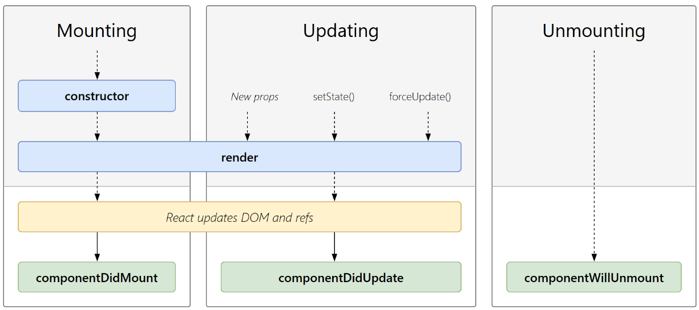

# controlled vs. uncontrolled

- controlled 可以做 field validate
- uncontrolled 只能在 form 上 onSubmit，只能在 submit 的一步做 validate，不能分项 validate
- we are using ref to access the value of the input element

```JavaScript
function FormValidation(props) {
  let inputValue = React.createRef();

  let handleSubmit = e => {
    alert(`Input value: ${inputValue.current.value}`);
    e.preventDefault();
  };

  return (
    <div>
      <form onSubmit={handleSubmit}>
        <input type="text" ref={inputValue} />
        <button type="submit">Submit</button>
      </form>
    </div>
  );
}

```

## 报错： A component is changing an uncontrolled input of type text to be controlled

```JavaScript
const Input = () => {
    const [val, setVal] = useState();

    return <input value={val} onChange={(e)=>{setVal(e.target.value)}} />
}
```

- val 初始化的收，没有给初始值。val 的初始值就是 undefined。首次渲染的时候，react 就认为这是一个 uncontrolled 的组件
- 而一旦开始输入，触发了 onChange 回调，就给 val 赋值了，这时 input 成为了 controlled 的组件
- 就会报这个错误
- 解决方法：
  - 给 val 一个空 string 作为初始值, useState('')
  - <input value={val || ''}>

# 回调函数

- 被作为参数传给别的函数的函数

# React 组件声明周期

组件的生命周期可分成三个状态：

- Mounting(挂载)：已插入真实 DOM
- Updating(更新)：正在被重新渲染
- Unmounting(卸载)：已移出真实 DOM



## 挂载

当组件实例被创建并插入 DOM 中时，其生命周期调用顺序如下：

- constructor(): 在 React 组件挂载之前，会调用它的构造函数。
- getDerivedStateFromProps(): 在调用 render 方法之前调用，并且在初始挂载及后续更新时都会被调用。
- render(): render() 方法是 class 组件中唯一必须实现的方法。
- componentDidMount(): 在组件挂载后（插入 DOM 树中）立即调用。

render() 方法是 class 组件中唯一必须实现的方法，其他方法可以根据自己的需要来实现。

## 更新

每当组件的 state 或 props 发生变化时，组件就会更新。

当组件的 props 或 state 发生变化时会触发更新。组件更新的生命周期调用顺序如下：

- getDerivedStateFromProps(): 在调用 render 方法之前调用，并且在初始挂载及后续更新时都会被调用。根据 shouldComponentUpdate() 的返回值，判断 React 组件的输出是否受当前 state 或 props 更改的影响。
- shouldComponentUpdate():当 props 或 state 发生变化时，- shouldComponentUpdate() 会在渲染执行之前被调用。
- render(): render() 方法是 class 组件中唯一必须实现的方法。
- getSnapshotBeforeUpdate(): 在最近一次渲染输出（提交到 DOM 节点）之前调用。
- componentDidUpdate(): 在更新后会被立即调用。

## 卸载

当组件从 DOM 中移除时会调用如下方法：

- componentWillUnmount(): 在组件卸载及销毁之前直接调用。

# 函数组件模拟生命周期

- componentDidMount()
- componentDidUpdate()
- componentWillUnmount()

```JavaScript
import React, { useState, useEffect } from 'react';

function FunctionalComponent() {
  const [count, setCount] = useState(0);

  // 模拟 componentDidMount
  useEffect(() => {
    console.log('Component did mount');
    // 清理函数，模拟 componentWillUnmount
    return () => {
      console.log('Component will unmount');
    };
  }, []);

  // 模拟 componentDidUpdate
  useEffect(() => {
    console.log('Component did update');
  }, [count]);

  return (
    <div>
      <p>Count: {count}</p>
      <button onClick={() => setCount(count + 1)}>Increment</button>
    </div>
  );
}

export default FunctionalComponent;
```
