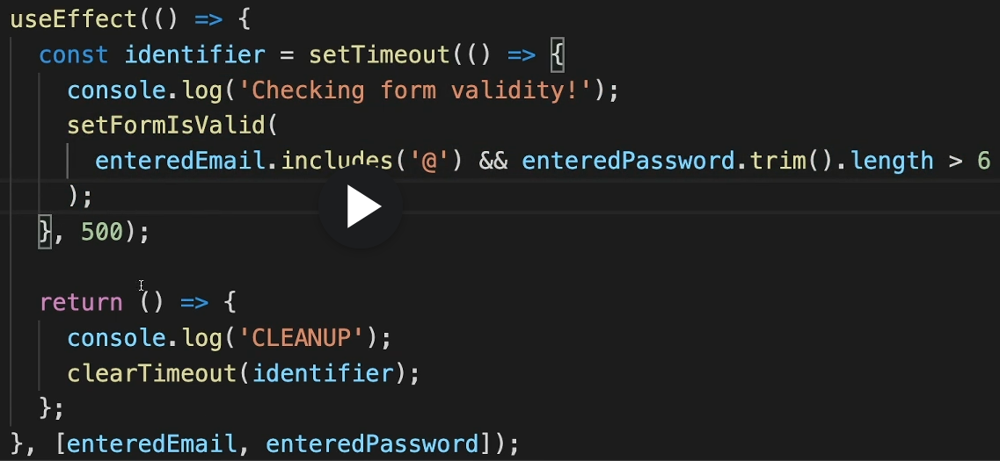
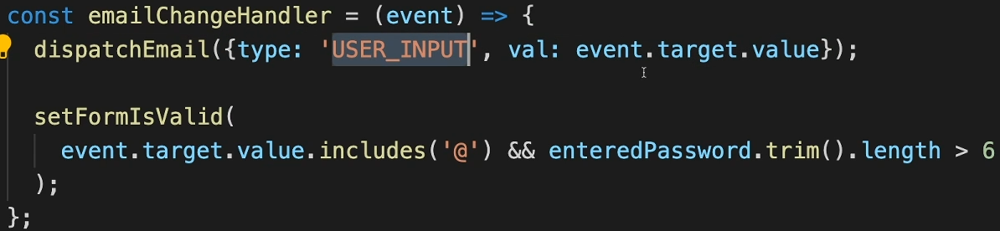
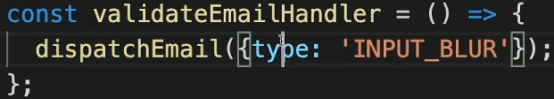
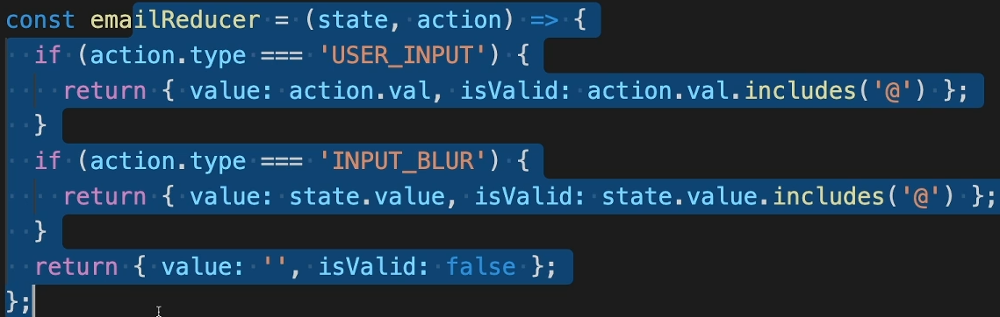
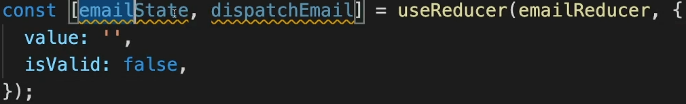

# Section 10: Advanced: Handling Side Effects, Using Reducers & Using the Context API

## 110. What are "Side Effects" & Introducing useEffect

主功能是展示，与用户互动，重新展示  
Side effect 是 http，本地存储，时间设置等，不与用户互动的部分

## 111. Using the useEffect() Hook

Use effect，没有 dependency 的情况下，for every state update, 都会被触发  
Use effect 在所有都触发之后触发，只有在 dependcy 变化的时候，才再次被触发。如果是空 array，就意味着只在第一次加载之后触发，不会形成无限循环  
useeffect 就是对 action 做出反应的位置

## 114. Using the useEffect Cleanup Function

Clean up function 就是 use effect 中的函数的返回值（return 一个函数）  
Clean up function runs 再每次 use effect 之前（除了第一次），也在 unmount 这个 component 之前  
以下这段，checking form 这句，在 type 多个字符之后只会出现一次，因为 clean up function 会在 use effect 之前执行，清理掉这个异步函数



## 116. Introducing useReducer & Reducers In General

reducer 就是更高级的 state，更复杂的，multiple ways of changing









# Section 13: A look behind the scenes of react & optimization techniques

## 185. How React Really Works

- react 关注三者，若它们三个有任何变化，就会重新 render DOM：

  - context: component-wide data
  - props: data from parent component
  - state: internal data

- React: determines how the component tree currently looks like and what it should look like
- ReactDOM: rexieves the differences (i.e. required changes) and then manipulates the real DOM

- re-evaluating componnets !== re-rendering the DOM
  - component 变化: re-evaluated whenever props, state or context changes. react executes component functions
  - real DOM 变化：changs to the real DOM are only made for differences between evaluations
- 函数型 component 会因为那三者的变化而被重新 render，但是真实的 DOM 不会被整体改变，只会被改变一部分，这就是 react 的工作
  - 例子：原本的 virtual DOM 是和 h1，现在的是 h1 + p。p 会被 insert into DOM，其他部分不变

ultimately 最终

## 186. Component Updates In Action

- react will only re run the APP function and re-evaluate what's on the screen, 当 props/context/state
- it all comes down to state changes, even context internally will use some state, that might change the value which is then distributed through context
- 这一切都归结为 state 变化，甚至上下文内部也会使用某些 state，这可能会改变然后通过上下文分发的值
- 如果我们考虑 props，从父级传递给子级，通过 props 传递的值会如何改变？
  好吧，只有最终，如果父级的 state 发生了变化，那么最终一切都会归结为 state 变化
- 写法一
  - setShowParagraph(!showParagraph)
- 写法二
  - setShowParagraph((preShowParagraph) => !prevShowParagraph)
  - 但由于我们依赖于之前的状态快照，我提到我们要在此处使用前向状态更新功能。
- 当点击 button 之后，APP RUNNING 这句话会再次出现一遍，因为 showParagraph 变化了， app 被从新 render 了

```JavaScript
function App(){
  const [showParagraph, setShowParagraph] = useState(false);

  console.log('APP RUNNING');

  const toggleParagraphHandler = () => {
    setShowParagraph((preShowParagraph) => !prevShowParagraph);
  }

  return (
    <>
    h1
    {showParagraph ? p : null}
    Button onClick={toggleParagraphHandler}
    <>
  )
}
```

## 187. A Closer Look At Child Component Re-Evaluation

- App.jsx

```JavaScript
function App(){
  const [showParagraph, setShowParagraph] = useState(false);

  console.log('APP RUNNING');

  const toggleParagraphHandler = () => {
    setShowParagraph((preShowParagraph) => !prevShowParagraph);
  }

  return (
    <>
    h1
    <DemoOutput show={false} />
    Button onClick={toggleParagraphHandler}
    <>
  )
}
```

- DemoOutput.jsx

```JavaScript
const DemoOutput = (props) => {
  console.log('DemoOutput RUNNING');

  return <p>{props.show ? 'This is new!' : ''}</p>
}

export default DemoOutput
```

- 即使 DemoOutput show={false} 是固定的 false，一直不会显示，但是点击 button 后，parent component 中 state 变化了，它的子组件依然会 re-executed，DemoOutput RUNNING 依然会出现在 console 中（APP RUNNING 也会）。但是真实的 DOM 中不会有变化，因为 react 评估了，发现没有变化，不会变动真实 DOM。但是各级子组件会全部挂上一次，console 中 app 以及它的各级子组件都会 ‘RUNNING’

## 188. Preventing Unnecessary Re-Evaluations with React.memo()

- 使用 React.memo(DemoOutput)，避免不必要的 re-rendering。使用后，‘DemoOutput RUNNING’ 就不会出现在 console 中，因为 DemoOutput component 的 props 没有变化，这部分子组件不会 re-execute

```JavaScript
import React from 'react';

const DemoOutput = (props) => {
  console.log('DemoOutput RUNNING');

  return <p>{props.show ? 'This is new!' : ''}</p>
}

export default React.memo(DemoOutput);
```

- 为什么不每个都使用 React.memo，因为会造成 cost。
  - memo 做的事情是，只要 app component 变化了，都会到 DemoOutput component 中，比较新的 props 和老的 props。react 需要额外做两件事，保存 previous prop value，比较
- 所以需要根据你的 component 的具体请款，选择是否使用 memo。比较一下两项，看看是否值得：
  - re-evaluating the component(re-excuting the child component)
  - comparing props
- props 的数量，component 的复杂度，子组件的数量。
- 如果有一个巨大的组件树，在高阶父组件中是值得使用 memo 的，可以避免 re-render 整个组件树的每个分支
- 相反的情况是，如果有一个 component，我已经知道，当每次父组件变化的时候，它会变化或者说它的 props 会变化，那么 memo 就没必要了
- 当 app 很小的时候，没有必要 memo，相反 app 大的时候，需要 memo。不用在每个组件上都是用，可以在关键位置拦截
- 如果在 button 中添加 memo，有趣的是，button running 依然出现在 console 中，即使 button 的所有 props（onclick & child content）看起来都没有变化
- 如果 props 中包含父组件中的函数，memo 就起不到作用了。因为父组件执行的时候，函数都会重新生成，函数在做同样的事，但会是一个全新的函数了，这是 js 的属性，那么 props 就变化了。但是为什么 DemoOutput 的 props false，也是一个 new created variabl，memo 认为它同原来一样呢？因为 boolean 是 primitive values，react memo 是利用三等号===，来进行比较的。如果是 Boolean/ string，三等后依然相同。但是如果是 arrays objects functions,即使内容一样，re-exucte 后，三等的结果仍然为 false，因为它们是 reference 类型

## 189. Preventing Function Re-Creation with useCallback()

- useCallback is a hook that allow us to basically store a function across component executions.
- 告诉 react，保存 function，每次执行的时候，不要重新 re-create 这个方法
- 使用 useCallback 也很简单，就是将方法当成第一个参数传给 useCallback
- useCallback 的 dependency 与 useEffect 类似，也是一个 array。其中包含里面方法用到的任何 state，props，context
- Anything you use in your function which is coming from the surrounding component so any state or props or context should be specified here.
- 没有必要在 dependency 中写 setShowParagraph，因为 react 承诺这个不会变化

```JavaScript
function App(){
  const [showParagraph, setShowParagraph] = useState(false);

  const toggleParagraphHandler = useCallback(() => {
    setShowParagraph((preShowParagraph) => !prevShowParagraph);
  }, [setShowParagraph])
}
```

- 空 array dependency 代表着，我们想要保存给 toggleParagraphHandler 的这个 callBack 方法，永远不会变化
- 用着方法后，button running 不会 re-execute

## 190. useCallback() and its Dependencies

- useCallback() 的功能是，保存一个方法，未来 reuse 它
- useCallback 的 dependency array 的意思是：we generally want to store that function(在 useCallback 中的 function), 但是一旦 dependency array 中的任何一个变化，就重新 create 一个新的 function，并且把新建的 function 保存起来。这就确保了，我们每次都是，在这个 function 中，使用了 dependency array 中的每个变量的，最新的值

```JavaScript
function App(){
  const [showParagraph, setShowParagraph] = useState(false);
  const [allowToggle, setAllowToggle] = useState(false);

  console.log('APP RUNNING');

  const toggleParagraphHandler = useCallback(() => {
    if (allowToggle) {
      setShowParagraph((preShowParagraph) => !prevShowParagraph);
    }
  }, []);

  const allowToggleHandler = () => {
    setAllowToggle(true);
  }

  return (
    <>
    h1
    <DemoOutput show={false} />
    Button onClick={toggleParagraphHandler}
    Button onClick={allowToggleHandler}
    <>
  )
}
```

- dependency 是空的时候，点击 toggleParagraphHandler button，console 没有任何反应。因为 allowToggle 是 false。点击 allowToggle button，console 会显示 app running，因为 allowToggle state 变化了。然而，这时即使 allowToggle 是 true 了，点击 toggleParagraphHandler button，依然没有任何 console。因为 js 特性，function 是闭包的，当 function 被定义的时候，js 会锁住所有使用的变量（主要指那些 function 外地变量）。useCallback 里面的 function 使用的 allowToggle 变量，这个变量来自 app function。js close over 这个变量或者 constant，定义方法的时候保存 constant。下一次这个方法执行的时候，这个被保存的变量将会被使用。这很完美，因为这可以使我们在方法中使用方法外的变量，在任何时间点执行这个方法，这正是将一个方法与 button 绑定的需求。但是问题，因为使用 useCallback，我们告诉 react，将这个方法（就是这个方法）保存在内存中。当 app 方法重新 evaluated，重新执行的时候，因为 allowToggle 变化了，then react 不会 re-create useCallback 中的方法。因为我们使用了 useCallback，我们告诉 react，在任何情况下，我们不想重新 create 这个方法，因此 allowToggle 的值依然是前一次的值
- 在 dependency 中添加 allowToggle 后：
  - 点击 toggleParagraphHandler button，console 没有任何反应
  - 点击 allowToggle button，console 会显示 app running + 2 \* button running
    - button running 两次，是因为 app running 后，两个 button 的 props 都变化了。第二 button 的 onClick allowToggleHandler 没有使用 useCallback,自然每次 app running 都会重新被 create，第一个 button 的 onClick 方法，是因为 allowToggle 的值变化了，它是第一个 button 的 onClick 方法的 useCallback 的 dependency，所以第一个 button 的 onClick 方法 也被 re-create 了。所以它们俩的 props 都变了
  - 点击 toggleParagraphHandler button，console，app running + demooutput running + button running （这个 button running 指的是第二 button 的，因为第一 button 使用了 useCallback，而 allowToggle 没变过，所以第一个 button 的 props 没有变化）

## 193. Understanding State Scheduling & Batching

- 延迟
  - 使用 setState()的时候，并不是立即执行的，而是 schedules a state update with data 'Book'(原本时 DVD 想要更新为 Book). a schedules state change, react 发现了这件事，react 计划执行它，但是 react 不是立即执行的。这部分，人类感觉，是立即执行的，但实际上不是的，react 有很对其他要做的事情，都比这个 setState()优先级高。整体来说，执行是未来一定会执行的，而且执行顺序是确保的，但是不会立即执行
  - 用户输入一些东西，对于输入的反应（reacting to that user input）会比，将屏幕 text 改变，的优先级更高
  - 因为，多个更新很可能同时被 scheduled，所以，当更新 state 的时候，需要前一次 state 的值的时候，强烈建议使用以下格式：setShowParagraph((preShowParagraph) => !prevShowParagraph)。
  - 以上是为了确保，拿到的是，最新的 state。多个 scheduled 的更新同时在等待的时候，它们都是来自同样的上一次的 component 快照。因为它们已经在排队了，最新的 state 更新，就不会被传入。所以必须利用上述方法，得到最新的 state
  - 另一个例子是使用 useEffect 的 denpendency array。当一个 state A 需要取决于其他 state B 的值的时候，需要将 B 当成 denpendency，在 useEffect 中更新 A
- 批量
  - 如果有两个或以上 state 更新，在同一块 synchronous code 切片中，比如说在同一个同步方法中。react 只会进行一次跟新 component/re-execution/re-evaluation

## 194. Optimizing with useMemo()

- array 是 object 不是 primitive 类型
- 因为 sort 是很消耗能量的
- 使用 useMemo,锁定 array

```JavaScript
function App(){
  const [listTitle, setListTitle] = useState('My List');

  const changeTitleHandler = useCallback(() => {
    setListTitle('New title')
  }, []);

  return (
    <>
    <DemoList title={listTitle} items={[5,3,1,10,9]} />
    // items={useMemo(()=>[5,3,1,10,9], [])}
    Button onClick={toggleParagraphHandler}
    <>
  )
}
```

```JavaScript
function DemoList(props){
  const sortedList = props.items.sort((a, b) => a - b)
  console.log('DemoList RUNNING')

  return (
    <>
      h2 props.title
      ul sortedList.maps...
    <>
  )
}
```

```JavaScript

const { items } = props

const sortedList = useMemo(() => {
  return items.sort((a, b) => a - b)
}, [items])

```

- 使用 use call back 的频率，比使用 use memo 高很多。因为记录方法，比记录数据，有用。记录数据一般是为了计算的 performance，根据这个数据，重新计算。否则没必要这么做。因为记录数据本身占据内存，会影响效率

# Summary

1. react 会重复 render，因为三者之一变化了：state, props, context
2. 父组件 re-render，子组件就会 re-render
3. React.memo(子组件)，防止 re-render。需要注意‘子组件’的参数，如果有非 primitive 的参数，需要利用 const 参数方法 = useCallback(( ) => { }, [ ])， ( ) => { } 是原本的参数方法
4. useMemo
   1. 用途：用于缓存计算结果
   2. 返回值：useMemo 返回计算结果，可以是任何类型的数据（例如数字、对象、数组等）。
   3. 示例用途：当需要计算并缓存一个值，以便在组件渲染期间多次使用时
   4. const memoizedValue = useMemo(() => computeExpensiveValue(dep1, dep2), [dep1, dep2]);
5. useCallback
   1. 用途：用于缓存函数引用。
   2. 返回值：useCallback 返回一个缓存的函数引用。
   3. 示例用途：当需要确保函数引用在依赖项发生变化时不会重新创建
   4. const memoizedCallback = useCallback(() => { doSomething(dep1, dep2); }, [dep1, dep2]);
